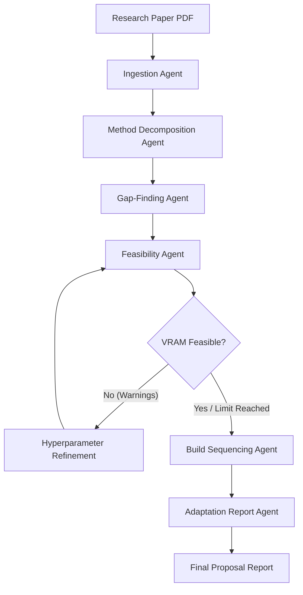

# 🖥️ Paper-to-Project Agent

An interactive, local-first agentic desktop application that converts research papers into feasibility-checked, staged implementation blueprints. The system is delivered through a transparent Windows desktop mascot with a docked sidebar control panel.

---

## 🔍 Overview

The **Paper-to-Project Agent** bridges the gap between academic research and practical engineering. Instead of manually translating formulas, architectures, and hyperparameters, this system automates ingestion, method decomposition, gap-finding (hyperparameter verification), feasibility validation, and build sequencing.

### Key Features
* **Local-First & Model-Agnostic:** Runs entirely locally on consumer hardware via Ollama, supporting dynamic model-switching (Llama 3.1/3.2, Qwen 2.5, Gemma 2). No API keys, no external costs, 100% data privacy.
* **Orchestration & Refinement Loop:** A 6-stage LangGraph state machine (Ingestion → Decomposition → Gap-Finding → Feasibility → Sequencing → Report) featuring an automated hyperparameter refinement loop that programmatically adjusts parameters to fit local hardware budgets.
* **Dynamic Workstation Profiling:** Directly queries the host OS to auto-detect dedicated VRAM size, active GPU name, and CPU threads to check feasibility constraints in real-time.
* **Interactive Desktop Mascot:** A transparent, DPI-aware Electron mascot (Phase 2) that visually reacts to the agent's real-time state (Sleeping, Reading, Investigating, Idle).
* **Docked Sidebar Panel:** A slide-out web control panel (Phase 2) showing live progress streams and the final compiled adaptation proposals.

---

## 🏗️ Architecture

```
LangGraph 6-Agent Core (Local Ollama: Llama / Qwen / Gemma)
   ├── Ingestion Agent (PyMuPDF & section parsing)
   ├── Method Decomposition Agent (Component graph)
   ├── Gap-Finding Agent (Tavily search & hyperparameter validation)
   ├── Feasibility Agent (Hardware, dataset, and timeline constraints)
   ├── Build Sequencing Agent (Dependency-ordered milestones)
   └── Adaptation Report Agent (Markdown report builder)
            │
            ▼ (FastAPI / SSE streaming bridge)
            │
            ▼
Electron Desktop Application
   ├── Transparent, frameless window (Mascot rig)
   ├── Docked sidebar (Live SSE stream & markdown display)
   └── Win32 native API integration (Taskbar alignment & active-win polling)
```

### LangGraph Agentic Pipeline Flow



---

## 🛠️ Tech Stack

* **Backend / Agents:** Python, LangGraph, FastAPI, PyMuPDF, Pydantic, Ollama
* **Frontend / Desktop App:** JavaScript, Electron, HTML, Vanilla CSS
* **Native OS Integration:** `koffi` (Win32 API bindings), `active-win` (window tracking)
* **Packaging:** PyInstaller (Python backend executable), Electron Builder (NSIS Windows Installer)

For a detailed breakdown of local model benchmarking performance comparison metrics and generalization tests, please refer to the [**Backend Developer Guide (backend/README.md)**](backend/README.md).

---

## 📅 Project Timeline & Phases

The build plan spans 28 days across 4 clean, sequential phases:

* **Phase 1: Agentic Core (Days 1–14)** - [**COMPLETED**] PDF parsing, 6-stage LangGraph pipelines, local Ollama integration, active VRAM release, robust fallbacks, and multi-model benchmarking. See [Phase 1 Progress Log (docs/phase_1.md)](docs/phase_1.md).
* **Phase 2: Desktop UI & Showcase Website (Days 15–21)** - [**IN PROGRESS**] Electron transparent window shell, Win32 taskbar queries, custom SVG scaling and animations, and a responsive Next.js landing website. See [Phase 2 Progress Log (docs/phase_2.md)](docs/phase_2.md).
* **Phase 3: Integration & Streaming (Days 22–25)** - FastAPI bridge, Server-Sent Events (SSE) stream, and linking the mascot's animations to the agent's real-time activities.
* **Phase 4: Packaging (Days 26–28)** - Compiling Python binaries with PyInstaller, building the NSIS installer via Electron Builder, dependency health checks, and VM testing.

---

## 🚀 Getting Started (Development Setup & Quick Start)

### Prerequisites
1. [Python 3.10+](https://www.python.org/downloads/)
2. [Node.js 18+](https://nodejs.org/)
3. [Ollama](https://ollama.com/) (installed and running locally)

### Installation & Environment Setup
1. Clone the repository and navigate to the project directory:
   ```bash
   git clone https://github.com/varunchandra10/Paper-2-Project.git
   cd Paper-2-Project
   ```
2. Activate your virtual environment and install backend dependencies:
   ```powershell
   # Activate virtual environment
   .venv\Scripts\Activate.ps1
   # Install dependencies
   pip install -r backend/requirements.txt
   ```
3. Pull the local reasoning models via Ollama:
   ```powershell
   ollama pull qwen2.5-coder:7b
   ollama pull llama3.2:3b
   ```

### Quick Run
To run the full compiled LangGraph pipeline on the default model and generate the adaptation proposal:
```powershell
python backend/tests/test_full_orchestration.py
```
*Output Report:* Saves the final proposal report to `backend/papers/vlcd_adaptation_report_langgraph.md`.

For advanced execution options (such as multi-model benchmarking, custom model arguments, and edge-case testing), refer to the [**Backend Setup Guide**](backend/README.md#running-the-tests--benchmarks).
