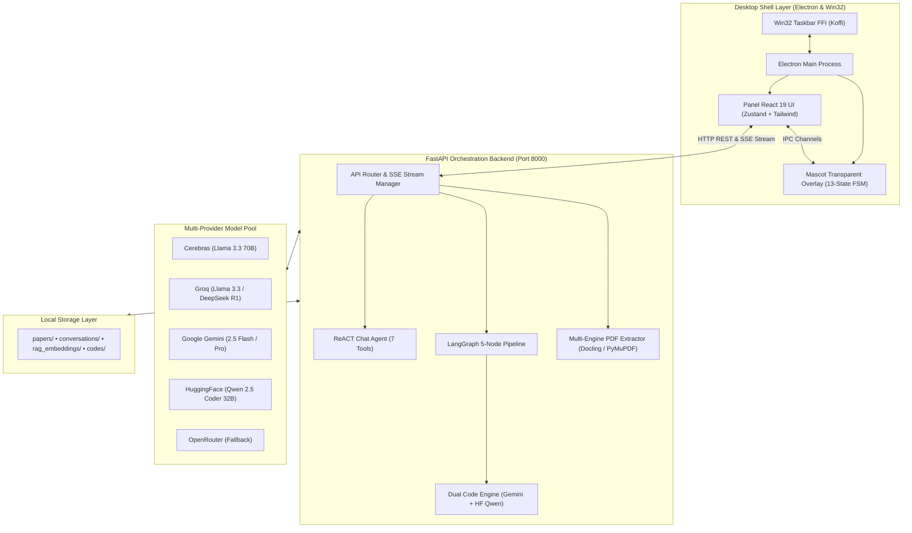
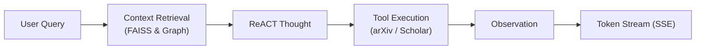
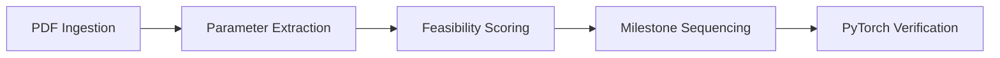
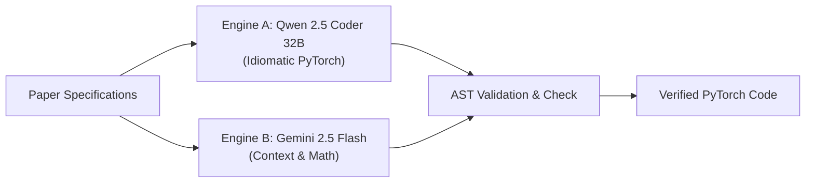
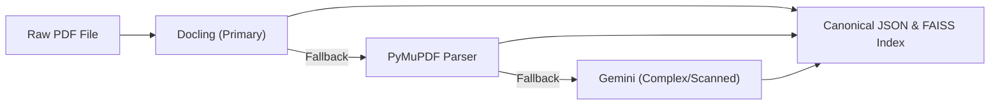

# 🌌 RUEXIS AI Platform — Autonomous Paper-to-Code Desktop Mascot

> **RUEXIS** — **R**esearch, **U**nderstand, **E**xtract, e**X**amine, **I**mplement, **S**ynthesize

<p align="center">
  <strong>Local-First Agentic Desktop Companion that Converts Scientific Research Papers into Staged PyTorch Implementations.</strong>
</p>

<p align="center">
  <!-- Core Runtimes & Frameworks -->
  
  
  
  
  
</p>

<p align="center">
  <!-- AI, Agents & Storage -->
  
  
  
  
</p>


---

## 🌟 What is RUEXIS AI?

**RUEXIS AI** is a **local-first, fully agentic desktop platform** that converts academic scientific literature into verified, runnable code across 6 structured stages:

| Stage | Operation | Engine / Component |
| :---: | :--- | :--- |
| **R** | **Read / Research** | Multi-engine PDF Ingestion (`Docling` + `PyMuPDF` + `Gemini OCR`) |
| **U** | **Understand** | ReACT conversational agent with 7 academic search & FAISS knowledge tools |
| **E** | **Extract** | Structured extraction of hyperparameters, datasets, loss functions & equations |
| **X** | **eXamine** | Autonomous hardware profiling & VRAM compute feasibility scoring |
| **I** | **Implement** | Parallel PyTorch synthesis via Dual Code Engine (`Qwen 2.5 Coder` + `Gemini`) |
| **S** | **Synthesize** | AST validation, milestone sequencing & animated desktop mascot status sync |

---

## 🎭 Interactive Mascot System

RUEXIS AI features a **transparent desktop mascot overlay** that sits above your taskbar, anchored to the bottom-right corner of your screen. It visually mirrors every backend agent state in real time.

### Four Characters

| ID | Character | Style |
|----|-----------|-------|
| `mr_nerdy` | Mr. Nerdy | Classic academic nerd |
| `ms_nerdy` | Ms. Nerdy | Female academic variant |
| `mr_nerd` | Mr. Nerd | Compact nerd |
| `ms_nerd` | Ms. Nerd | Compact female variant |

### 13 Animation States

| State | Trigger |
|-------|---------|
| `standing` | Default idle |
| `blink` | Random idle micro-animation |
| `wave` | App startup greeting |
| `thinking` | ReACT thought / tool execution |
| `hunch` | Chat response generating |
| `catching` | PDF file staged for upload |
| `excite` | Pipeline completed successfully |
| `tired` | Extended work session |
| `having_sipping` | Long operation in progress |
| `sleep` | Long inactivity (idle timeout) |
| `angry` | Pipeline / upload error |
| `confused` | Unexpected response |
| `peeking` | Transition from edge back to idle |

> Click the mascot to toggle the main app panel. Drag it to reposition anywhere on screen.

---

## 🏗️ Architecture Overview

RUEXIS AI connects a native desktop overlay with a local FastAPI agentic backend and cloud/local LLM providers:



---

## 🤖 Inference Providers

### Chat Interface (User-Selectable)

| Provider | Models | Type |
|----------|--------|------|
| **Groq** | Qwen 3.8 27B, GPT-OSS 120B | Free cloud LPU |
| **OpenRouter** | Gemini 2.5 Flash, DeepSeek R1 | Free community tier |
| **Local Ollama** | Any installed model | 100% offline |

### Backend-Exclusive (Not in Chat UI)

| Provider | Model | Reserved For |
|----------|-------|-------------|
| **Google Gemini** | `gemini-2.5-flash` | PDF extraction + Dual Code Engine B |
| **Hugging Face** | `Qwen/Qwen2.5-Coder-32B-Instruct` | Dual Code Engine A |

### Auto-Failover

If a provider hits a rate limit (HTTP 429), the `ModelRouter` automatically retries the next configured provider. The frontend `ModelSelector` updates to tick the correct model immediately — no manual intervention needed.

---

## ⚡ Core Pipeline Architectures

### 1. ReACT Conversational Pipeline
Context-aware reasoning loop equipped with academic retrieval and knowledge graph tools:



### 2. Autonomous Paper Analysis Pipeline (LangGraph)
5-stage autonomous workflow transforming raw research papers into verified code:



### 3. Dual Code Synthesis Engine
Parallel code generation leveraging dual specialized models with automated AST validation:



### 4. Multi-Engine PDF Extraction
Resilient document ingestion with hierarchical parser fallback:



---

## 📁 Project Structure

```
Paper-2-Project/
├── backend/          # FastAPI server, LangGraph pipelines, agents & model router
├── frontend/         # Desktop application layer
│   ├── electron_app/ # Electron main process, Win32 FFI & mascot sprite engine
│   └── renderer/     # React 19 glassmorphic UI, Zustand state & SSE listener
├── docs/             # System architectures, master project plan & subsystem guides
├── website/          # Product landing page & showcase
└── README.md         # Master overview & quickstart guide
```

---

## 📖 System Documentation & Architecture Guides

| Document | Path | Description |
|---|---|---|
| **System Architecture** | [`docs/detailed_architectures.md`](./docs/detailed_architectures.md) | **7-Division modular system flow**, Mermaid sequence diagrams, FSM, and master integrated synthesis |
| **Project Master Plan** | [`docs/Paper-2-Project_plan.md`](./docs/Paper-2-Project_plan.md) | High-level roadmap, core architecture decisions, and milestone execution checklist |
| **Complete Backend Guide** | [`docs/backend_docs/complete_backend_guide.md`](./docs/backend_docs/complete_backend_guide.md) | Exhaustive backend manual (FastAPI routes, LangGraph pipeline, retrieval DB, agents) |
| **Backend Day-Wise Guide** | [`docs/backend_docs/backend_day_wise_explanation.md`](./docs/backend_docs/backend_day_wise_explanation.md) | Chronological backend development log and phase-by-phase implementation breakdown |
| **Backend Commands** | [`docs/backend_docs/backend_commands.md`](./docs/backend_docs/backend_commands.md) | Server startup, test suites, virtual environment, and verification commands |
| **Backend Test Report** | [`docs/backend_docs/master_e2e_backend_test_report.md`](./docs/backend_docs/master_e2e_backend_test_report.md) | Full end-to-end backend test verification results and route status |
| **Complete Frontend Guide** | [`docs/frontend_docs/complete_frontend_guide.md`](./docs/frontend_docs/complete_frontend_guide.md) | Exhaustive frontend manual (React 19, Zustand state stores, glassmorphic UI, Electron IPC) |
| **Frontend Day-Wise Guide** | [`docs/frontend_docs/day_wise_explanation.md`](./docs/frontend_docs/day_wise_explanation.md) | Chronological frontend development log, 13-state sprite engine, and Win32 docking |
| **Frontend Commands** | [`docs/frontend_docs/frontend_commands.md`](./docs/frontend_docs/frontend_commands.md) | Vite renderer, Electron launch, multi-terminal startup, and build commands |

---

## 📚 Component READMEs

| Component | README | Description |
|-----------|--------|-------------|
| **Backend** | [`backend/README.md`](./backend/README.md) | Full API reference, agent flows, model routing, dual code engine |
| **Renderer** | [`frontend/renderer/README.md`](./frontend/renderer/README.md) | React state slices, SSE parsing, model selector, quota dashboard |
| **Electron App** | [`frontend/electron_app/README.md`](./frontend/electron_app/README.md) | Window management, IPC channels, mascot state machine, sprite engine |

---

## 🔑 Required Environment Variables

| Variable | For |
|----------|-----|
| `SECRET_KEY` | JWT auth signing |
| `GROQ_API_KEY` | Chat (Qwen 3.8 27B, GPT-OSS 120B) |
| `OPENROUTER_API_KEY` | Chat (Gemini 2.5 Flash, DeepSeek R1) |
| `GEMINI_API_KEY` | PDF extraction + Dual Code Engine B |
| `HUGGINGFACE_API_KEY` | Dual Code Engine A (Qwen 2.5 Coder 32B) |
| `TAVILY_API_KEY` | arXiv + Scholar search tools |

All configured in `backend/.env`. See [`backend/.env.example`](./backend/.env.example) for the full template.

---

## 📜 License

This project is released under the **MIT License**.

---

## 👤 Author

**Kola Varun Chandra**

[](https://github.com/varunchandra10)

[](https://www.linkedin.com/in/kola-varun-chandra-702137391)

---

## 🙏 Acknowledgements

A few UI components in this project were inspired by **[Antigravity](https://antigravity.google/)**.
