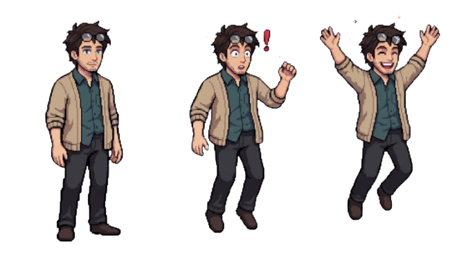
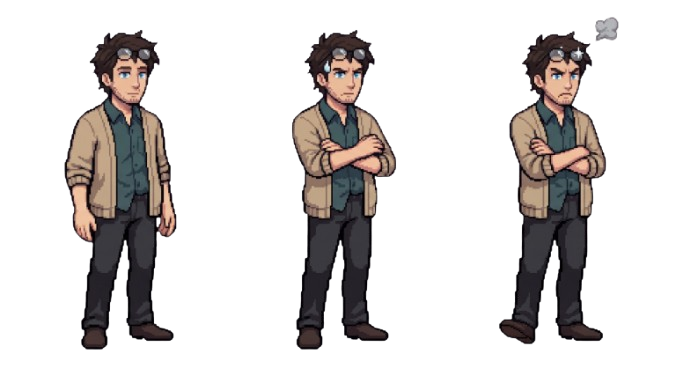
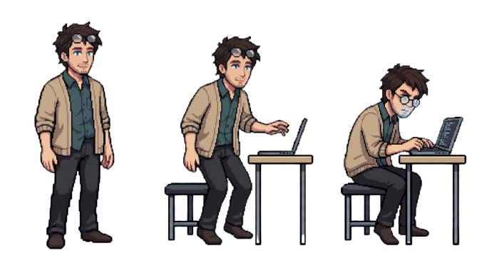
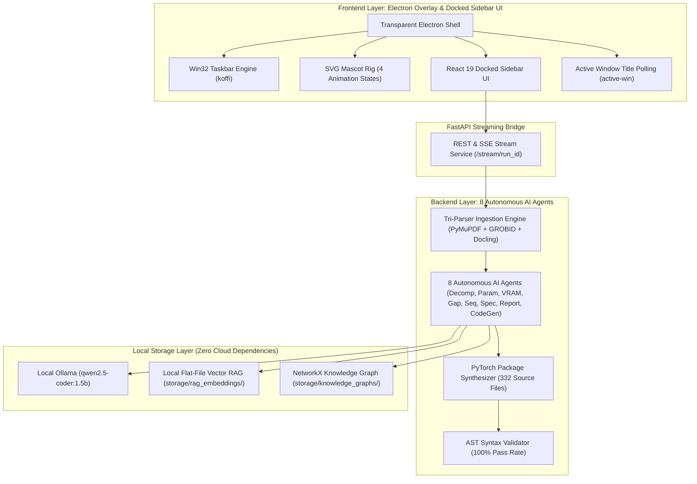

# 🌌 Synthexis AI Platform — Autonomous Paper-to-Code Desktop Mascot

<p align="center">
  <strong>Local-First Agentic Desktop Companion that Converts Scientific Research Papers into Staged PyTorch Implementations.</strong>
</p>

<p align="center">
  
  
  
  
  
  
</p>

---

## 🌟 Interactive Mascot System & Visual States

Synthexis features an interactive **Desktop Mascot Companion** that sits directly on your Win32 taskbar, detects research PDFs in your active window, and animates its visual states in sync with backend multi-agent progress:

<p align="center">
  
  &nbsp;&nbsp;&nbsp;&nbsp;&nbsp;&nbsp;&nbsp;&nbsp;
  
  &nbsp;&nbsp;&nbsp;&nbsp;&nbsp;&nbsp;&nbsp;&nbsp;
  
  &nbsp;&nbsp;&nbsp;&nbsp;&nbsp;&nbsp;&nbsp;&nbsp;
  
</p>

<p align="center">
  <code>1. Sleeping (Taskbar Docked)</code> &nbsp;&bull;&nbsp;
  <code>2. Curious (PDF Header Match)</code> &nbsp;&bull;&nbsp;
  <code>3. Investigating (RAG Search)</code> &nbsp;&bull;&nbsp;
  <code>4. Working (PyTorch CodeGen)</code>
</p>

> 🎭 **Multi-Mascot Character Support**: Includes 4 built-in avatar skins (Nerdy Man, Nerdy Woman, Nerdy Adult Male, Nerdy Adult Female). **More mascot characters and custom avatar skins to be added!**

---

## 🏗️ Complete Architecture Overview (Frontend & Backend)

Synthexis is structured into two decoupled, high-performance layers:

### 1. 🎨 Frontend Architecture (Desktop Shell & Mascot UI)
* **Electron Overlay Shell**: Frameless, transparent, always-on-top window overlay with `setIgnoreMouseEvents` pass-through for seamless desktop integration.
* **Win32 Taskbar Query Engine**: Calls native Win32 `SHAppBarMessage` (`ABM_GETTASKBARPOS` via `koffi`) to anchor the mascot directly onto your Windows taskbar.
* **Active Window Detection**: `active-win` polling service monitoring focused window titles for PDF viewers (Acrobat, Edge, Sumatra) and paper sites (arXiv, IEEE, CVPR).
* **Docked 3-Tier React Sidebar**: React 19 + TailwindCSS 4 slide-out panel offering 3 output depths (**Brief Summary**, **Detailed Spec**, **Full PyTorch Code Viewer**).
* **Real-Time SSE Event Progress**: Server-Sent Events (SSE) bridge emitting live agent status updates directly to mascot visual animation states.

### 2. ⚡ Backend Architecture (Multi-Agent Core & Storage)
* **Tri-Parser Ingestion Pipeline**: Ingests scientific PDFs via **PyMuPDF** (layout coordinates), **GROBID** (TEI XML parsing at `localhost:8070`), and **Docling** (OCR & borderless tables) into a canonical `PaperDocument` schema.
* **8 Autonomous AI Agents**:
  1. **Method Decomposition Agent**: Maps encoders, fusion layers, and decoders into a `ComponentGraph`.
  2. **Parameter Agent**: Extracts 11 training hyperparameters (`learning_rate`, `batch_size`, `optimizer`, `backbone`).
  3. **CUDA VRAM Feasibility Agent**: Audits host GPU memory (`NVIDIA GeForce RTX 5050` CUDA VRAM) against neural model memory footprints.
  4. **Parameter Gap Resolver Agent**: Resolves parameter gaps and applies VRAM fallback scaling adaptations.
  5. **Build Sequencing Agent**: Constructs a 6-milestone build DAG sequence.
  6. **Technical Specification Agent**: Generates an engineering specification blueprint (`ProjectSpecification`).
  7. **Adaptation Report Agent**: Synthesizes portfolio-grade executive proposal reports.
  8. **PyTorch Code Generator Agent**: Synthesizes an 8-file modular PyTorch codebase (`config.py`, `dataset.py`, `models/encoder.py`, `models/fusion.py`, `models/decoder.py`, `losses.py`, `train.py`, `evaluate.py`).
* **AST Code Verification Gate**: Runs Python's native AST parser (`ast.parse`) across all synthesized codebases (**100% pass rate**).
* **Local-First Storage & Local LLM**: Operates 100% locally on Ollama (`qwen2.5-coder:1.5b`) with zero cloud dependencies and flat-file vector RAG (`storage/rag_embeddings/`) and NetworkX Knowledge Graphs (`storage/knowledge_graphs/`).



> 💡 **Cloud API Notice:** Free cloud APIs (Groq, OpenRouter) are intentionally disabled due to free-tier key exhaustion (`HTTP 429 Rate Limit Exceeded`). All pipeline processing executes 100% locally via local Ollama (`qwen2.5-coder:1.5b`) to guarantee zero API dependencies and zero rate-limit failures.

---

## 📚 Module READMEs & Detailed Documentation Portal

### 📁 Component Module READMEs
- ⚡ **Backend Engine**: [`backend/README.md`](./backend/README.md)  
  *FastAPI service architecture, multi-agent pipelines, AST verification, and RAG retrieval.*
- 🎨 **Frontend Master Guide**: [`frontend/README.md`](./frontend/README.md)  
  *Dual-window Electron architecture, mascot canvas engine, and Zustand state store.*
- 🖥️ **Electron Desktop Shell**: [`frontend/electron_app/README.md`](./frontend/electron_app/README.md)  
  *Frameless overlay, Win32 taskbar FFI (`koffi`), DPI scaling, and `active-win` polling.*
- ⚛️ **React 19 Sidebar Renderer**: [`frontend/renderer/README.md`](./frontend/renderer/README.md)  
  *Vite 8 + React 19 UI components, 3-tier depth selector, and ReACT chat feed.*

### 📄 Detailed Architecture & Implementation Docs (`docs/`)
- 🌌 **Master System Architecture**: [`docs/overall_project_architecture.md`](./docs/overall_project_architecture.md)
- 📄 **Master 31-Day Project Plan**: [`docs/backend_docs/Paper-2-Project_plan.md`](./docs/backend_docs/Paper-2-Project_plan.md)
- 🏆 **Master E2E Backend Verification Report**: [`docs/backend_docs/master_e2e_backend_test_report.md`](./docs/backend_docs/master_e2e_backend_test_report.md)
- 🛠️ **Backend Day-Wise Explanation**: [`docs/backend_docs/backend_day_wise_explanation.md`](./docs/backend_docs/backend_day_wise_explanation.md)
- 📖 **74-File Backend Reference Guide**: [`docs/backend_docs/complete_backend_guide.md`](./docs/backend_docs/complete_backend_guide.md)
- 🎨 **Frontend Master Day-Wise Explanation**: [`docs/frontend_docs/day_wise_explanation.md`](./docs/frontend_docs/day_wise_explanation.md)

---

## 📊 Verification Scorecard (48 Research Paper Corpus)

| Subsystem | Target Component / Agent | Test Corpus | Verification Result | Performance Metric |
|---|---|---|---|---|
| **Scientific Extraction** | Ingestion Engine (PyMuPDF + GROBID + Docling) | 48 Research PDFs | **100% PASS** | 48/48 3-Tier IEEE Titles & Section Trees |
| **Canonical Representation** | Canonical Schema Validator (`PaperDocument`) | 48 JSON Files | **100% PASS** | 48/48 Schema Conformance |
| **Quality Validation** | Validator Engine (`validate_paper_document`) | 48 Papers | **100% PASS** | 48/48 QA_PASS Achieved |
| **Local RAG & Knowledge Graph** | Hybrid Vector Retriever & NetworkX Engine | 48 Papers | **100% PASS** | 3 RAG Chunks & 15+ KG Nodes / Paper |
| **Multi-Agent Core** | Agents 1 – 7 (Decomp, Param, VRAM, Gap, Seq, Spec, Report) | 48 Papers | **100% PASS** | 100% Local Ollama Reasoning (`qwen2.5-coder:1.5b`) |
| **PyTorch Code Generator** | Agent 8 (Codebase Package Synthesizer) | 48 Repositories | **100% PASS** | **332 PyTorch Files** Synthesized |
| **AST Verification Gate** | AST Syntax Validator (`ast.parse`) | 332 Python Files | **100% PASS** | **100% AST Syntax Validity** (0 Syntax Errors) |
| **Conversational Memory** | ReACT Chat Agent (`ChatAgent` + `ChatDatabase`) | 48 Conversations | **100% PASS** | Multi-Turn Context-Aware Responses |
| **Hardware Telemetry** | FastAPI Endpoint (`get_hardware_metrics`) | System Hardware | **100% PASS** | Real-Time CPU, RAM, RTX 5050 GPU Profiling |

---

## ⚙️ Quick Start Guide

### 1. Prerequisites
- **Python**: `>= 3.10`
- **Node.js**: `>= 18.0`
- **Docker**: Container running GROBID (`docker run -p 8070:8070 grobid/grobid:0.9.0-crf`)
- **Local Ollama**: Running `qwen2.5-coder:1.5b` (`ollama serve`)

### 2. Launching the Backend FastAPI Server
```bash
# Navigate to backend directory
cd backend

# Install Python dependencies
pip install -r requirements.txt

# Start FastAPI server (http://localhost:8000)
uvicorn app.main:app --reload --port 8000
```

### 3. Launching the Desktop Mascot & React Sidebar UI
```bash
# Navigate to electron application directory
cd frontend/electron_app

# Install Node dependencies
npm install

# Start Desktop Mascot Overlay & Sidebar UI
npm start
```

### 4. Running the End-to-End Test Suite
```bash
# Execute master test notebook across 48 research paper corpus
cd backend
python -m pytest tests/
```

---

## 📜 License & Citation

Synthexis AI Platform is released under the **MIT License**.

```bibtex
@article{synthexis2026,
  title={Synthexis: Autonomous Paper-to-Code Platform with Staged PyTorch Synthesis and Taskbar Mascot Companion},
  author={Synthexis DeepMind Team},
  year={2026}
}
```
