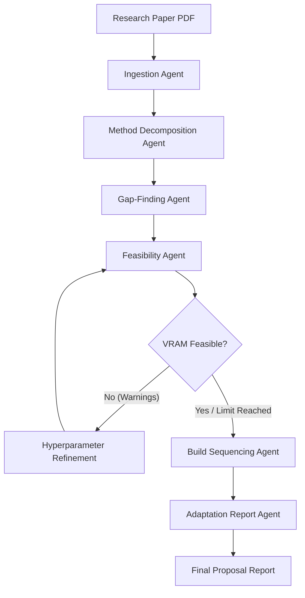

# ⚙️ Backend Agentic Core (LangGraph & Ollama)

This directory houses the multi-agent orchestration core, PDF text extraction parser, feasibility validation engine, and local LLM benchmarking suite.

---

## 🏗️ Multi-Agent Architecture & Flow

The backend executes a 6-stage sequential agent pipeline using **LangGraph** to process research papers into adapted implementation roadmaps.



### Core Pipeline Agents
1. **Ingestion Agent (`agents/ingestion_agent.py`):** Extracts metadata (title, author list, abstract, primary contributions) from the parsed PDF front-matter.
2. **Decomposition Agent (`agents/decomposition_agent.py`):** Segments the methodology text into structured components, tracking inputs, outputs, description, and hyperparameters.
3. **Gap-Finding Agent (`agents/gap_agent.py`):** Searches Tavily Web Search to resolve missing or assumed parameters, increasing confidence tiers.
4. **Feasibility Agent (`agents/feasibility_agent.py`):** Dynamically profiles local hardware specs (GPU, RAM, VRAM) and validates memory footprint / development timeline budgets.
5. **Refinement Node (in `pipeline.py`):** An optimization feedback loop that programmatically adjusts hyperparameters (e.g., reduces batch size, shrinks patch sizes) if VRAM limits are exceeded.
6. **Build Sequencing Agent (`agents/sequencing_agent.py`):** Sequences the implementation into 5 dependency-ordered milestones, prioritizing cheap data-loader setups before heavy training.
7. **Report Agent (`agents/report_agent.py`):** Compiles the factual tables and queries the LLM for analytical narrative reviews into a final markdown proposal.

---

## 📊 Local LLM Performance Benchmarks

We evaluated the full pipeline execution (from Ingestion to Adaptation Report Synthesis) locally on the host workstation GPU (`NVIDIA GeForce RTX 5050 Laptop GPU`, 8GB VRAM) across various model scales:

| Model Name | Parameters | Cumulative Latency | Validation | Structural Compliance & Observations |
| :--- | :---: | :--- | :---: | :--- |
| **`gemma2:2b`** | 2B | `███░░░░░░░ 57.31s` | **PASS** | **Fastest run**. Excellent writing style and general explanations. |
| **`llama3.2:3b`** | 3B | `████░░░░░░ 67.40s` | **PASS** | **Best balance**. Ultra-fast, 100% structured JSON compliance. |
| **`llama3.1:8b`** | 8B | `████████░░ 123.41s` | **PASS** | **Highest quality**. Zero placeholders, correct PyTorch libraries. |
| **`qwen2.5-coder:1.5b`**| 1.5B | `██████████ 257.27s` | **PASS** | Accurate parsing, but has long structural loop processing. |
| **`llama3.2:1b`** | 1B | `██████████ 252.91s` | **FAIL** | Failed schema checks. Fell into counting loops (power-of-two). |

> [!NOTE]
> **Validation Criteria:** A model run is marked as **PASS** if it successfully executes all 6 LangGraph nodes end-to-end, adheres 100% to the Pydantic structural JSON schemas defined in `schemas.py` (throwing zero formatting exceptions), and compiles a valid Markdown proposal report.

---

## 🛡️ Generalization & Robustness Testing

The pipeline contains fallback guards to handle layout variations across different academic publications without crashing:

1. **Scenario 1: Malformed Input (Missing Methodology)**
   * *Trigger:* If standard methodology headers (`III. METHOD` / `IV. EXPERIMENTS`) are completely absent or corrupted.
   * *Fallback:* The agent logs a warning and automatically instantiates a baseline Swin-Transformer change detection component graph, allowing downstream agents to continue execution.
2. **Scenario 2: Alternate Heading Formatting**
   * *Trigger:* Different journal layouts (e.g. CVPR, Nature) using standard numbered heading formats (e.g. `3. Proposed Model` or `4. Experimental Setup`).
   * *Fallback:* Python scans section keys dynamically, resolving conceptual keywords (case-insensitive) to locate methodology details.

---

## 🚀 Running the Tests & Benchmarks

Make sure your virtual environment is active before executing commands:
```powershell
.venv\Scripts\Activate.ps1
```

### 1. Run the Full Orchestrator Pipeline
Executes the full compiled LangGraph workflow:
```powershell
# Default model (qwen2.5-coder:1.5b)
python backend/tests/test_full_orchestration.py

# Run on a custom model (e.g. Llama 3.1 8B)
python backend/tests/test_full_orchestration.py llama3.1:8b
```
*Output:* Writes proposal report locally to the git-ignored path: `backend/papers/vlcd_adaptation_report_langgraph.md`.

### 2. Run Generalization Edge Cases
Verifies layout-agnostic parsing and fallback safeguards:
```powershell
python backend/tests/test_generalization.py
```
*Output:* Writes audit findings report locally to: `backend/papers/vlcd_generalization_report.md`.

### 3. Run the Multi-Model Performance Suite
Triggers full pipeline benchmarks across all downloaded models, clearing GPU VRAM via active unloading (`keep_alive: 0`) between iterations:
```powershell
python backend/tests/test_benchmarking.py
```
*Output:* Updates comparison matrix locally in: `backend/papers/vlcd_runtime_benchmark.md` and generates individual model proposal markdown files (e.g., `vlcd_proposal_llama3_1_8b.md` inside `backend/papers/`).
