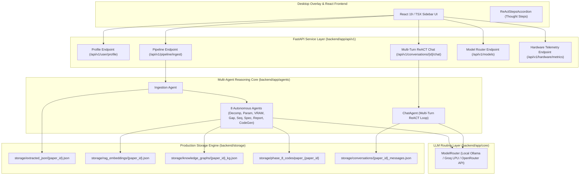
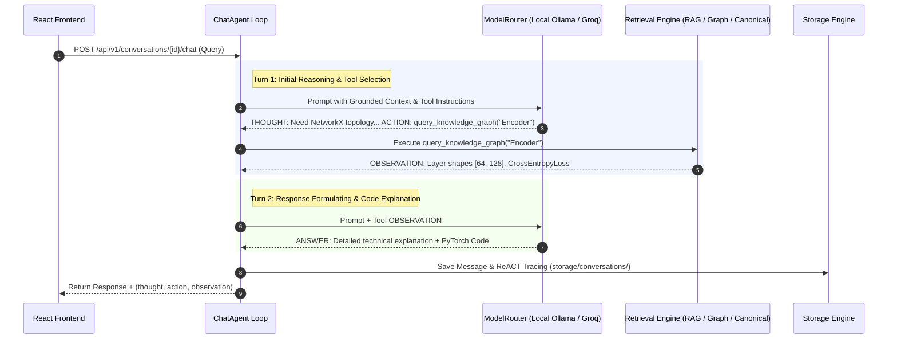

# ⚡ Synthexis — Backend Architecture & API Reference

Welcome to the backend reference documentation for **Synthexis AI Platform**. 
This backend is a high-performance **FastAPI** service powered by a **Local Flat-File RAG Engine**, a **NetworkX Knowledge Graph**, an **8-Agent Reasoning Core**, **PyTorch Code Package Synthesizer (Agent 8)**, **AST Code Syntax Verification**, and **Local-First LLM Routing with Groq Cloud & OpenRouter Fallbacks**.

---

## 🏗️ Architectural System Overview



---

## 🔄 Multi-Turn Autonomous ReACT Loop

The conversational engine in [`chat_agent.py`](file:///c:/Users/kvcsu_ht23nk8/OneDrive/Desktop/all_Projects/Projects/agentic_projects/Paper-2-Project/backend/app/agents/chat_agent.py) operates under an iterative Reasoning + Action loop (up to 3 turns):



---

## 🚀 Core Backend Capabilities

### 1. ⚡ Local Flat-File RAG Engine (`storage/rag_embeddings/`)
- **Zero Heavy Database Overhead:** Operates with flat-file JSON vector caches, eliminating external database server dependencies.
- **Hybrid Retrieval:** Reciprocal Rank Fusion (RRF) combining dense float vector similarity search with exact keyword matching in **< 5 milliseconds**.
- **JSON Vector Caching:** Semantic text chunks, 768-dimensional float vectors, and section provenance metadata save directly to `storage/rag_embeddings/{paper_id}.json`.

### 2. 🕸️ In-Memory NetworkX Knowledge Graph (`app/retrieval/knowledge_graph.py`)
- **Topological Module Graphs:** Constructs directed graphs (`networkx.DiGraph`) mapping extracted paper modules (encoders, attention, fusion layers, decoders), hyperparameters, loss functions, and tensor shape bounds.
- **Persistence:** NetworkX graph structures serialize directly to `storage/knowledge_graphs/{paper_id}_kg.json`.

### 3. 🛡️ AST Code Syntax Verification (`app/agents/code_gen_agent.py`)
- **8-File PyTorch Package Synthesizer (Agent #8):** Generates modular PyTorch codebases (`config.py`, `dataset.py`, `models/encoder.py`, `models/fusion.py`, `models/decoder.py`, `losses.py`, `train.py`, `evaluate.py`).
- **AST Syntax Verification:** Evaluates synthesized PyTorch code files using Python's native `ast.parse()`, enforcing **100% syntax validity**.
- **Persistence:** Synthesized code repositories write directly to `storage/phase_8_codes/paper_{paper_id}/`.

### 4. 🌩️ Local-First LLM Routing + Cloud API Fallbacks (`app/core/model_router.py`)
- **Local-First Ollama Execution:** Routes generation to local Ollama (`qwen2.5-coder:1.5b`) at `http://localhost:11434`.
- **Cloud API Fallbacks:** When API keys are configured in `.env`, automatically cascades fallbacks to Groq Cloud API (`GROQ_API_KEY`) and OpenRouter API (`OPENROUTER_API_KEY`).

---

## 📁 Repository Directory Structure

```text
backend/
├── app/
│   ├── main.py                          # FastAPI Application Entry Point
│   ├── agents/
│   │   ├── ingestion_agent.py           # Ingestion & Canonical Schema Validator
│   │   ├── decomposition_agent.py       # Agent #1: Method Component Graph Builder
│   │   ├── parameter_agent.py           # Agent #2: Training Hyperparameter Extractor
│   │   ├── feasibility_agent.py         # Agent #3: CUDA VRAM Memory Footprint Audit
│   │   ├── gap_agent.py                 # Agent #4: Parameter Gap Resolution
│   │   ├── sequencing_agent.py          # Agent #5: Milestone Build DAG Sequencer
│   │   ├── specification_agent.py       # Agent #6: Project Specification Blueprint
│   │   ├── report_agent.py              # Agent #7: Executive Proposal Report Generator
│   │   ├── code_gen_agent.py            # Agent #8: PyTorch Package Synthesizer & AST Check
│   │   └── chat_agent.py                # Multi-Turn ReACT Conversational Agent
│   ├── api/
│   │   └── v1/
│   │       ├── api_router.py            # Central Router Registry
│   │       └── endpoints/
│   │           ├── auth.py              # Standalone Profile API (user_profile.json)
│   │           ├── chat.py              # Multi-Turn ReACT Chat & History API
│   │           ├── hardware.py          # System Hardware Telemetry API (RTX 5050 VRAM)
│   │           ├── models.py            # Dynamic Local & Cloud Model Router API
│   │           ├── papers.py            # Paper Storage & Canonical JSON API
│   │           └── pipeline.py          # Multi-Agent Ingestion & Progress API
│   ├── core/
│   │   ├── config.py                    # Settings & Storage Path Definitions
│   │   ├── database.py                  # Flat-File JSON Database Engine
│   │   ├── model_router.py              # Local Ollama + Groq + OpenRouter Router
│   │   ├── conventions.py               # ID Normalization Utilities
│   │   ├── history_logger.py            # Multi-Turn Chat Conversation Logger
│   │   └── security.py                  # Password Salting & Security Utilities
│   ├── extraction/
│   │   ├── router.py                    # PDFParserRouter Tri-Parser Failover Engine
│   │   ├── pdf_inspector.py             # Diagnostic Scanned / Corrupted PDF Inspector
│   │   ├── pymupdf_parser.py            # PyMuPDF Block Layout & Bounding Box Extractor
│   │   ├── grobid_parser.py             # Docker GROBID Academic TEI/XML Parser (:8070)
│   │   ├── docling_parser.py            # Docling Deep-Learning Layout OCR Engine
│   │   └── section_detector.py          # Hierarchical Section Tree & IEEE Title Detector
│   ├── retrieval/
│   │   ├── chunker.py                   # Semantic Paragraph Chunker
│   │   ├── embeddings.py                # Dense 768-Dim Local Embedding Generator
│   │   ├── vector_db.py                 # Flat-File JSON Vector RAG DB
│   │   └── knowledge_graph.py           # NetworkX Directed Knowledge Graph Engine
│   └── schemas/
│       ├── paper.py                     # Canonical PaperDocument Pydantic Model
│       ├── graph.py                     # ComponentGraph & BuildSequence Schemas
│       ├── specification.py             # ProjectSpecification Blueprint Schema
│       └── validation.py                # Extraction Quality Validation Schemas
├── tests/
│   └── end_to_end_backend_testing.ipynb# Master 12-Phase E2E Test Suite (48 Papers)
├── storage/                             # Production Server Storage Directory
│   ├── extracted_json/                  # Canonical Paper JSON Files ({paper_id}.json)
│   ├── knowledge_graphs/                # NetworkX Graph JSONs ({paper_id}_kg.json)
│   ├── rag_embeddings/                  # Flat-File Vector RAG Stores ({paper_id}.json)
│   ├── phase_8_codes/                   # Synthesized PyTorch Repositories (paper_{id}/)
│   ├── conversations/                   # Thread Chat Messages ({paper_id}_messages.json)
│   ├── papers/                          # Uploaded PDF Binary Files
│   └── user_profile.json                # Standalone User Profile Settings
└── requirements.txt                     # Python Package Dependencies
```

---

## 🛠️ Local Setup & Launch

### 1. Prerequisites
- Python `>= 3.10`
- Docker running GROBID container: `docker run -p 8070:8070 grobid/grobid:0.9.0-crf`
- Local Ollama running `qwen2.5-coder:1.5b`: `ollama serve`
- Optional: Cloud API Keys in `.env` (`GROQ_API_KEY`, `OPENROUTER_API_KEY`, `TAVILY_API_KEY`)

### 2. Environment Configuration
Create or update `backend/.env`:
```env
OLLAMA_HOST=http://localhost:11434
GROBID_URL=http://localhost:8070
DEFAULT_MODEL=qwen2.5-coder:1.5b
GROQ_API_KEY=your_groq_api_key_here
OPENROUTER_API_KEY=your_openrouter_api_key_here
```

### 3. Installation & Launch
```bash
# 1. Install dependencies
pip install -r requirements.txt

# 2. Start FastAPI Server
uvicorn app.main:app --reload --port 8000
```
*Server runs at `http://127.0.0.1:8000` with interactive Swagger API docs at `http://127.0.0.1:8000/docs`.*
