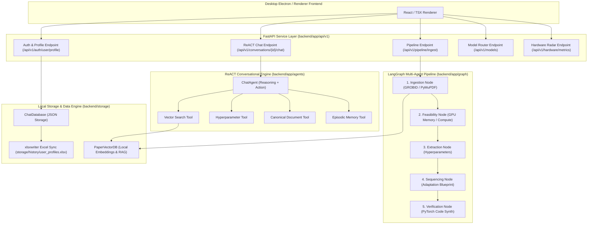
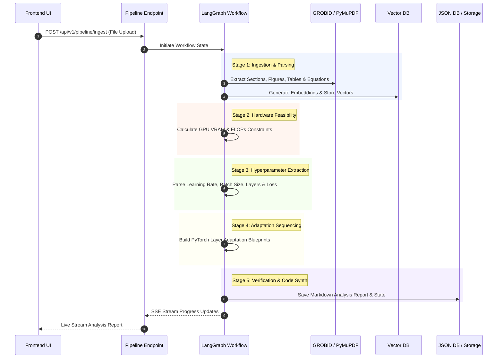

# ⚡ Synthexis — Backend Architecture & API Reference

Welcome to the backend architecture documentation for **Synthexis**. 
This backend is a high-performance **FastAPI** service powered by a **LangGraph** multi-agent pipeline, **GROBID** document structure parser, **FAISS / Local Vector Store**, **ReACT LLM Reasoning Agent**, and an automated **Excel User Profile Sync Engine**.

---

## 🏗️ Architecture Overview

The backend is structured around modular agentic layers:



---

## 🔄 LangGraph 5-Stage Paper Pipeline Sequence

When a research paper (PDF / DOCX) is ingested, the LangGraph workflow executes a 5-stage sequential analysis graph:



---

## 📁 Repository Directory Structure

The backend maintains a clean modular organization using folder-wide relative paths:

```
backend/
├── main.py                          # FastAPI Application Entry Point
├── requirements.txt                 # Python Dependencies
├── app/
│   ├── agents/
│   │   ├── chat_agent.py            # ReACT Reasoning Agent & LLM Prompt Builder
│   │   └── ReAct_parser.py          # Thought/Action/Observation Output Parser
│   ├── api/
│   │   └── v1/
│   │       ├── api_router.py        # Central Router Registry
│   │       └── endpoints/
│   │           ├── auth.py          # User Profile Storage & Excel Export API
│   │           ├── chat.py          # Conversational Agent & History API
│   │           ├── hardware.py      # System GPU/RAM Hardware Telemetry API
│   │           ├── models.py        # Dynamic Local/Cloud LLM Discovery API
│   │           ├── papers.py        # Paper Storage & Markdown Report API
│   │           └── pipeline.py      # LangGraph Ingestion & SSE Pipeline API
│   ├── core/
│   │   ├── config.py                # Environment Settings & System Paths
│   │   ├── database.py              # ChatDatabase & xlsxwriter Excel Exporter
│   │   └── model_router.py          # Ollama & Cloud LLM Router Logic
│   ├── graph/
│   │   ├── state.py                 # LangGraph Pipeline State Definition
│   │   ├── workflow.py              # LangGraph Graph Assembly & Edges
│   │   └── nodes/
│   │       ├── ingestion.py         # Stage 1: Document Parsing Node
│   │       ├── feasibility.py       # Stage 2: Compute & VRAM Estimator Node
│   │       ├── extraction.py        # Stage 3: Parameter Extraction Node
│   │       ├── sequencing.py        # Stage 4: Adaptation Blueprint Node
│   │       └── verification.py      # Stage 5: Code Verification & Report Node
│   ├── retrieval/
│   │   ├── embeddings.py            # Local Vector Embedding Generator
│   │   └── vector_store.py          # PaperVectorDB Index & Search
│   └── tools/
│       ├── base_tool.py             # Agent Tool Abstract Base Class
│       ├── canonical_document_tool.py# Document Hierarchy & Section Tool
│       ├── episodic_memory_tool.py  # Cross-Project Episodic Lessons Tool
│       ├── hyperparameter_tool.py   # Approved Parameter Query Tool
│       └── vector_search_tool.py    # Hybrid RAG Vector Search Tool
└── storage/
    ├── history/
    │   └── user_profiles.xlsx       # Automated User Profile Excel Database
    ├── papers/                      # Uploaded PDF / DOCX Files
    └── db/                          # Local JSON Application Database
```

---

## 🚀 Key Modules & Capabilities

### 1. Persistent Profile & Excel Synchronization (`app/core/database.py`, `app/api/v1/endpoints/auth.py`)
Persists extended developer profile fields (`dob`, `age`, `phoneNumber`, `projectPath`, `ollamaLink`, `avatarId`) into local database storage and auto-exports synchronized spreadsheets to `storage/history/user_profiles.xlsx` via `xlsxwriter`.

### 2. ReACT Agent Reasoning Loop (`app/agents/chat_agent.py`, `app/tools/`)
Executes a Reasoning + Action loop:
- **`THOUGHT:`** Evaluates user intent against retrieved RAG chunks.
- **`ACTION:`** Queries `PaperVectorDB`, `get_hyperparameters`, or `query_episodic_memory`.
- **`OBSERVATION:`** Synthesizes retrieved facts and structural context.
- **`ANSWER:`** Formats clear prose or executable PyTorch code blocks.

### 3. Dynamic Inference Discovery (`app/api/v1/endpoints/models.py`, `app/core/model_router.py`)
Queries local Ollama instance (`http://localhost:11434/api/tags`) and configured cloud providers (Groq, OpenRouter, Gemini) to expose available model engines to the frontend dropdown selector.

---

## 🛠️ Local Setup & Execution

### Prerequisites
- Python 3.10+
- Optional: Local Ollama server running at `http://localhost:11434`
- Optional: GROBID Docker container running at `http://localhost:8070`

### Installation & Launch

1. **Install Dependencies:**
   ```bash
   pip install -r requirements.txt
   ```

2. **Run Backend Service:**
   ```bash
   python main.py
   ```
   *The server runs locally at `http://127.0.0.1:8000`.*

3. **API Documentation:**
   Interactive Swagger documentation is accessible at `http://127.0.0.1:8000/docs`.
