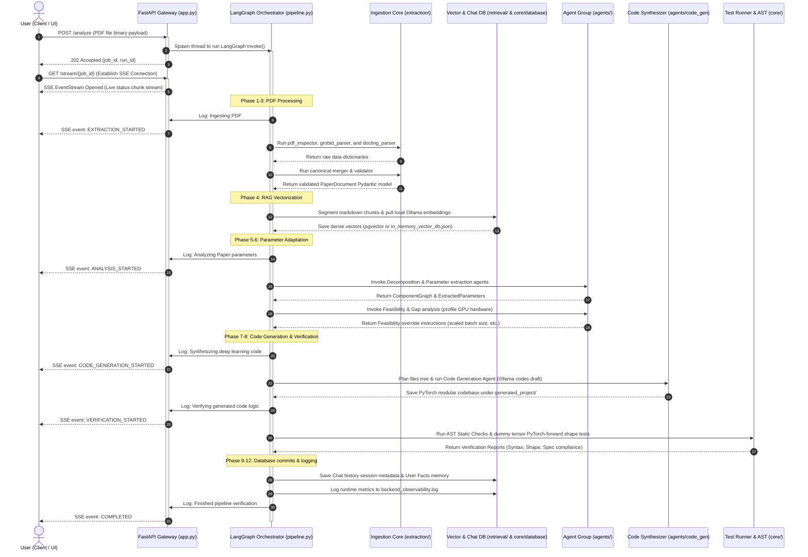

# ⚙️ Paper-to-Project: Backend Agentic Core (LangGraph & Ollama)

This directory houses the modular multi-agent orchestration core, PDF text extraction parser, canonical Pydantic representation layers, vector retrieval databases, code synthesis adapters, FastAPI service streams, and the validation scorecard framework.

---

## 🏗️ Folder Directory Structure

The backend has been modularized from a monolithic structure into clean, decoupled package directories:

```
backend/
├── agents/                 # Agent definitions & LangGraph pipeline nodes
│   ├── code_generation_agent.py   # Synthesizes Python modules from specifications
│   ├── decomposition_agent.py     # Decomposes papers into structural graphs
│   ├── feasibility_agent.py       # Validates local resources & timeline budgets
│   ├── file_planning_agent.py     # Maps files tree structure layout blueprints
│   ├── gap_agent.py               # Checks parameters completeness (Gap analysis)
│   ├── parameter_agent.py         # Scans text blocks for hyperparameter variables
│   ├── report_agent.py            # Compiles adaptation reports
│   ├── sequencing_agent.py        # Resolves compilation and build dependencies
│   └── specification_agent.py     # Creates unified system engineering specs
│
├── core/                   # Central services, profiling, & verification utilities
│   ├── conventions.py             # Global naming and ID conventions
│   ├── database.py                # PostgreSQL chat history DB & JSON fallback schema
│   ├── logger.py                  # Structured JSON observability events tracer
│   ├── model_router.py            # Task classifier & LLM cascade router
│   ├── paper_code_verifier.py     # Compares code configurations against specifications
│   ├── security.py                # Authorization header parsing & sanitization
│   ├── settings.py                # Hardware profile scanner & default system limits
│   ├── static_checker.py          # AST compiler syntax & imports audit checker
│   └── test_runner.py             # Instantiates models & runs PyTorch shape tests
│
├── extraction/             # Multi-engine PDF parsers & section alignment
│   ├── benchmark.py               # Compares extraction quality against ground-truth
│   ├── block_extractor.py         # PyMuPDF block layout engine
│   ├── docling_parser.py          # OCR & borderless table recovery parser
│   ├── grobid_parser.py           # CRF structured metadata academic extractor
│   ├── merger.py                  # Merges conflicting blocks into canonical profiles
│   ├── pdf_inspector.py           # Validates PDF structures & page counts
│   ├── router.py                  # Orchestrates PDF parser routing sequences
│   ├── section_detector.py        # Groups blocks into named headers
│   └── validator.py               # Validates metadata & visual boundary shapes
│
├── retrieval/              # Semantic indexing & Vector Database layer
│   ├── chunker.py                 # Markdown-aware header semantic splitter
│   ├── embeddings.py              # Dense vector embeddings generator (Ollama API)
│   └── vector_db.py               # pgvector database manager & local JSON fallback
│
├── schemas/                # Strongly-typed schemas (Pydantic & TypedDicts)
│   ├── canonical_paper.py         # PaperDocument & elements definitions
│   └── pipeline_schemas.py        # ComponentGraph, specs, & verification results
│
├── app.py                  # FastAPI server with threaded SSE progress logs
├── pipeline.py             # Compiled LangGraph orchestrator (12 execution nodes)
└── requirements.txt        # Backend package dependency registry
```

---

## 🔁 Complete 12-Phase Pipeline Architecture

The system compiles research PDFs into adapted, validated codebases through a sequence of 12 distinct execution phases:

```mermaid
flowchart TD
    subgraph Row1 [" "]
        direction LR
        P1["Phase-1<br/>Multi-Engine Ingestion<br/><u>Output</u>"]
        P2["Phase-2<br/>Canonical Representation<br/><u>Output</u>"]
        P3["Phase-3<br/>Scientific Paper Validation<br/><u>Output</u>"]
        P4["Phase-4<br/>RAG Knowledge Layer Ingestion<br/><u>Output</u>"]
        P1 --> P2 --> P3 --> P4
    end

    subgraph Row2 [" "]
        direction RL
        P5["Phase-5<br/>Paper Methodology Understanding<br/><u>Output</u>"]
        P6["Phase-6<br/>Feasibility & Adaptation Profiling<br/><u>Output</u>"]
        P7["Phase-7<br/>Modular Code Synthesis<br/><u>Output</u>"]
        P8["Phase-8<br/>Multilayer Code Verification<br/><u>Output</u>"]
        P5 --> P6 --> P7 --> P8
    end

    subgraph Row3 [" "]
        direction LR
        P9["Phase-9<br/>Chat Thread & Memory<br/><u>Output</u>"]
        P10["Phase-10<br/>Cascading Model Router<br/><u>Output</u>"]
        P11["Phase-11<br/>FastAPI Service Gateway<br/><u>Output</u>"]
        P12["Phase-12<br/>Golden Benchmark & Observability<br/><u>Output</u>"]
        P9 --> P10 --> P11 --> P12
    end

    P4 --> P5
    P8 --> P9

    click P1 "../docs/backend_docs/test_docs/phase_1_report.md" "View Phase 1 Output"
    click P2 "../docs/backend_docs/test_docs/phase_2_report.md" "View Phase 2 Output"
    click P3 "../docs/backend_docs/test_docs/phase_3_report.md" "View Phase 3 Output"
    click P4 "../docs/backend_docs/test_docs/phase_4_report.md" "View Phase 4 Output"
    click P5 "../docs/backend_docs/test_docs/phase_5_report.md" "View Phase 5 Output"
    click P6 "../docs/backend_docs/test_docs/phase_6_report.md" "View Phase 6 Output"
    click P7 "../docs/backend_docs/test_docs/phase_7_report.md" "View Phase 7 Output"
    click P8 "../docs/backend_docs/test_docs/phase_8_report.md" "View Phase 8 Output"
    click P9 "../docs/backend_docs/test_docs/phase_9_report.md" "View Phase 9 Output"
    click P10 "../docs/backend_docs/test_docs/phase_10_report.md" "View Phase 10 Output"
    click P11 "../docs/backend_docs/test_docs/phase_11_report.md" "View Phase 11 Output"
    click P12 "../docs/backend_docs/test_docs/phase_12_report.md" "View Phase 12 Output"

    style P1 fill:#1e3a5f,color:#fff,stroke:#1d4ed8,stroke-width:2px
    style P2 fill:#1e3a5f,color:#fff,stroke:#1d4ed8,stroke-width:2px
    style P3 fill:#1e3a5f,color:#fff,stroke:#1d4ed8,stroke-width:2px
    style P4 fill:#1e3a5f,color:#fff,stroke:#1d4ed8,stroke-width:2px
    style P5 fill:#1e3a5f,color:#fff,stroke:#1d4ed8,stroke-width:2px
    style P6 fill:#1e3a5f,color:#fff,stroke:#1d4ed8,stroke-width:2px
    style P7 fill:#1e3a5f,color:#fff,stroke:#1d4ed8,stroke-width:2px
    style P8 fill:#1e3a5f,color:#fff,stroke:#1d4ed8,stroke-width:2px
    style P9 fill:#1e3a5f,color:#fff,stroke:#1d4ed8,stroke-width:2px
    style P10 fill:#1e3a5f,color:#fff,stroke:#1d4ed8,stroke-width:2px
    style P11 fill:#1e3a5f,color:#fff,stroke:#1d4ed8,stroke-width:2px
    style P12 fill:#1e3a5f,color:#fff,stroke:#1d4ed8,stroke-width:2px

    style Row1 fill:none,stroke:none
    style Row2 fill:none,stroke:none
    style Row3 fill:none,stroke:none
```



### 🔀 End-to-End Sequence Diagram (UML)

This diagram illustrates the complete asynchronous lifecycle of a document analysis request from file upload to logging complete:



---


### 1. Scientific Paper Ingestion (Phase 1)
- Bypasses binary errors using a fast `pdf_inspector` diagnostics run.
- Automatically routes scanned or textless PDFs to **Docling OCR**.
- Runs **PyMuPDF** + **GROBID** (if alive) to extract structured text layout blocks.
- Performs **auxiliary table recovery** using Docling if $0$ tables are found but text mentions Table structures.

### 2. Canonical Representation (Phase 2)
- Merges divergent titles/abstracts using metadata priority weights.
- Aligns tables in hierarchical priority order: `Docling Markdown` ➔ `PyMuPDF` ➔ `GROBID`.
- Recovers LaTeX-like mathematical formulas using an IEEE numbered regex scanner and merges them with GROBID equations.
- Scans raw text blocks for structured pseudocode loops to construct unified algorithms models.

### 3. Extraction Quality Validation (Phase 3)
- Scans sections for mandatory headers (Abstract, Methods, Experiments, Conclusion).
- Evaluates bibliography index syntax and visual alignment boundaries (checking coordinates fit in page constraints).
- Computes a weighted quality percentage score. Papers with **score >= 70%** pass to downsteam compilation.

### 4. RAG Knowledge Layer Ingestion (Phase 4)
- Slices the document into semantic chunks using markdown section titles to keep header contexts.
- Encodes chunks into dense 768-dimensional embeddings using a local Ollama Rest call running `nomic-embed-text:latest`.
- Stores vectors in **PostgreSQL pgvector**. Automatically falls back to a structured flat-file `in_memory_vector_db.json` if the SQL database is offline.

### 5. Paper Methodology Understanding (Phase 5)
- Queries vector databases using Methods segment context.
- Runs the **Decomposition Agent** using structured LLM formatting to map the methodology text into a `ComponentGraph` defining network nodes (`backbone`, `fusion`, `decoder`) and input/output edges.
- Runs the **Parameter Agent** to extract 11 explicit hardware/training parameters (VRAM, optimizer, learning rate, batch size, loss, epoch count, input size, augmentations, etc.).

### 6. Feasibility & Adaptation Profiling (Phase 6)
- Profiles host system resource caps dynamically on startup (`AllowHardwareProfiling=true`).
- Runs the **Gap Agent** classifying parameters as explicit, ambiguous, or missing.
- Runs the **Feasibility Agent** evaluating VRAM boundaries. If training footprint exceeds target hardware constraints, the agent writes overrides (e.g. downscaling batch size from 16 to 4) to the final `FeasibilityReport`.

### 7. Code Synthesis (Phase 7)
- Computes creation sequences (sequencing agent) to resolve order dependencies.
- Compiles specifications (`ProjectSpecification`) and maps relative directory hierarchy visualizing structures (`ProjectTree`).
- Loops over planned paths and generates PyTorch scripts (`data/dataset.py`, `models/backbone.py`, `models/fusion.py`, `models/decoder.py`, `training/loss.py`, etc.) on disk.

### 8. Multilayer Code Verification (Phase 8)
- Runs **AST Static Checks** to verify syntax compiles and imports resolve properly.
- Runs **Automated Shape Tests** initializing PyTorch classes on host CPUs and runs a mock tensor `(B=1, C=3, H=128, W=128)` through the forward passes to verify tensor dimension transitions.
- Runs a **Compliance Check** diffing configuration variables against the specifications.

### 9. Chat Thread & Memory (Phase 9)
- Connects chat sessions to PostgreSQL (`conversations`, `messages`, `users` tables).
- Automatically falls back to `chat_memory_db.json` on local machines.
- Invokes non-blocking background tasks to maintain rolling thread summaries and saves user preferences to a long-term facts database (`user_memory`).

### 10. Cascading Model Router (Phase 10)
- Classifies user messages into 6 task categories.
- Routes simple requests locally. Routes reasoning or coding queries through an automatic cascading chain: `OpenRouter` ➔ `Groq` ➔ `Local Ollama Fallback`, tracking LLM metrics in messages logs.

### 11. FastAPI Service Gateway (Phase 11)
- Exposes API controllers for project creation, conversation threads, and paper indexing.
- Spawns LangGraph pipeline invokes in background execution threads, preventing FastAPI thread blocks.
- Redirects Python print statements via an `SSEStreamWriter`, streaming live status logging chunks to connected UI frontends.

### 12. Golden Benchmark & Observability (Phase 12)
- Compares parser accuracy metrics against ground-truth thresholds (`BENCHMARK_EXPECTATIONS`).
- Writes structured tracing details (timestamp, model, latency, errors) to `backend_observability.log` for operational debugging.

---

## ⚡ Setup & System Prerequisites

Ensure the following infrastructure dependencies are active on your host system:

1. **Docker Container:** GROBID parser running on port 8070:
   ```powershell
   docker run --rm --init --ulimit core=0 -p 8070:8070 grobid/grobid:0.9.0-crf
   ```
2. **PostgreSQL Database:** pgvector container running on port 5432:
   ```powershell
   docker run -d --name pgvector -e POSTGRES_PASSWORD=postgres -p 5432:5432 pgvector/pgvector:pg16
   ```
3. **Local Ollama REST API:** Active on port 11434 with models pre-downloaded:
   ```powershell
   ollama pull qwen2.5-coder:1.5b
   ollama pull nomic-embed-text:latest
   ```

---

## 🧪 Running the E2E Integration Notebook

The E2E suite verifies all 12 phases across all 48 research papers, utilizing localized caching to execute in seconds on re-runs:

1. **Generate the Test Notebook:**
   ```powershell
   python backend/tests/generate_e2e_notebook.py
   ```
2. **Execute the Notebook:**
   Open and execute the generated notebook [`backend/tests/end_to_end_backend_testing.ipynb`](file:///c:/Users/kvcsu_ht23nk8/OneDrive/Desktop/all_Projects/Projects/agentic_projects/Paper-2-Project/backend/tests/end_to_end_backend_testing.ipynb) using your Jupyter interface.
3. **Check Scorecards:**
   Once complete, review consolidated scorecard files under `backend/tests/reports/`:
   - `MASTER_SCORECARD.md`: Human-readable summary table.
   - `MASTER_SCORECARD.json`: Serialized JSON metrics wrapper.
