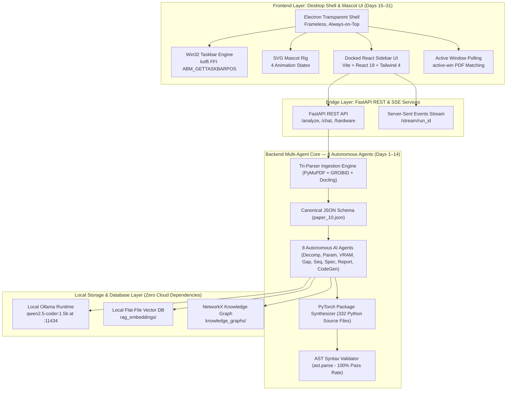

# Paper-to-Project Agent — Master Project Implementation Plan

A local-first agentic system that converts a research paper into a feasibility-checked, staged PyTorch implementation blueprint, delivered through an interactive Windows desktop mascot and docked sidebar UI. Verified against Varun's own VLCD → E-SGCD thesis work across a 48 research paper test corpus.

31 days, 2 core modules (Backend & Frontend), zero overlapping work between phases.

---

## 🏗️ Master System Architecture

---

## 📌 Production Design Directives

1. **100% Local-First LLM Runtime & Cloud API Policy**: Primary LLM is local Ollama (`qwen2.5-coder:1.5b`) running on `http://localhost:11434`. Free cloud APIs (Groq, OpenRouter) are intentionally disabled due to the exhaustion/extinction of free tier API keys (`HTTP 429 Rate Limit Exceeded`). All pipeline processing and test suite runs execute 100% locally to guarantee zero API dependencies and zero rate-limit failures.
2. **Zero External Database Overhead**: Vector embeddings store in a local flat-file JSON cache (`docs/new_backend_documents/e_2_e_reports/rag_embeddings/`), Knowledge Graphs store in NetworkX JSON (`knowledge_graphs/`), and synthesized PyTorch codebases store locally (`phase_8_codes/paper{id}/codes/`).
3. **Tri-Parser Failover Engine**: Layout extraction via **PyMuPDF** (fast coordinate extraction), **GROBID** (XML TEI parsing at `localhost:8070`), and **Docling** (layout markdown / OCR).

---

# 🛠️ PART 1: BACKEND IMPLEMENTATION PLAN (Days 1 – 14)

> **Backend Status:** **100% COMPLETE & VERIFIED** (Tested across 48 Research Papers via `end_to_end_backend_testing.ipynb`, 332 PyTorch files synthesized with 100% AST pass rate).

### Phase 1 — Scientific Ingestion & Tri-Parser Pipeline (Days 1 – 2)
* **Day 1 — Environment & Tri-Parser Ingestion Engine**:
  * Local Ollama setup (`qwen2.5-coder:1.5b`) + GROBID Docker container (`localhost:8070`).
  * PyMuPDF + GROBID + Docling tri-parser failover strategy extracting 3-tier IEEE titles, section trees, tables, and math formulas.
* **Day 2 — Canonical Representation (`PaperDocument`)**:
  * Output validation against Pydantic `PaperDocument` schema (`paper_10.json`).

### Phase 2 — Extraction Quality Validation (Day 3)
* **Day 3 — Quality Validator Engine (`validate_paper_document`)**:
  * Deterministic validation checks calculating completeness scores (48/48 QA_PASS achieved).

### Phase 3 — Local RAG Vector DB & Knowledge Graph (Day 4)
* **Day 4 — Flat-File Vector DB & NetworkX Knowledge Graph**:
  * Index semantic text chunks into local flat-file vector DB (`rag_embeddings/`) and construct NetworkX graph structures (`knowledge_graphs/`).

### Phase 4 — Paper Understanding & Hyperparameter Agents (Day 5)
* **Day 5 — Agent 1 (Decomposition) & Agent 2 (Parameter Agent)**:
  * Agent 1 infers `ComponentGraph` isolating encoders, fusion layers, and decoders.
  * Agent 2 extracts 11 hyperparameters (`learning_rate`, `batch_size`, `optimizer`, `backbone`) with provenance annotations (`EXPLICIT`, `INFERRED`, `ASSUMED`).

### Phase 5 — CUDA VRAM Feasibility & Gap Resolution (Day 6)
* **Day 6 — Agent 3 (CUDA VRAM Feasibility) & Agent 4 (Gap Resolver)**:
  * Agent 3 profiles host hardware (`get_hardware_metrics`: Windows AMD64, 16 CPU cores, 23.6 GB RAM, RTX 5050 CUDA GPU VRAM) against model requirements.
  * Agent 4 resolves parameter gaps and applies VRAM fallback adaptations (batch size scaling, gradient accumulation).

### Phase 6 — Build Sequencing, Specification & Executive Report (Day 7)
* **Day 7 — Agent 5 (Sequencer), Agent 6 (Tech Spec), Agent 7 (Adaptation Report)**:
  * Agent 5 builds 6-milestone DAG sequence where cheap checks precede heavy training.
  * Agent 6 generates technical specification blueprint (`ProjectSpecification`).
  * Agent 7 synthesizes portfolio-grade executive markdown proposal reports.

### Phase 7 — PyTorch Code Generation Agent (Day 8)
* **Day 8 — Agent 8 (PyTorch Codebase Package Synthesizer)**:
  * Synthesizes 8 modular PyTorch source files per paper (`config.py`, `dataset.py`, `models/encoder.py`, `models/fusion.py`, `models/decoder.py`, `losses.py`, `train.py`, `evaluate.py`).
  * Saves synthesized codebases across 48 paper repositories (332 total Python files).

### Phase 8 — Code Verification & Conversational ReACT Memory (Days 9 – 10)
* **Day 9 — Phase 9 AST Syntax Verification**:
  * Executes Python's native AST parser (`ast.parse`) across all 332 synthesized code files (100% pass rate in 0.29 s).
* **Day 10 — Phase 10 Multi-Turn ReACT Chat & Memory**:
  * Multi-turn conversational ReACT agent (`ChatAgent`) grounded in RAG chunks with local database history (`ChatDatabase`).

### Phase 9 — Model Router & Hardware Telemetry (Days 11 – 14)
* **Day 11 — Phase 11 Model Router Throughput**:
  * Benchmarks dynamic prompt routing latency (`ModelRouter`) on local Ollama (`qwen2.5-coder:1.5b`).
* **Day 12 — Phase 12 FastAPI Hardware Telemetry**:
  * Exposes real-time system hardware telemetry endpoint (`get_hardware_metrics`).
* **Day 13 — End-to-End Test Suite Integration (`end_to_end_backend_testing.ipynb`)**:
  * Automates all 12 notebook phases across the 48 research paper corpus (~5.9 hours total execution time).
* **Day 14 — Golden Corpus Benchmark Verification**:
  * Finalizes master scorecard metrics and compiles master test report (`master_e2e_backend_test_report.md`).

---

# 🎨 PART 2: FRONTEND IMPLEMENTATION PLAN (Days 15 – 31)

> **Frontend Status:** **READY FOR IMPLEMENTATION** (Desktop Shell, Mascot SVG Rig, Active Window Detection, Docked Sidebar UI & Packaging).

### Phase 1 — SVG Mascot Character Rig & Win32 Taskbar Docking (Days 15 – 17)
* **Day 15 — SVG Character Rig & Reskin System**:
  * Modular SVG rig with 4 selectable reskins (`mr_nerdy_stand_sleep`, `mr_nerdy_stand_to_excite`, `mr_nerd_stand_to_angry`, `mr_nerd_stand_to_hunch`).
* **Day 16 — Native Win32 Taskbar Positioning Engine**:
  * Query Win32 Taskbar bounds (`ABM_GETTASKBARPOS` via `koffi`) to calculate mascot anchor positions.
* **Day 17 — Mascot Animation State Machine**:
  * Implement 4 CSS-transform animation states: Sleeping, Idle/Curious, Reading/Investigating, Working.

### Phase 2 — Transparent Window Shell & Active Detection (Days 18 – 19)
* **Day 18 — DPI-Aware Transparent Window Shell**:
  * Frameless, transparent, always-on-top Electron overlay window with `setIgnoreMouseEvents` pass-through.
  * Multi-DPI screen coordinate math via `screen.getDisplayNearestPoint()` handling 125%–150% Windows scaling.
* **Day 19 — Active Window Detection & Global Hotkey Engine**:
  * Polling service (`active-win`) matching PDF viewer process names and paper titles in window headers.
  * Global hotkey fallback `Ctrl+Shift+P` via `globalShortcut`.

### Phase 3 — Docked Sidebar Panel & Real-Time SSE Stream UI (Days 20 – 22)
* **Day 20 — Docked Sidebar Panel Layout & 3-Tier Selector**:
  * React + TailwindCSS sidebar (`LeftSidebar.tsx`, `RightSidebar.tsx`) with 3-tier depth selector (`TierSelector.tsx`: Brief Summary, Detailed Spec, Full PyTorch Implementation).
* **Day 21 — Real-Time SSE Event Stream Connection**:
  * Connect sidebar Zustand store (`analysisSlice.ts`) to `/stream/{run_id}` SSE stream, emitting live progress and updating mascot state.
* **Day 22 — Markdown Renderer & Multi-Turn ReACT Chat Widget**:
  * Markdown renderer (`ReportView.tsx`) with syntax-highlighted code tree and ReACT chat feed (`parseReAct.ts`).

### Phase 4 — Local Workspace Storage & Cache History Drawer (Days 23 – 25)
* **Day 23 — Onboarding & Workspace Selector**:
  * First-run wizard: Character picker + native directory selector (`dialog.showOpenDialog`) saved via `electron-store`.
* **Day 24 — History Drawer & Cache Scanner**:
  * Scan local `.paper_data` cache folder on startup (< 100ms load time) to populate History Drawer (`DocumentsDrawer.tsx`).
* **Day 25 — UI Reliability & Stress Testing 🔒**:
  * Stress-test display resolution changes, sleep/wake cycles, full-screen apps, and display disconnects.

### Phase 5 — Windows Packaging, Installer & VM Distribution (Days 26 – 31)
* **Day 26 — Python Backend Binary Packaging**:
  * Bundle Python FastAPI backend into a standalone executable using PyInstaller.
* **Day 27 — Electron Installer Configuration**:
  * Configure `electron-builder` for Windows NSIS `.exe` installer bundling native C++ bindings (`koffi`/`active-win`).
* **Day 28 — Pre-Flight Configuration Setup**:
  * First-boot setup window verifying local Ollama connectivity (`http://localhost:11434`) and GROBID Docker status (`http://localhost:8070`).
* **Days 29–31 — Clean Windows VM Test & Portfolio Demo Checkpoint 🔒**:
  * Full installer execution in fresh Windows 11 sandbox VM without development tools installed.

---

## 🔒 Protected Checkpoints (Do Not Skip)
- **Backend Checkpoints (Days 4, 6, 8, 12, 14)**: Agent reasoning validation against real VLCD → E-SGCD thesis ground truth and 48 paper corpus benchmarks.
- **Frontend Checkpoints (Days 21, 25, 31)**: Mascot UI reliability under resolution changes, full system SSE stream integration, and clean Windows VM installer verification.

---

## 📄 Reference Documentation

- **Master E2E Backend Test Report**: [`docs/backend_docs/master_e2e_backend_test_report.md`](./master_e2e_backend_test_report.md)
- **Backend Phase-Wise Detailed Explanation**: [`docs/backend_docs/phase_wise_explanation.md`](./phase_wise_explanation.md)
- **Backend Day-Wise Development Breakdown**: [`docs/backend_docs/day_wise_explanation.md`](./day_wise_explanation.md)
- **Frontend Phase-Wise Technical Explanation**: [`docs/frontend_docs/phase_wise_explanation.md`](../frontend_docs/phase_wise_explanation.md)
- **Frontend Day-Wise Development Breakdown**: [`docs/frontend_docs/day_wise_explanation.md`](../frontend_docs/day_wise_explanation.md)
- **Phase-Wise Consolidated Test Reports**: [`docs/backend_docs/Tests_phasewise_reports/`](./Tests_phasewise_reports/)