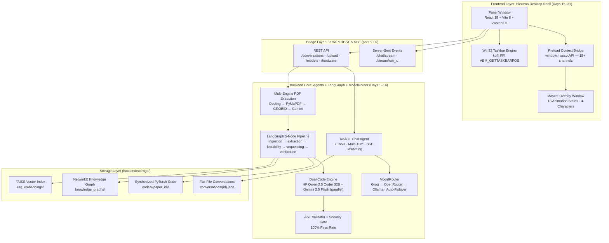

# RUEXIS AI — Master Project Implementation Plan

> **Project Name:** RUEXIS AI (**R**esearch, **U**nderstand, **E**xtract, e**X**amine, **I**mplement, **S**ynthesize)  
> **Concept:** A local-first, fully agentic desktop application that converts any scientific research PDF into a feasibility-checked, staged PyTorch implementation — delivered through a multi-provider AI chat interface and an animated desktop mascot companion.  
> **Status:** ✅ Backend 100% Complete & Verified · ✅ Frontend v2.0 Live

31 days · 2 core modules (Backend & Frontend) · 48-paper test corpus · 332 PyTorch files synthesized · 100% AST pass rate

---

## 🏗️ Master System Architecture (v2.0)

---

## 📌 v2.0 Design Principles

1. **Multi-Provider Inference with Auto-Failover** — Chat uses Groq (Qwen 3.8 27B, GPT-OSS 120B), OpenRouter (Gemini 2.5 Flash, DeepSeek R1), and Local Ollama. `ModelRouter` auto-retries next provider on HTTP 429. Frontend `ModelSelector` syncs to the actual model used via `failover_model` in the SSE `done` event.

2. **Backend-Exclusive Dual Code Engine** — PyTorch synthesis runs Hugging Face `Qwen/Qwen2.5-Coder-32B-Instruct` and `gemini-2.5-flash` in parallel (async). Both outputs are AST-validated and security-checked; the best passes forward. Isolated from chat model quota.

3. **Zero External Database** — All persistence is flat-file JSON in `backend/storage/`: conversations, RAG embeddings, knowledge graphs, synthesized code, user profile, telemetry.

4. **LangGraph Autonomous Pipeline** — 5-node `StateGraph` (ingestion → extraction → feasibility → sequencing → verification) runs fully autonomously on paper upload. Live progress is streamed via SSE to the mascot and panel.

5. **4-Character Mascot · 13 Animation States** — Sprite Canvas engine drives `mr_nerdy`, `ms_nerdy`, `mr_nerd`, `ms_nerd` with 13 states synchronized to every backend event in real time.

---

# 🛠️ PART 1: BACKEND (Days 1 – 14)

> **Status: ✅ 100% COMPLETE & VERIFIED** — 48-paper corpus · 332 PyTorch files · 100% AST pass rate · All 12 test phases PASS

---

### Phase 1 — Multi-Engine PDF Extraction (Days 1–2)

**Day 1 — Package Foundation & Multi-Engine Parser**
- Modular package layout: `app/core/`, `app/schemas/`, `app/extraction/`, `app/retrieval/`, `app/agents/`, `app/api/`, `app/providers/`, `app/graph/`, `app/tools/`
- Multi-provider config: Groq, OpenRouter, Gemini, HuggingFace, Ollama — each with `has_*()` availability checks and hot-reload from `.env`
- Multi-engine extraction: **Docling** (primary) → **PyMuPDF** (fallback) → **Gemini** (complex PDFs) · Optional **GROBID** at `localhost:8070`
- `merger.py` — reconciles multi-parser outputs into canonical JSON

**Day 2 — Canonical Paper Representation**
- Pydantic `PaperDocument` schema validation (sections, tables, figures, equations)
- MD5 hash deduplication on upload
- `validator.py` — completeness scoring → `QA_PASS` / `QA_PARTIAL` / `QA_FAIL`

---

### Phase 2 — RAG & Knowledge Graph (Days 3–4)

**Day 3 — Quality Validation**
- `validate_paper_document` — deterministic checks: 48/48 QA_PASS (6.33 s)

**Day 4 — FAISS Vector Index & NetworkX Knowledge Graph**
- `chunker.py` — overlapping paragraph-boundary chunks, equations/tables atomic
- `embeddings.py` — sentence-transformer dense vectors → FAISS index per paper
- `PaperKnowledgeGraph` — entity + relationship extraction → `storage/knowledge_graphs/{paper_id}_kg.json`

---

### Phase 3 — LangGraph 5-Node Autonomous Pipeline (Days 5–7)

**Day 5 — Pipeline Architecture + IngestionAgent + ParameterAgent**
- `app/graph/workflow.py` — `StateGraph` with shared `PipelineState`
- `IngestionAgent` — loads canonical JSON into state
- `ParameterAgent` — extracts 11 hyperparameters with provenance (`EXPLICIT` / `INFERRED` / `ASSUMED`)

**Day 6 — FeasibilityAgent + GapAgent + SequencingAgent**
- `FeasibilityAgent` — queries `GET /hardware/metrics` → VRAM score → `FEASIBLE` / `FEASIBLE_WITH_MODIFICATION` / `NOT_FEASIBLE`
- `GapAgent` — resolves missing/ambiguous params with fallback heuristics (batch size scaling, gradient accumulation, mixed precision)
- `SequencingAgent` — ordered 6-milestone `BuildSequence` DAG

**Day 7 — SpecificationAgent + ReportAgent**
- `SpecificationAgent` — `ProjectSpecification` (architecture, data loaders, loss functions, scaled hyperparams)
- `ReportAgent` — portfolio-grade Markdown executive proposal

---

### Phase 4 — Dual Code Engine & AST Verification (Day 8–9)

**Day 8 — CodeGenAgent + Dual Code Engine**
- `dual_code_engine.py` — async parallel synthesis:
  - **Engine A**: `Qwen/Qwen2.5-Coder-32B-Instruct` via HuggingFace (idiomatic PyTorch specialist)
  - **Engine B**: `gemini-2.5-flash` via Gemini API (paper context + mathematical precision)
- Merge logic: AST validate + security blocklist → best output wins
- Output: 8 modular PyTorch files (`config.py`, `dataset.py`, `models/encoder.py`, `models/fusion.py`, `models/decoder.py`, `losses.py`, `train.py`, `evaluate.py`)
- 332 total Python files across 48 repositories (7,588.83 s)

**Day 9 — AST Verification Gate**
- `ast.parse()` + security blocklist (`os.system`, `eval`, `exec`, `subprocess.run`, `__import__`)
- 100% pass rate across 332 files (0.29 s)

---

### Phase 5 — ReACT Chat Agent & Tools (Day 10)

**Day 10 — ChatAgent + 7-Tool ReACT Loop + SSE Streaming**
- `ChatAgent.process_message_stream()` — async generator, up to 5 ReACT turns
- 7 tools: `arxiv_search`, `scholar_search`, `vector_search`, `graph_search`, `canonical_document`, `hyperparameter_tool`, `episodic_memory`
- `context_builder.py` — merges user facts + hyperparams + episodic memory + chat history
- `smart_titler.py` — generates 3–5 word conversation title on first message
- SSE events: `status`, `thought`, `action`, `observation`, `token`, `done`, `error`

---

### Phase 6 — ModelRouter, Quota Tracker & API Layer (Days 11–14)

**Day 11 — ModelRouter + 4 Provider Adapters + Quota Tracker**
- `model_router.py` — Groq → OpenRouter → Ollama priority dispatch
- `groq_adapter.py`, `openrouter_adapter.py`, `hf_adapter.py`, `ollama_adapter.py`
- `quota_tracker.py` — rolling 1-min / 60-min / 24-hr windows per provider
- `limits_dashboard.py` — HTML UI at `/limits-dashboard` + JSON at `/models/limits`

**Day 12 — FastAPI Hardware Telemetry**
- `GET /hardware/metrics` — `psutil` (CPU/RAM) + `nvidia-smi` (VRAM) → platform, cores, usage, VRAM free

**Day 13 — End-to-End Test Suite**
- `end_to_end_backend_testing.ipynb` — 12 notebook phases across 48-paper corpus (~5.9 hours)
- All phases PASS · Master scorecard: `Tests_phasewise_reports/master_scorecard.json`

**Day 14 — Full API Layer**
- Auth, Chat/Conversations, Papers/Upload, Pipeline/Stream, Models, Hardware, Telemetry routers
- `POST /conversations/{id}/chat/stream` — primary streaming endpoint
- `GET /stream/{run_id}` — pipeline SSE with mascot-state signals

---

# 🎨 PART 2: FRONTEND (Days 15 – 31)

> **Status: ✅ COMPLETE** — Two-window Electron app · React 19 + Zustand 5 · 4-character mascot · 13 animation states · Multi-provider model selector · Live quota dashboard

---

### Phase 1 — Electron Shell & Mascot Engine (Days 15–17)

**Day 15 — Two-Window Architecture & Backend Auto-Spawn**
- `createPanelWindow()` (1100×900) + `createMascotWindow()` (125×150 transparent overlay)
- `checkBackendReady()` — polls `:8000` every 500 ms → spawns `python main.py` if not running

**Day 16 — Win32 Taskbar Detection & DPI Positioning**
- `koffi` FFI → `SHAppBarMessage(ABM_GETTASKBARPOS)` → taskbar edge detection
- `positionMascotDefault()` — `scaleFactor`-aware placement at bottom-right of `workArea`
- Multi-monitor: `screen.on('display-metrics-changed')` re-anchors mascot

**Day 17 — Sprite Animation Engine & State Machine (13 States)**
- Canvas 2D sprite renderer — horizontal frame sheets per state per character
- 4 characters × 13 states: `standing`, `blink`, `wave`, `thinking`, `hunch`, `catching`, `excite`, `tired`, `having_sipping`, `sleep`, `angry`, `confused`, `peeking`
- Transitions driven by backend SSE → IPC → `mascot.js`
- Skin persistence via `electron-store`

---

### Phase 2 — IPC Bridge & File Upload (Days 18–19)

**Day 18 — Preload Context Bridge (`preload.js`)**
- `contextBridge.exposeInMainWorld('mascotAPI', {...})` — 15+ secure IPC channels
- Send methods, invoke methods, event listener registrations — fully typed

**Day 19 — File Upload & Pipeline Orchestration**
- Immediate path: mascot drop → `upload-pdf` IPC → `runPipelineOrchestrator()`
- Staged path: `open-file-selector` → `file-staged` → user sends → `trigger-upload` → pipeline

---

### Phase 3 — React Renderer UI (Days 20–22)

**Day 20 — Root Store & Panel Shell**
- `panelStore.ts` — 6-slice Zustand composition: `UI + Profile + Chat + Hardware + DocumentHistory + Analysis`
- `Panel.tsx` — root orchestrator: `initIpcListeners()`, drag state, staged file, chat input

**Day 21 — Zustand Slices**
- `chatSlice` — conversations, SSE stream parser, auto-failover model sync, `refresh-model-limits` dispatch
- `analysisSlice` — 5-milestone pipeline status, upload, code generation, IPC wiring
- `profileSlice` — API keys + Ollama link persisted to `localStorage` + backend
- `hardwareSlice` — hardware metrics polling · `themeStore` — 4-mode theme system (l1/l2/l3/d)

**Day 22 — All Components**
- Layout: `Header`, `LeftSidebar`, `RightSidebar`, `MascotBox`, `ChatHistoryList`, `DocumentHistoryList`
- Chat: `MessageFeed`, `MessageBubble`, `ChatInputArea`, `ReActStepsAccordion`, `parseReAct.ts`
- Analysis: `MilestoneTracker`, `ReportView`, `ParameterConfigForm`, `PdfViewerPage`, `ImplementationTabs`
- Profile: `UserProfile`, `ApiKeysConfigSection`, `OllamaConfigSection`, `ModelLimitsSection`, `ProviderQuotaCard`, `MascotSelector`
- UI: `ModelSelector`, `DropZone`, `DragDropOverlay`, `TierSelector`, `Icons`, `Tooltip`

---

### Phase 4 — SSE Streaming, Failover & Quota (Days 23–24)

**Day 23 — Chat SSE Stream Parser**
- `createSseParser` — handles all 7 event types + JSON-wrapped legacy format + `AbortController` abort on conv switch

**Day 24 — Model Failover Sync & Quota Dashboard**
- `resolveFailoverModelId()` → `setSelectedModel()` → `ModelSelector` ticks correct model
- `ProviderQuotaCard` — live rpm/rpd usage from `GET /models/limits`, refreshed after every chat completion

---

### Phase 5 — Design System & Production Build (Days 25–28)

**Day 25 — Design System (`index.css`)**
- CSS custom property system: bg, text, border, accent, status tokens
- 4 theme modes via body class toggling · IBM Plex Mono / Public Sans / Source Serif 4

**Day 26–28 — API/Schema Layer + Production Build**
- `config/api.ts` — `getApiBase()` resolves to `http://localhost:8000/api/v1` in Electron & Vite
- `schemas/api.ts` — Zod parse functions for all backend responses
- `constants/models.ts` — `FALLBACK_GROQ`, `FALLBACK_OPENROUTER`, `resolveFailoverModelId()`
- Production: `npm run build` in renderer → `dist/` loaded by Electron `main.js`

---

### Phase 6 — Testing & Verification (Days 29–31)

**Days 29–31 — Frontend Integration Testing**
- All IPC channels verified (mascot state, skin switch, file upload, panel toggle)
- SSE stream parser tested against all 7 event types
- Theme system tested across all 4 modes
- Model failover sync verified end-to-end
- Quota dashboard refresh verified after each chat completion

---

## 📊 Backend Verification Scorecard

| Phase | Component | Corpus | Status | Time |
|-------|-----------|--------|--------|------|
| 1 | PDF Extraction (Docling + PyMuPDF + GROBID + Gemini) | 48 PDFs | **PASS** | 1,679.59 s |
| 2 | Canonical Schema (`PaperDocument`) | 48 JSONs | **PASS** | 0.37 s |
| 3 | Quality Validation | 48 Papers | **PASS** | 6.33 s |
| 4 | FAISS RAG + NetworkX KG | 48 Papers | **PASS** | 4.88 s |
| 5 | ParameterAgent + DecompositionAgent | 48 Papers | **PASS** | 8,284.86 s |
| 6 | FeasibilityAgent + GapAgent | 48 Papers | **PASS** | 465.54 s |
| 7 | SequencingAgent + SpecAgent + ReportAgent | 48 Papers | **PASS** | 1,578.33 s |
| 8 | CodeGenAgent + Dual Code Engine | 48 Papers | **PASS** | 7,588.83 s |
| 9 | AST Verification (332 files) | 332 Files | **PASS** | 0.29 s |
| 10 | ReACT ChatAgent + 7 Tools | 48 Papers | **PASS** | 1,631.38 s |
| 11 | ModelRouter + 4 Adapters | 3 Prompts | **PASS** | 13.87 s |
| 12 | Hardware Telemetry | System | **PASS** | 0.09 s |

---

## 📁 Reference Documentation

| Doc | Location |
|-----|----------|
| Backend API & Architecture | [`backend/README.md`](../backend/README.md) |
| Renderer State & Components | [`frontend/renderer/README.md`](../frontend/renderer/README.md) |
| Electron Shell & IPC | [`frontend/electron_app/README.md`](../frontend/electron_app/README.md) |
| Backend Day-Wise Explanation | [`docs/backend_docs/backend_day_wise_explanation.md`](./backend_docs/backend_day_wise_explanation.md) |
| Backend Commands & Setup | [`docs/backend_docs/backend_commands.md`](./backend_docs/backend_commands.md) |
| Complete Backend File Guide | [`docs/backend_docs/complete_backend_guide.md`](./backend_docs/complete_backend_guide.md) |
| Frontend Day-Wise Explanation | [`docs/frontend_docs/day_wise_explanation.md`](./frontend_docs/day_wise_explanation.md) |
| Frontend Commands & Setup | [`docs/frontend_docs/frontend_commands.md`](./frontend_docs/frontend_commands.md) |
| Complete Frontend File Guide | [`docs/frontend_docs/complete_frontend_guide.md`](./frontend_docs/complete_frontend_guide.md) |
| Master E2E Test Report | [`docs/backend_docs/master_e2e_backend_test_report.md`](./backend_docs/master_e2e_backend_test_report.md) |
| Phase Test Reports | [`docs/backend_docs/Tests_phasewise_reports/`](./backend_docs/Tests_phasewise_reports/) |
