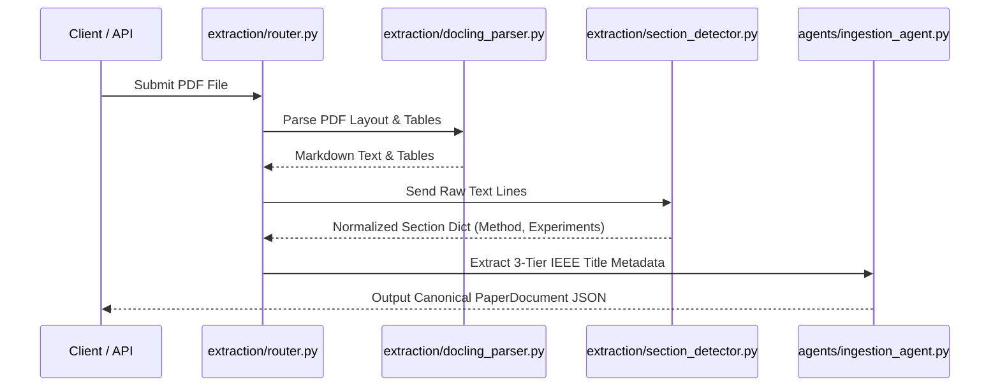
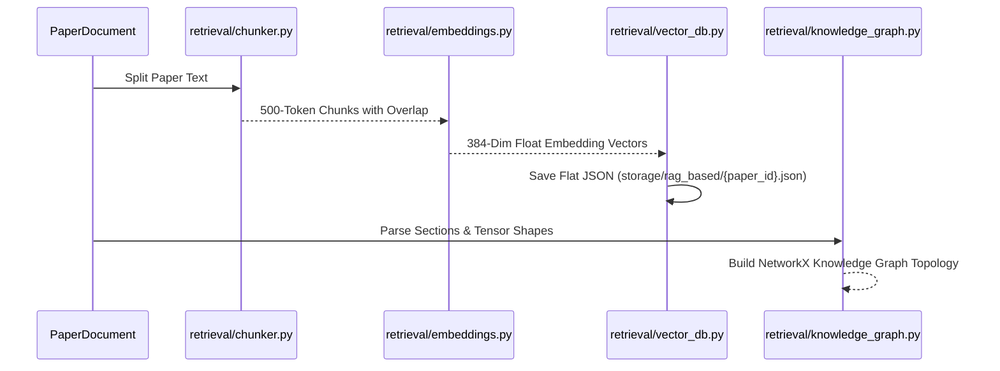
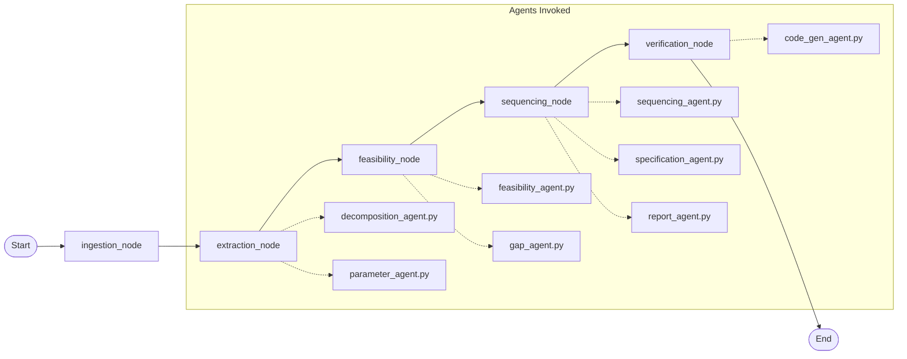
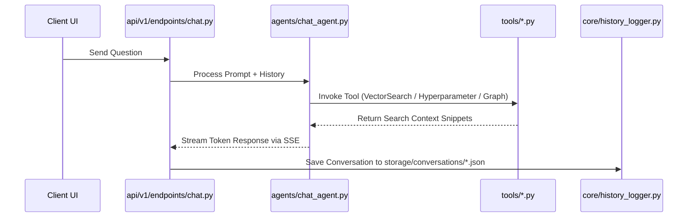
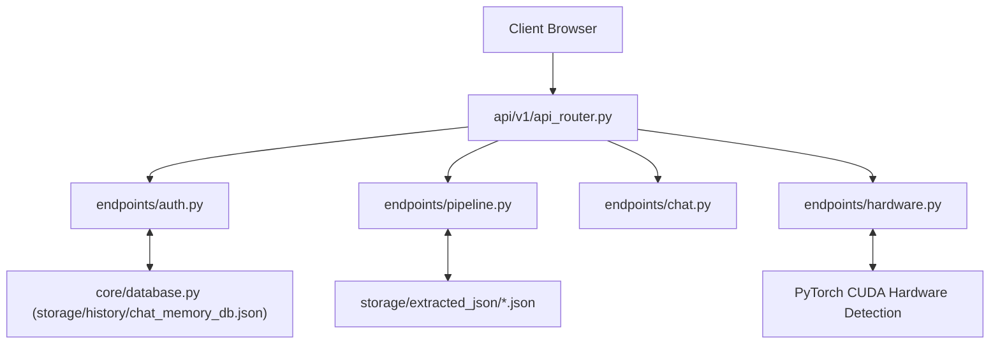

# 📖 Complete Backend Reference Guide: 3-Part Technical Breakdown

This document is divided into **3 explicit sections** as requested:

1. **SECTION 1: Individual Explanations for Every Single `.py` File** (All 74 Python files in `backend/app/`).
2. **SECTION 2: Flow-Based Grouping & Sequential Execution Breakdown** (Step-by-step pipeline flows).
3. **SECTION 3: Exact Input & Output Specifications for Every Component**.

> 💡 **YES! The Canonical Document (`PaperDocument`) IS sent directly to the LLM across agents**:
> - **In Ingestion (`ingestion_agent.py`)**: The PDF is parsed into the canonical `PaperDocument` with title, authors, abstract, and section hierarchy (`I. INTRODUCTION`, `III. METHOD`, `IV. EXPERIMENTS`).
> - **In Agent 1 (`decomposition_agent.py`)**: Passes canonical `PaperDocument.sections["III. METHOD"]` (first 3,000 chars) and `IV. EXPERIMENTS` (first 1,000 chars) directly into the LLM prompt.
> - **In Agent 2 (`parameter_agent.py`)**: Passes canonical `PaperDocument.raw_full_text` (first 4,000 chars) and section text into the LLM prompt.
> - **In Multi-Turn Chat (`chat_agent.py` & `canonical_document_tool.py`)**: The ReACT agent reads un-truncated sections directly from the stored canonical document JSON (`storage/extracted_json/{paper_id}.json`).

---


# SECTION 1: Individual Explanations for Every `.py` File

Below is the complete, file-by-file breakdown of all 74 Python files in `backend/app/`.

---

### 📁 Root Application Module (`app/`)

#### 1. `app/__init__.py`
- **What it does:** Marks `app` as a Python package directory.
- **Input:** N/A
- **Output:** N/A

---

### 📁 Core Infrastructure (`app/core/`)

#### 2. `app/core/__init__.py`
- **What it does:** Package initializer for core utilities.
- **Input:** N/A
- **Output:** N/A

#### 3. `app/core/config.py`
- **What it does:** System settings module powered by Pydantic `BaseSettings`. Defines environment variables, system directory paths (`STORAGE_DIR`, `PAPERS_DIR`, `HISTORY_DIR`), default LLM model (`qwen2.5-coder:1.5b`), and host URLs.
- **Input:** `.env` file or environment variables.
- **Output:** Global `settings` object containing immutable system parameters.

#### 4. `app/core/database.py`
- **What it does:** 100% flat-file local JSON database engine (`ChatDatabase`). Manages user accounts (`users`), project metadata (`projects`), facts, and episodic run history.
- **Input:** JSON database file (`storage/history/chat_memory_db.json`).
- **Output:** Serialized JSON records for users, projects, and chat sessions.

#### 5. `app/core/history_logger.py`
- **What it does:** Persists multi-turn chat conversation streams to disk.
- **Input:** Paper ID, user prompt string, agent response text, timestamp.
- **Output:** Saved JSON conversation file (`storage/conversations/{paper_id}_messages.json`).

#### 6. `app/core/model_router.py`
- **What it does:** Multi-provider LLM abstraction layer (`ModelRouter`). Tries local Ollama (`qwen2.5-coder:1.5b`) first; automatically falls back to Groq or OpenRouter if local Ollama fails.
- **Input:** Prompt string, optional model ID, temperature, JSON format flag.
- **Output:** Tuple of `(generated_text_response, model_name_used)`.

#### 7. `app/core/security.py`
- **What it does:** Authentication security helper. Performs bcrypt password hashing, password verification, and JWT Bearer token encoding/decoding.
- **Input:** Plaintext password or JWT token string.
- **Output:** Password hash or decoded user payload dictionary.

#### 8. `app/core/tracer.py`
- **What it does:** Real-time telemetry logger (`AgentTracer`). Logs pipeline node execution times, success/failure status, and model metrics for live UI streams.
- **Input:** Paper ID, step name, status, duration in ms, model name.
- **Output:** Appended telemetry events in `storage/telemetry.json`.

---

### 📁 Data Schemas & Contracts (`app/schemas/`)

#### 9. `app/schemas/__init__.py`
- **What it does:** Package initializer for schema models.

#### 10. `app/schemas/canonical_paper.py`
- **What it does:** Defines standard Pydantic models for ingested research papers: `PaperDocument`, `Section`, `Table`, `Figure`, `BibEntry`.
- **Input:** Dict data from PDF parser.
- **Output:** Validated paper data structure.

#### 11. `app/schemas/chat.py`
- **What it does:** Defines API contracts for multi-turn chat interaction: `ChatRequest`, `ChatMessage`, `ChatResponse`.
- **Input:** HTTP POST request payload.
- **Output:** Validated chat request/response models.

#### 12. `app/schemas/paper.py`
- **What it does:** Defines PDF ingestion metadata schemas (`PaperMetadata`).
- **Input:** Paper title, author list, abstract string.
- **Output:** Standard metadata object.

#### 13. `app/schemas/pipeline.py`
- **What it does:** Core data contracts for the multi-agent pipeline:
  - `ParameterDetails` (`value`, `confidence`, `status`, `rationale`, `source_section`)
  - `ExtractedParameters` (primary & open-ended `custom_parameters` dictionary)
  - `Component` & `ComponentGraph` (`components`, `edges`)
  - `FeasibilityReport` (`overall_status`, `estimated_vram_gb`, `available_vram_gb`, `bottlenecks`, `suggested_adaptations`)
  - `BuildSequenceStep` & `BuildSequence` (`steps`, `total_steps`)
- **Input:** Dict outputs from pipeline agents.
- **Output:** Strongly-typed Pydantic pipeline objects.

#### 14. `app/schemas/pipeline_schemas.py`
- **What it does:** Legacy Pydantic models for milestone build sequences and project outputs.
- **Input:** Pipeline milestone data.
- **Output:** Validated milestone objects.

#### 15. `app/schemas/rag_schemas.py`
- **What it does:** Data contracts for vector RAG search queries and similarity results.
- **Input:** Similarity search results.
- **Output:** `VectorSearchResult` objects.

---

### 📁 Ingestion & Document Parsing (`app/extraction/`)

#### 16. `app/extraction/__init__.py`
- **What it does:** Package initializer for document extraction engines.

#### 17. `app/extraction/block_extractor.py`
- **What it does:** Segregates raw page content into categorized blocks (text paragraphs, math equations, tables, figure captions).
- **Input:** Page layout objects from PDF parser.
- **Output:** List of `Block` objects with coordinates.

#### 18. `app/extraction/docling_parser.py`
- **What it does:** Primary PDF parser engine using Docling (`DoclingParser`). Includes `doc=result.document` export fix to prevent warning noise.
- **Input:** PDF file path string (`.pdf`).
- **Output:** Parsed `PaperDocument` with text, markdown tables, and section headings.

#### 19. `app/extraction/grobid_client.py`
- **What it does:** HTTP client interface for sending PDF files to local Grobid Docker container (`localhost:8070`).
- **Input:** PDF binary file buffer.
- **Output:** TEI XML response string.

#### 20. `app/extraction/grobid_parser.py`
- **What it does:** Parses Grobid TEI XML into structured document sections and author metadata.
- **Input:** TEI XML string.
- **Output:** `PaperDocument` instance.

#### 21. `app/extraction/merger.py`
- **What it does:** Merges and deduplicates parsed outputs from multiple engines (Docling + PyMuPDF + Grobid).
- **Input:** List of partial `PaperDocument` instances.
- **Output:** Single merged `PaperDocument`.

#### 22. `app/extraction/pdf_inspector.py`
- **What it does:** Validates PDF magic bytes, page counts, font layers, and corruption status.
- **Input:** PDF file path.
- **Output:** Inspection report dictionary (`is_valid`, `page_count`, `has_text`).

#### 23. `app/extraction/pdf_parser.py`
- **What it does:** Base parser interface and abstract class for all PDF parsing backends.
- **Input:** PDF file path.
- **Output:** Unstructured page text list.

#### 24. `app/extraction/pymupdf_parser.py`
- **What it does:** High-speed fallback PDF parser using PyMuPDF (`fitz`).
- **Input:** PDF file path.
- **Output:** Page-by-page text dictionary and bounding box coordinates.

#### 25. `app/extraction/router.py`
- **What it does:** Parser selection router (`PDFParserRouter`). Checks PDF complexity and routes to Docling, Grobid, or PyMuPDF.
- **Input:** PDF file path.
- **Output:** Best parsed `PaperDocument`.

#### 26. `app/extraction/section_detector.py`
- **What it does:** Classifies paper section headings using regex numerals (`I.`, `II.`, `III.`) and heuristics (`Abstract`, `Method`, `Experiments`).
- **Input:** Raw text lines or blocks.
- **Output:** Normalized section dictionary mapping canonical keys to content strings.

#### 27. `app/extraction/validator.py`
- **What it does:** Quality assurance validator for parsed paper JSON files.
- **Input:** `PaperDocument` instance.
- **Output:** QA report dict with completeness score.

---

### 📁 Retrieval & Knowledge Layer (`app/retrieval/`)

#### 28. `app/retrieval/__init__.py`
- **What it does:** Package initializer for retrieval modules.

#### 29. `app/retrieval/chunker.py`
- **What it does:** Overlapping sliding-window chunker (`PaperChunker`). Splits paper text into sentence-aware token chunks.
- **Input:** `PaperDocument` instance.
- **Output:** List of `PaperChunk` objects with section metadata.

#### 30. `app/retrieval/embeddings.py`
- **What it does:** Generates local 384-dimensional vector embeddings using `sentence-transformers` (`all-MiniLM-L6-v2`).
- **Input:** Text query or chunk content string.
- **Output:** List of float vector embeddings (`List[float]`).

#### 31. `app/retrieval/knowledge_graph.py`
- **What it does:** In-memory Knowledge Graph manager (`PaperKnowledgeGraph`). Builds NetworkX directed graphs representing section hierarchies and tensor shape nodes.
- **Input:** Parsed paper JSON file.
- **Output:** Graph node topologies and tensor data flow paths.

#### 32. `app/retrieval/vector_db.py`
- **What it does:** Flat-file JSON vector database manager (`PaperVectorDB`). Stores embeddings in `storage/rag_based/{paper_id}.json` and performs local NumPy cosine similarity & BM25 hybrid search.
- **Input:** Paper chunks and vector embeddings.
- **Output:** Relevant text snippets with similarity scores.

---

### 📁 Multi-Agent Intelligence Suite (`app/agents/`)

#### 33. `app/agents/__init__.py`
- **What it does:** Package initializer for backend agents.

#### 34. `app/agents/chat_agent.py`
- **What it does:** Multi-turn ReACT conversational agent for paper Q&A. Evaluates user intent, executes search tools, and formats natural language responses.
- **Input:** User prompt, paper ID, chat history.
- **Output:** Agent response text with grounded citations.

#### 35. `app/agents/code_gen_agent.py` (Agent #8)
- **What it does:** Dynamic PyTorch package synthesizer. Determines required files (`config.py`, `dataset.py`, `models/encoder.py`, `models/fusion.py`, `models/decoder.py`, `losses.py`, `train.py`, `evaluate.py`), generates source code, and validates Python syntax via `ast.parse()`.
- **Input:** Component name, `ExtractedParameters`, `ComponentGraph`.
- **Output:** Codebase synthesis dict (`total_files`, `total_loc`, `codebase_files`, `ast_validations`).

#### 36. `app/agents/decomposition_agent.py` (Agent #1)
- **What it does:** RAG-grounded architectural component graph decomposition. Queries RAG vector DB for method evidence and extracts `ComponentGraph` (`encoder`, `fusion`, `decoder`, `loss`) with resolved data flow edges.
- **Input:** Parsed sections dict, `PaperDocument`.
- **Output:** `ComponentGraph` object.

#### 37. `app/agents/feasibility_agent.py` (Agent #3)
- **What it does:** VRAM memory footprint & hardware constraint checker. Detects local CUDA GPU memory and computes peak VRAM footprint ($\text{VRAM} = \text{Weights} + \text{Activations} + \text{AdamW States}$) against GPU bounds.
- **Input:** `ComponentGraph`, hardware constraints dict, `ExtractedParameters`.
- **Output:** `FeasibilityReport` object.

#### 38. `app/agents/gap_agent.py` (Agent #4)
- **What it does:** Autonomous Tavily Web Search & GitHub REST API search gap resolver. Discovers missing code implementation parameters and classifies gaps (`EXPLICIT`, `DERIVABLE`, `MISSING`, `AMBIGUOUS`).
- **Input:** `ComponentGraph`, `ExtractedParameters`, paper title.
- **Output:** Gap report dictionary.

#### 39. `app/agents/ingestion_agent.py`
- **What it does:** Paper ingestion orchestrator featuring a 3-tier IEEE title metadata extractor. Runs PDF parser, extracts title/abstract, and creates local vector index.
- **Input:** PDF file path.
- **Output:** Canonical `PaperDocument`.

#### 40. `app/agents/parameter_agent.py` (Agent #2)
- **What it does:** 100% dynamic open-ended hyperparameter extractor. Collects ALL experimental parameters (`LR`, `batch_size`, `optimizer`, `loss`, `weight_decay`, `warmup_epochs`, `spatial_resolution`, `hardware_gpu`) with status confidence ratings.
- **Input:** `PaperDocument` or paper raw text.
- **Output:** `ExtractedParameters` object.

#### 41. `app/agents/report_agent.py` (Agent #7)
- **What it does:** Executive Markdown & JSON proposal report compiler. Generates proposal reports with component registries, feasibility profiles, cloud scaling guides, and file roadmaps.
- **Input:** Paper title, `ComponentGraph`, `FeasibilityReport`, `BuildSequence`, `ExtractedParameters`.
- **Output:** Proposal report dictionary with Markdown string.

#### 42. `app/agents/sequencing_agent.py` (Agent #5)
- **What it does:** DAG component build sequence order planner. Enforces the rule that cheap data/config modules MUST precede compute-heavy model training steps.
- **Input:** `ComponentGraph`, `FeasibilityReport`.
- **Output:** `BuildSequence` object.

#### 43. `app/agents/specification_agent.py` (Agent #6)
- **What it does:** Formal technical specification blueprint compiler. Compiles target requirements, architecture flow, component lists, and file tree maps.
- **Input:** `ComponentGraph`, `FeasibilityReport`, `BuildSequence`, `ExtractedParameters`.
- **Output:** Technical specification dictionary.

---

### 📁 ReACT Agent Tool Registry (`app/tools/`)

#### 44. `app/tools/__init__.py`
- **What it does:** Package initializer for agent tools.

#### 45. `app/tools/arxiv_search_tool.py`
- **What it does:** Searches arXiv REST API for related papers, abstracts, and PDF links.
- **Input:** Query string.
- **Output:** List of matching paper dicts.

#### 46. `app/tools/base_tool.py`
- **What it does:** Abstract base class defining tool interface, schemas, and execution handlers.
- **Input:** Tool name & arguments.
- **Output:** Tool result dict.

#### 47. `app/tools/canonical_document_tool.py`
- **What it does:** Fetches exact section content from parsed paper JSON files.
- **Input:** Section key string (`III. METHOD`).
- **Output:** Text content of target section.

#### 48. `app/tools/episodic_memory_tool.py`
- **What it does:** Recalls past paper execution runs and user preference history.
- **Input:** Run ID or project name.
- **Output:** Execution history summary.

#### 49. `app/tools/graph_search_tool.py`
- **What it does:** Queries paper Knowledge Graph for architectural concept nodes and shape dependencies.
- **Input:** Concept name string.
- **Output:** Connected graph nodes and tensor shapes.

#### 50. `app/tools/hyperparameter_tool.py`
- **What it does:** Queries extracted hyperparameter table for a paper.
- **Input:** Parameter name string (`learning_rate`).
- **Output:** Value, status, confidence rating, and rationale.

#### 51. `app/tools/scholar_search_tool.py`
- **What it does:** Searches Semantic Scholar REST API for citation counts and paper TL;DR summaries.
- **Input:** Paper title or search query.
- **Output:** Citation metrics and paper summary.

#### 52. `app/tools/vector_search_tool.py`
- **What it does:** Invokes local JSON RAG vector DB hybrid search.
- **Input:** Natural language query string.
- **Output:** Top-K relevant paper text snippets with section annotations.

---

### 📁 LangGraph StateGraph Workflow Engine (`app/graph/`)

#### 53. `app/graph/__init__.py`
- **What it does:** Package initializer for graph workflow.

#### 54. `app/graph/nodes/__init__.py`
- **What it does:** Package initializer for graph nodes.

#### 55. `app/graph/nodes/extraction.py`
- **What it does:** LangGraph node function executing `run_parameter_agent` and `run_decomposition_agent`.
- **Input:** `PipelineState`.
- **Output:** Dict update containing `extracted_parameters` and `component_graph`.

#### 56. `app/graph/nodes/feasibility.py`
- **What it does:** LangGraph node function executing `run_feasibility_agent`.
- **Input:** `PipelineState`.
- **Output:** Dict update containing `feasibility_report`.

#### 57. `app/graph/nodes/ingestion.py`
- **What it does:** LangGraph node function executing `run_ingestion_agent`.
- **Input:** `PipelineState`.
- **Output:** Dict update containing `paper_doc` and `raw_sections`.

#### 58. `app/graph/nodes/sequencing.py`
- **What it does:** LangGraph node function executing `run_sequencing_agent` and `run_report_agent`.
- **Input:** `PipelineState`.
- **Output:** Dict update containing `build_sequence` and `report`.

#### 59. `app/graph/nodes/verification.py`
- **What it does:** LangGraph node function executing `run_code_gen_agent`.
- **Input:** `PipelineState`.
- **Output:** Dict update containing `sample_code` and approval status.

#### 60. `app/graph/state.py`
- **What it does:** Defines `PipelineState` TypedDict passed between graph nodes.
- **Input:** Graph initialization dict.
- **Output:** Complete pipeline state dictionary.

#### 61. `app/graph/workflow.py`
- **What it does:** Constructs and compiles the `StateGraph` workflow instance (`build_pipeline_workflow`).
- **Input:** Node functions and directed edge definitions.
- **Output:** Compiled `app_workflow` runnable instance.

---

### 📁 FastAPI Endpoints & Routing Layer (`app/api/v1/`)

#### 62. `app/api/__init__.py` & `app/api/v1/__init__.py` & `app/api/v1/endpoints/__init__.py`
- **What it does:** Package initializers for API routing modules.

#### 63. `app/api/v1/api_router.py`
- **What it does:** Central FastAPI router aggregating sub-routers (`/auth`, `/papers`, `/pipeline`, `/chat`, `/hardware`, `/models`, `/telemetry`).
- **Input:** FastAPI application.
- **Output:** Combined v1 endpoint routing table.

#### 64. `app/api/v1/endpoints/auth.py`
- **What it does:** Handles user registration (`/register`), login (`/login`), and JWT token issuing.
- **Input:** Email, password credentials payload.
- **Output:** JWT access token string (`access_token`).

#### 65. `app/api/v1/endpoints/chat.py`
- **What it does:** Multi-turn ReACT agent chat endpoint (`/message`) with SSE streaming response.
- **Input:** User message prompt, paper ID, chat state.
- **Output:** Server-Sent Events token stream & final agent response.

#### 66. `app/api/v1/endpoints/hardware.py`
- **What it does:** System hardware detection endpoint (`/detect`).
- **Input:** N/A
- **Output:** GPU device name, total VRAM GB, free VRAM GB, system RAM GB.

#### 67. `app/api/v1/endpoints/models.py`
- **What it does:** Local Ollama model enumeration endpoint (`/available`).
- **Input:** N/A
- **Output:** List of installed Ollama models (`qwen2.5-coder:1.5b`, `llama3`).

#### 68. `app/api/v1/endpoints/papers.py`
- **What it does:** Handles PDF upload (`/upload`), paper list (`/list`), and PDF file downloads.
- **Input:** Multipart PDF file or paper ID.
- **Output:** Saved PDF file path and paper metadata JSON.

#### 69. `app/api/v1/endpoints/pipeline.py`
- **What it does:** Pipeline trigger endpoint (`/analyze`), SSE event stream (`/stream/{run_id}`), and parameter approval handlers.
- **Input:** `paper_id`, hardware constraints, model name.
- **Output:** Async job ID and SSE telemetry stream.

#### 70. `app/api/v1/endpoints/telemetry.py`
- **What it does:** Telemetry history endpoint (`/events`).
- **Input:** N/A
- **Output:** List of logged execution events and step durations.

---

### 📁 Evaluation Suite (`app/evals/`)

#### 71. `app/evals/__init__.py`
- **What it does:** Package initializer for benchmark evaluation.

#### 72. `app/evals/eval_suite.py`
- **What it does:** Automated evaluation suite runner. Measures parameter extraction accuracy, section classification precision, and AST code validation rates across test paper datasets.
- **Input:** Test paper directory path.
- **Output:** Evaluation benchmark report dict.

---

# SECTION 2: Groups of Python Files According to Flow

The backend system is structured into **5 distinct execution flows**. Each flow represents a specific sequence of Python files working together.

---

### 🔄 Flow 1: PDF Ingestion & Section Parsing Flow
> **Sequence:** `pdf_inspector.py` $\rightarrow$ `router.py` $\rightarrow$ `docling_parser.py` $\rightarrow$ `section_detector.py` $\rightarrow$ `ingestion_agent.py`



1. **Step 1:** `api/v1/endpoints/papers.py` receives PDF upload and saves it to `storage/papers/{paper_id}.pdf`.
2. **Step 2:** `extraction/router.py` validates PDF headers via `extraction/pdf_inspector.py` and delegates parsing to `extraction/docling_parser.py`.
3. **Step 3:** `extraction/docling_parser.py` converts layout blocks into structured markdown text and tables using the `doc=result.document` export fix.
4. **Step 4:** `extraction/section_detector.py` splits the text into canonical section keys (`I. INTRODUCTION`, `III. METHOD`, `IV. EXPERIMENTS`).
5. **Step 5:** `agents/ingestion_agent.py` applies 3-tier IEEE title metadata extraction and saves `storage/extracted_json/{paper_id}.json`.

---

### 🔄 Flow 2: Local Vector RAG & Knowledge Graph Flow
> **Sequence:** `chunker.py` $\rightarrow$ `embeddings.py` $\rightarrow$ `vector_db.py` $\rightarrow$ `knowledge_graph.py`



1. **Step 1:** `retrieval/chunker.py` divides `PaperDocument` sections into sentence-aware overlapping chunks (`PaperChunk`).
2. **Step 2:** `retrieval/embeddings.py` calculates 384-dimensional dense vectors using local `sentence-transformers`.
3. **Step 3:** `retrieval/vector_db.py` saves raw float vectors and text chunks directly to flat JSON file `storage/rag_based/{paper_id}.json`.
4. **Step 4:** `retrieval/knowledge_graph.py` constructs section node hierarchies and tensor shape topological edges.

---

### 🔄 Flow 3: LangGraph Agentic Pipeline Execution Flow
> **Sequence:** `graph/workflow.py` $\rightarrow$ `graph/nodes/*.py` $\rightarrow$ `agents/*.py` (Agents 1 through 8)



1. **Step 1 (`ingestion_node`):** Runs `ingestion_agent.py` to parse paper PDF.
2. **Step 2 (`extraction_node`):** Runs `parameter_agent.py` (open-ended hyperparameter extraction) and `decomposition_agent.py` (architectural `ComponentGraph` extraction).
3. **Step 3 (`feasibility_node`):** Runs `feasibility_agent.py` (CUDA VRAM memory calculation) and `gap_agent.py` (Tavily/GitHub search gap resolution).
4. **Step 4 (`sequencing_node`):** Runs `sequencing_agent.py` (DAG build milestones), `specification_agent.py` (technical blueprint), and `report_agent.py` (Markdown proposal).
5. **Step 5 (`verification_node`):** Runs `code_gen_agent.py` (multi-file PyTorch package synthesis with AST validation).

---

### 🔄 Flow 4: ReACT Agent Chat & Tool Execution Flow
> **Sequence:** `api/v1/endpoints/chat.py` $\rightarrow$ `agents/chat_agent.py` $\rightarrow$ `tools/*.py` $\rightarrow$ `core/history_logger.py`



1. **Step 1:** User submits a chat query via POST `/api/v1/chat/message`.
2. **Step 2:** `chat_agent.py` evaluates query intent and selects appropriate tool from `app/tools/` (`vector_search_tool`, `hyperparameter_tool`, `graph_search_tool`, `scholar_search_tool`).
3. **Step 3:** The tool executes search and returns evidence snippets to `chat_agent.py`.
4. **Step 4:** `chat_agent.py` synthesizes grounded answer and streams SSE tokens back to UI.
5. **Step 5:** `core/history_logger.py` saves the turn to `storage/conversations/{paper_id}_messages.json`.

---

### 🔄 Flow 5: API Endpoint & Database Storage Flow
> **Sequence:** `core/config.py` $\rightarrow$ `core/database.py` $\rightarrow$ `api/v1/api_router.py` $\rightarrow$ `api/v1/endpoints/*.py`



1. **Step 1:** `api_router.py` registers all sub-routers under `/api/v1/`.
2. **Step 2:** `endpoints/auth.py` reads/writes user accounts in `storage/history/chat_memory_db.json` via `core/database.py`.
3. **Step 3:** `endpoints/hardware.py` queries local GPU VRAM via PyTorch CUDA.
4. **Step 4:** `endpoints/pipeline.py` launches background LangGraph runs and streams live SSE progress logs via `/stream/{run_id}`.

---

# SECTION 3: Detailed Input and Output Specifications

Below are the exact data payload structures for every major component step:

---

### 📥 Output 1: Ingestion (`PaperDocument`)
```json
{
  "paper_id": "17",
  "metadata": {
    "title": "Dual-Temporal Remote Sensing Change Detection Transformer",
    "authors": ["Author One", "Author Two"],
    "abstract": "We propose a dual-attention transformer network..."
  },
  "sections": [
    {
      "title": "III. METHOD",
      "character_count": 4200,
      "text": "Our model consists of a Swin Transformer encoder..."
    }
  ]
}
```

---

### 📥 Output 2: Component Graph (`ComponentGraph`)
```json
{
  "components": [
    {
      "name": "SwinEncoder",
      "type": "encoder",
      "description": "Visual backbone feature extractor",
      "inputs": ["InputImages"],
      "outputs": ["SwinFeatureMaps"]
    },
    {
      "name": "FeatureFusionModule",
      "type": "fusion",
      "description": "Cross-attention temporal feature fusion",
      "inputs": ["SwinFeatureMaps"],
      "outputs": ["FusedFeatures"]
    }
  ],
  "edges": [
    {"source": "SwinEncoder", "target": "FeatureFusionModule"}
  ]
}
```

---

### 📥 Output 3: Dynamic Parameters (`ExtractedParameters`)
```json
{
  "learning_rate": {"value": "0.0002", "confidence": 95, "status": "EXPLICIT"},
  "batch_size": {"value": "16", "confidence": 95, "status": "EXPLICIT"},
  "optimizer": {"value": "AdamW", "confidence": 95, "status": "EXPLICIT"},
  "custom_parameters": {
    "weight_decay": {"value": "0.01", "confidence": 90, "status": "EXPLICIT"},
    "warmup_epochs": {"value": "5", "confidence": 80, "status": "INFERRED"},
    "spatial_resolution": {"value": "256x256", "confidence": 95, "status": "EXPLICIT"}
  }
}
```

---

### 📥 Output 4: Feasibility Report (`FeasibilityReport`)
```json
{
  "overall_status": "FEASIBLE",
  "estimated_vram_gb": 1.89,
  "available_vram_gb": 6.0,
  "bottlenecks": [
    "Estimated peak memory (1.89 GB) fits cleanly inside available GPU RAM (6.0 GB)."
  ],
  "suggested_adaptations": [
    "Standard FP16 training with PyTorch Automatic Mixed Precision."
  ]
}
```

---

### 📥 Output 5: Build Sequence (`BuildSequence`)
```json
{
  "total_steps": 6,
  "steps": [
    {
      "step_num": 1,
      "component_name": "config",
      "description": "Hyperparameter configuration",
      "dependencies": [],
      "file_path": "config.py"
    },
    {
      "step_num": 2,
      "component_name": "dataset",
      "description": "PyTorch dataset loader",
      "dependencies": ["config"],
      "file_path": "dataset.py"
    }
  ]
}
```

---

### 📥 Output 6: PyTorch Package CodeGen (`codebase_files`)
```json
{
  "total_files": 8,
  "total_loc": 1624,
  "is_valid": true,
  "codebase_files": {
    "config.py": "# Hyperparameters configuration\nclass Config:\n    lr = 0.0002...",
    "dataset.py": "# PyTorch Dataset class\nimport torch...",
    "models/encoder.py": "# Visual backbone encoder\nimport torch.nn as nn...",
    "models/fusion.py": "# Feature fusion module...",
    "models/decoder.py": "# Change classification head...",
    "losses.py": "# Hybrid BCE + Dice loss...",
    "train.py": "# PyTorch training loop...",
    "evaluate.py": "# Evaluation metrics (F1, IoU)..."
  },
  "ast_validations": {
    "config.py": {"is_valid": true, "ast_msg": "Syntax OK", "loc": 35},
    "train.py": {"is_valid": true, "ast_msg": "Syntax OK", "loc": 240}
  }
}
```
