# 📄 Phase-wise Backend Explanation

> Detailed breakdown of each backend phase — flowchart + key points.
> Displays structural inputs and outputs matching step-by-step between consecutive phases.

---

# Phase 1 — Scientific Paper Extraction

## 🔁 Flowchart

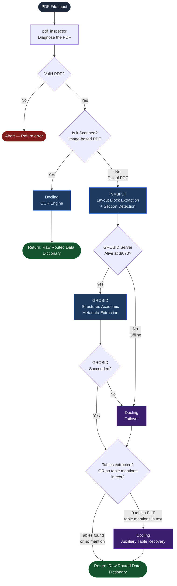

---

## 🧩 Key Modules Involved

| Module | File | Role |
|--------|------|------|
| `pdf_inspector` | `extraction/pdf_inspector.py` | Diagnoses the PDF — scanned vs digital, page count, equation count, table count, validity |
| `block_extractor` | `extraction/block_extractor.py` | Extracts raw layout blocks from digital PDFs using PyMuPDF |
| `section_detector` | `extraction/section_detector.py` | Groups blocks into named sections (Abstract, Methods, Results, etc.) |
| `grobid_parser` | `extraction/grobid_parser.py` | Sends PDF to GROBID server → gets structured academic metadata |
| `docling_parser` | `extraction/docling_parser.py` | OCR + complex layout parser, used as fallback and for scanned PDFs |
| `router` | `extraction/router.py` | Orchestrates all of the above — the main entry point for Phase 1 |

---

## 📥 Input & 📤 Output

*   **INPUT:** Raw PDF research paper file path.
*   **OUTPUT:** `Raw Routed Data Dictionary` containing:
    *   `pymupdf_output`: Lightweight section mapping.
    *   `grobid_output`: Structured XML metadata (authors, equations, references).
    *   `docling_output`: High-quality tables and OCR layers.
    *   `selected_parsers`: List of routing engines successfully run.

---

## 📌 Explanation — Point by Point

### 1. PDF Inspector runs first on every paper
- Reads the PDF's raw structure using PyMuPDF.
- Reports: page count, detected table count, equation count, figure count.
- Most importantly: determines if the PDF is **digital** (text-embedded) or **scanned** (image-based).
- If the file is invalid (corrupt, wrong format) → pipeline aborts immediately.

### 2. Scanned PDFs go directly to Docling
- If `is_scanned = True`, PyMuPDF and GROBID are skipped entirely.
- Docling runs its full OCR pipeline to recover text from page images.
- This path is for research papers that were photographed or printed-then-scanned.

### 3. Digital PDFs always run PyMuPDF first
- PyMuPDF extracts raw text blocks with position and font metadata.
- The `section_detector` then groups these blocks into named academic sections.
- This gives us a fast, lightweight section map even before GROBID runs.

### 4. GROBID is pinged before every paper
- A live ping is sent to `http://localhost:8070/api/isalive`.
- If GROBID responds `true` → it processes the PDF via its CRF model.
- GROBID specialises in: structured sections, references list, equations, author metadata, DOI.
- If GROBID is offline or returns an error → Docling is used as the fallback automatically.

### 5. Docling is the universal fallback
- Docling can handle both digital and scanned PDFs.
- It is used in 3 situations:
  - Scanned PDF (primary path).
  - GROBID offline (automatic failover).
  - GROBID ran but returned invalid output.

### 6. Auxiliary table recovery — smart extra step
- After PyMuPDF + GROBID run, the router checks: did we extract any tables?
- If **0 tables** were found BUT the extracted text contains mentions like `"Table 1"`, `"Table IV"` → this signals the paper has tables that were missed (borderless tables, vector-drawn tables).
- In this case, Docling is invoked a second time just for table recovery.

---

# Phase 2 — Canonical Paper Representation

## 🔁 Flowchart

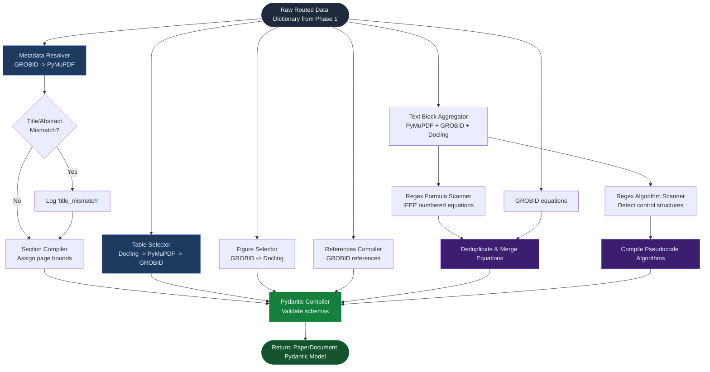

---

## 🧩 Key Modules Involved

| Module | File | Role |
|--------|------|------|
| `merger` | `extraction/merger.py` | Implements the merge logic, resolver tiers, regex scans, and model compilation |
| `schemas` | `schemas/canonical_paper.py` | Defines the validated Pydantic model properties (`PaperDocument`, `PaperMetadata`, `Section`, `Table`, `Equation`, `Algorithm`, `Reference`) |

---

## 📥 Input & 📤 Output

*   **INPUT:** `Raw Routed Data Dictionary` (Output of Phase 1).
*   **OUTPUT:** `PaperDocument Pydantic Model` containing unified metadata, sections with approximated page boundaries, tables, parsed equations, algorithms, and compiling bibliography references.

---

## 📌 Explanation — Point by Point

### 1. Title and Abstract Fallback Heuristics
- The system prioritizes GROBID for document metadata because it parses headers using dedicated machine learning models.
- If GROBID fails or is offline, Phase 2 automatically falls back to PyMuPDF's metadata extraction to resolve title and abstract.

### 2. Approximate Page Boundary Resolution
- Academic PDFs lack fixed page tags inside their sections.
- Phase 2 resolves this by scanning section titles. It dynamically maps logical section headers to physical pages (e.g., placing the Abstract on page 1, and the Conclusion/Bibliography on the last pages) using total page metrics from `pdf_inspector`.

### 3. Hierarchical Table Priority
- Tables are highly prone to formatting corruption during PDF extraction. 
- Phase 2 resolves this by checking parsers in order of cell structural accuracy:
  1. **Docling Markdown** (Primary — retains clean cell grids).
  2. **PyMuPDF Tables** (First fallback).
  3. **GROBID XML Tables** (Second fallback).

### 4. Regex Math Scanner
- Many inline or numbered formulas are missed by standard XML text routing.
- Phase 2 runs a regex scanner across all accumulated text blocks. It matches lines ending in parentheses (e.g., `(3)`) and validates them using math character heuristics (looking for symbols like `=`, `+`, `\`, `α`, `∑`) to classify them as equations.

### 5. Regex Algorithm and Pseudocode Scanner
- Scans text blocks for headers containing `"Algorithm"` or `"ALGORITHM"` followed by numeric identifiers.
- Captures the subsequent block and checks for common pseudocode markers (e.g., `input`, `output`, `initialize`, `loop`, `←`). If verified, it parses the block into a structured `Algorithm` model.

### 6. Conflict Logging
- If PyMuPDF and GROBID extract different titles, the conflict is recorded in `extraction_metadata.conflicts` as a `title_mismatch` log, allowing developers to audit extraction discrepancies.

---

# Phase 3 — Scientific Paper Validation

## 🔁 Flowchart

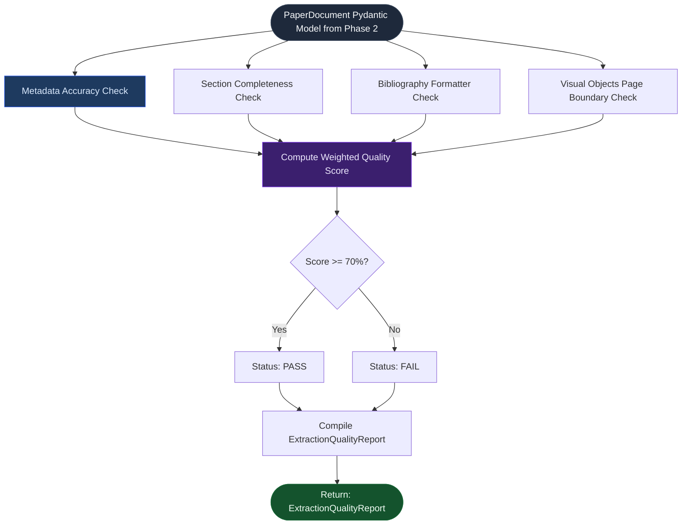

---

## 🧩 Key Modules Involved

| Module | File | Role |
|--------|------|------|
| `validator` | `extraction/validator.py` | Assesses extracted elements for structural integrity and calculates the validation scorecard |

---

## 📥 Input & 📤 Output

*   **INPUT:** `PaperDocument Pydantic Model` (Output of Phase 2).
*   **OUTPUT:** `ExtractionQualityReport Pydantic Model` containing:
    *   `overall_score`: Quality percentage check.
    *   `failed_checks`: Detailed list of warnings/errors.
    *   `status`: System status flag (`PASS` or `FAIL`).

---

## 📌 Explanation — Point by Point

### 1. Multi-layered Verification Sweep
- Evaluates the compiled Pydantic document structure across four critical metrics:
  - **Metadata Integrity:** Validates that title and abstract are non-empty and meet minimum length.
  - **Section Completeness:** Checks for essential logical sections (Abstract, Introduction, Methods, Experiments, Conclusion).
  - **Reference Structure:** Verifies references contain valid indices, titles, and non-empty metadata.
  - **Visual Object Alignment:** Checks that page coordinates for tables/figures map within physical page bounds.

### 2. Weighted Scorecard System
- Rather than basic pass/fail, the validator computes an accuracy score based on the percentage of checks successfully met.
- Points are allocated for abstract presence, references successfully mapped, section formatting, and layout resolution correctness.

### 3. Dynamic Threshold Constraints
- Papers scoring **>= 70%** are marked as `PASS`, indicating they have clean structure and can safely undergo LLM feature parsing.
- Failures or missing core sections populate the `errors` log to guide developers on extraction defects.

---

# Phase 4 — RAG / Knowledge Layer

## 🔁 Flowchart

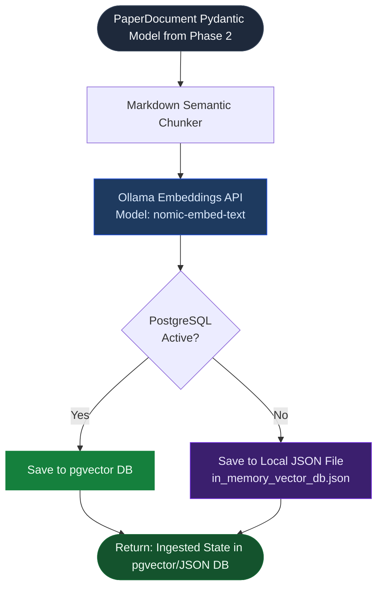

---

## 🧩 Key Modules Involved

| Module | File | Role |
|--------|------|------|
| `chunker` | `retrieval/chunker.py` | Slices section contents semantically while retaining parent headers |
| `embeddings` | `retrieval/embeddings.py` | Encodes text chunks into dense 768-dimensional vector arrays |
| `vector_db` | `retrieval/vector_db.py` | Manages pgvector connections, queries, and in-memory fallback JSON schemas |

---

## 📥 Input & 📤 Output

*   **INPUT:** `PaperDocument Pydantic Model` (Output of Phase 2, verified by Phase 3).
*   **OUTPUT:** `Ingested State in pgvector/JSON DB` (Populates local PostgreSQL pgvector schemas or saves serialized embeddings to local `in_memory_vector_db.json`).

---

## 📌 Explanation — Point by Point

### 1. Markdown-aware Chunking
- Traditional sliding-window text splitters break sections mid-sentence or lose header context.
- Phase 4 implements semantic chunking by using markdown headers (`#`, `##`, `###`) to preserve contextual blocks.

### 2. Local Embedding Pipeline
- Queries a local Ollama Rest API running `nomic-embed-text:latest` to generate dense vector embeddings.
- Returns a 768-dimensional floating-point array for each chunk, ensuring high retrieval accuracy.

### 3. Resilient Database Fallback Layer
- The system attempts to connect to PostgreSQL on port 5432 using `psycopg2`.
- If the database is unreachable or offline, the RAG layer automatically falls back to storing vector indices inside `backend/papers/in_memory_vector_db.json` as a flat-file database, preventing pipeline crashes.

---

# Phase 5 — Paper Understanding

## 🔁 Flowchart

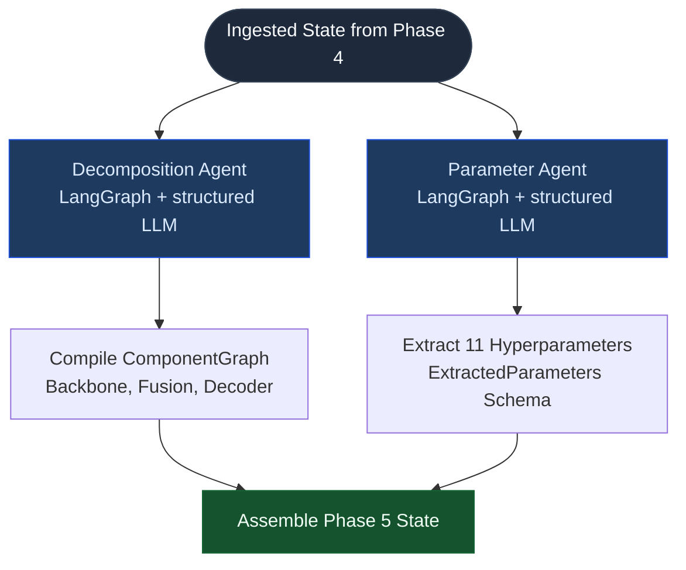

---

## 🧩 Key Modules Involved

| Module | File | Role |
|--------|------|------|
| `decomposition_agent` | `agents/decomposition_agent.py` | Identifies components, inputs/outputs, and compiles compilation edges |
| `parameter_agent` | `agents/parameter_agent.py` | Scans RAG context to extract and format 11 primary parameters |

---

## 📥 Input & 📤 Output

*   **INPUT:** `Ingested State in pgvector/JSON DB` (Output of Phase 4).
*   **OUTPUT:** `Phase 5 State` containing:
    *   `comp_graph`: ComponentGraph containing model nodes and connection edges.
    *   `params`: ExtractedParameters schema representing explicit network hyperparameters.

---

## 📌 Explanation — Point by Point

### 1. Component Graph Extraction (Decomposition)
- The Decomposition Agent parses the paper's methods section to construct a pipeline representation.
- It returns a `ComponentGraph` containing nodes (e.g. `backbone`, `fusion`, `decoder`) and directional dependency edges representing shape flow.

### 2. Structured Parameter Extraction
- The Parameter Agent is bound to the `ExtractedParameters` Pydantic schema.
- It extracts exactly 11 key hyperparameters (VRAM, optimizer, learning rate, batch size, epochs, loss, input dimensions, augmentations, etc.) directly as properties of the schema.

---

# Phase 6 — Feasibility + Adaptation

## 🔁 Flowchart

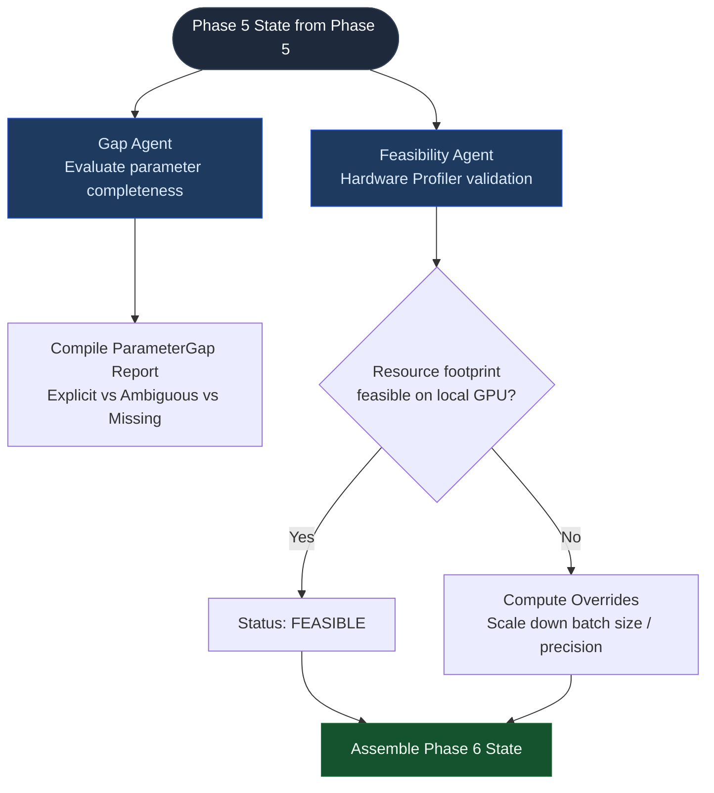

---

## 🧩 Key Modules Involved

| Module | File | Role |
|--------|------|------|
| `gap_agent` | `agents/gap_agent.py` | Analyzes parameter gaps and categorizes parameter statuses |
| `feasibility_agent` | `agents/feasibility_agent.py` | Cross-checks parameter footprint against local hardware limits and applies adaptations |

---

## 📥 Input & 📤 Output

*   **INPUT:** `Phase 5 State` (ComponentGraph & ExtractedParameters) + Dynamic System Constraints.
*   **OUTPUT:** `Phase 6 State` containing:
    *   `feasibility`: FeasibilityReport containing resource status and scaled adaptations.
    *   `gap_report`: GapReport analyzing parameter completeness.
    *   `comp_graph`: Validated network component layout.

---

## 📌 Explanation — Point by Point

### 1. Parameter Gap Auditing
- Hyperparameters are classified into three levels of completeness:
  - **EXPLICIT:** Declared clearly with numerical limits.
  - **AMBIGUOUS:** Mentioned without concrete values (requires framework baseline fallback).
  - **MISSING:** Omitted entirely in the text.

### 2. Hardware Resource Profiling
- The feasibility agent reads host resources (CPU cores, RAM size, GPU VRAM) dynamically.
- It calculates VRAM requirements for model backbone training. If the required footprint exceeds the hardware's capabilities, it triggers self-healing overrides (e.g., scaling batch size from `16` down to `4`).

---

# Phase 7 — Code Generation

## 🔁 Flowchart

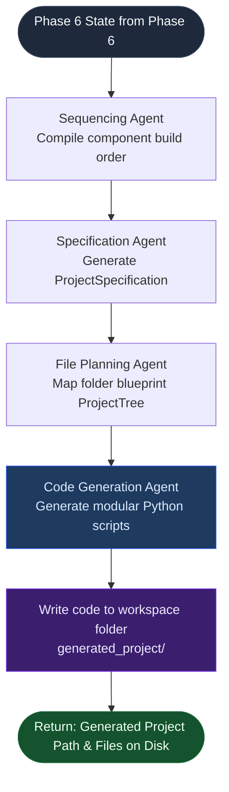

---

## 🧩 Key Modules Involved

| Module | File | Role |
|--------|------|------|
| `sequencing_agent` | `agents/sequencing_agent.py` | Compiles compilation order based on component dependencies |
| `specification_agent` | `agents/specification_agent.py` | Formulates the overall design blueprint (`ProjectSpecification`) |
| `file_planning_agent` | `agents/file_planning_agent.py` | Visualizes ASCII tree structures and maps files to descriptions |
| `code_generation_agent` | `agents/code_generation_agent.py` | Generates component code, falling back to baseline templates if LLM fails |

---

## 📥 Input & 📤 Output

*   **INPUT:** `Phase 6 State` (Feasibility limits, gap classifications, and structural graph) + `Phase 5 State` (ExtractedParameters).
*   **OUTPUT:** `Generated Project Path & Files on Disk` (Complete workspace structure written under `generated_project/` containing PyTorch scripts, configs, requirements, and readmes).

---

## 📌 Explanation — Point by Point

### 1. Compilation Sequencing
- The Sequencing Agent determines the correct build order (e.g., data loaders must be created before backbones, which must be created before decoders, and loss functions must precede trainers).

### 2. Component-Level Synthesis
- Code generation compiles separate, functional Python scripts matching the target modules:
  - `data/dataset.py`: PyTorch dataset loader.
  - `models/backbone.py`: Swin or ResNet image backbone.
  - `models/fusion.py`: Adapter layer.
  - `models/decoder.py`: Change segmentation decoder.
  - `training/loss.py`: BCE + Dice losses.
  - `training/trainer.py` & `evaluation/evaluator.py`: Iterators.

### 3. Failsafe Baseline Injection
- If the local LLM generates invalid code or encounters timeouts, the generator falls back to verified modular Python templates. This prevents import issues and preserves pipeline completion.

---

# Phase 8 — Code Verification

## 🔁 Flowchart

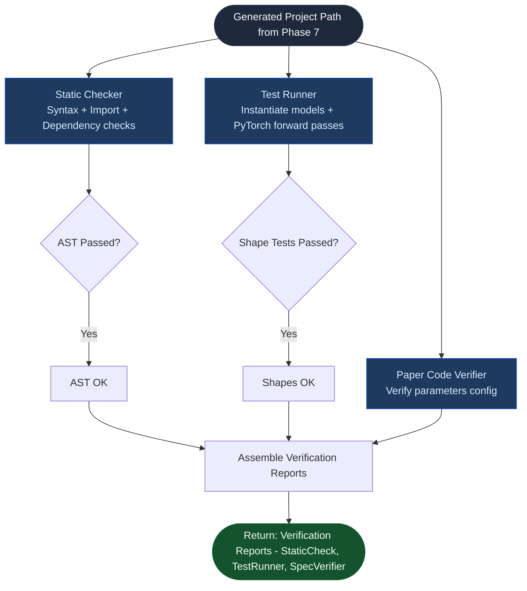

---

## 🧩 Key Modules Involved

| Module | File | Role |
|--------|------|------|
| `static_checker` | `core/static_checker.py` | Audits syntax validity, import paths, and requirements alignment |
| `test_runner` | `core/test_runner.py` | Instantiates models and runs a mock forward pass using PyTorch |
| `paper_code_verifier` | `core/paper_code_verifier.py` | Diff scanner matching config settings against original parameters |

---

## 📥 Input & 📤 Output

*   **INPUT:** `Generated Project Path` (Output of Phase 7) + `Phase 5 Parameters` + `Phase 6 ComponentGraph`.
*   **OUTPUT:** `Verification Reports - StaticCheck, TestRunner, SpecVerifier` containing AST success flags, forward-pass runtime statuses, and spec diff summaries.

---

## 📌 Explanation — Point by Point

### 1. AST Syntax Verification
- Passes the code through Python's Abstract Syntax Tree (`ast.parse`) module to catch compile-time syntax and structural import anomalies without risk of running broken scripts.

### 2. Runtime Shape Passing
- The `test_runner` instantiates the synthesized neural networks and runs a dummy input tensor `(B=1, C=3, H=128, W=128)` through the forward passes of the backbone, fusion, and decoder modules, validating that tensor dimensions match expected output sizes.

### 3. Compliance Diff Checks
- Validates the `config.json` inside the generated project, verifying that the synthesized learning rates, losses, and models align with what the paper specified (or what feasibility adapted).

---

# Phase 9 — Chat + Memory

## 🔁 Flowchart

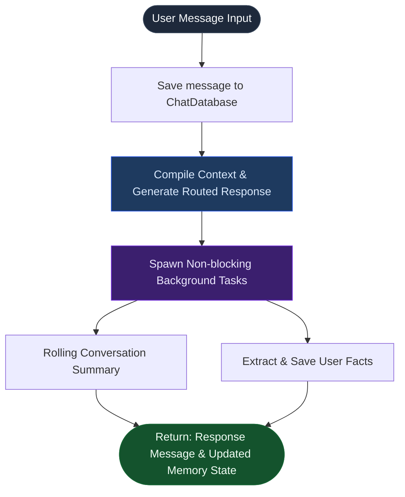

---

## 🧩 Key Modules Involved

| Module | File | Role |
|--------|------|------|
| `database` | `core/database.py` | Connects to PostgreSQL, manages schemas, falls back to JSON file |
| `chat_manager` | `core/chat_manager.py` | Manages contexts, formats prompts, and runs background memory tasks |

---

## 📥 Input & 📤 Output

*   **INPUT:** User Query text + `ChatDatabase` active thread.
*   **OUTPUT:** `Response Message & Updated Memory State` (Returns chat answer while saving conversation context and extracted user facts in background threads).

---

## 📌 Explanation — Point by Point

### 1. SQL database Fallback Architecture
- Chat database operations target PostgreSQL. If the server goes offline, it automatically falls back to `backend/papers/chat_memory_db.json`.

### 2. Background Task Execution
- Summarization and memory extraction run as non-blocking background tasks. Users receive answers instantly without waiting for memory indexing tasks to finish.

---

# Phase 10 — Model Router

## 🔁 Flowchart

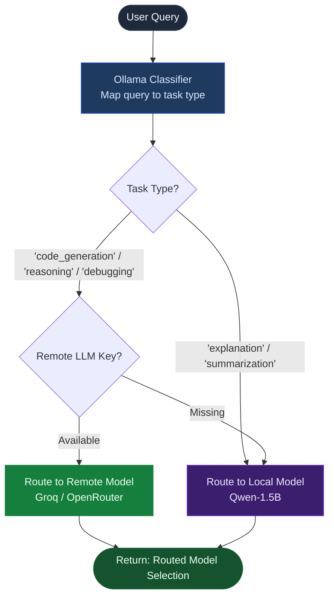

---

## 🧩 Key Modules Involved

| Module | File | Role |
|--------|------|------|
| `model_router` | `core/model_router.py` | Classifies tasks, manages API keys, and handles fallback logic |

---

## 📥 Input & 📤 Output

*   **INPUT:** `User Query` text (Phase 9 chat loop).
*   **OUTPUT:** `Routed Model Selection` (Directs message prompt execution to local LLM REST ports or Cascading Remote APIs).

---

## 📌 Explanation — Point by Point

### 1. Query Task Classification
- Queries are classified into six categories: `explanation`, `extraction`, `reasoning`, `code_generation`, `debugging`, or `summarization` using Ollama classification prompts.

### 2. Cascade Fallback Handling
- Complex queries are routed to remote LLMs (Groq, OpenRouter). If remote APIs timeout, keys are missing, or connection issues occur, the router cascades immediately to the local model.

---

# Phase 11 — FastAPI + SSE

## 🔁 Flowchart

```mermaid
flowchart TD
    ClientReq([Client HTTP Request]) --> Endpoint{Route?}

    Endpoint -- POST /analyze --> RunThread[Spawn Graph Pipeline Thread]
    RunThread --> SSEWriter[SSEStreamWriter\nCapture stdout prints]
    SSEWriter --> Stream[GET /stream/{run_id}\nStream logs as SSE events]

    Endpoint -- GET /conversations --> DBCall[Retrieve Persistent Chat Messages]

    Stream --> Response([Return: FastAPI Response / SSE Live Logs Stream])
    DBCall --> Response

    style ClientReq fill:#1e293b,color:#f8fafc,stroke:#334155
    style Response fill:#14532d,color:#f0fdf4,stroke:#166534
    style RunThread fill:#1e3a5f,color:#dbeafe,stroke:#1d4ed8
    style Stream fill:#3b1f6e,color:#ede9fe,stroke:#6d28d9
```

---

## 🧩 Key Modules Involved

| Module | File | Role |
|--------|------|------|
| `app` | `backend/app.py` | FastAPI application serving endpoints and streaming background pipeline logs |

---

## 📥 Input & 📤 Output

*   **INPUT:** Client HTTP Request.
*   **OUTPUT:** `FastAPI Response / SSE Live Logs Stream` (Pushes structured HTTP JSON results or live stream logs e.g. `event: log` to client sockets).

---

## 📌 Explanation — Point by Point

### 1. Threaded Pipeline Isolation
- Spawns LangGraph invokes inside separate threads to keep FastAPI's request-response loop active.

### 2. Server-Sent Events (SSE) log Streaming
- The `SSEStreamWriter` captures python stdout print statements and pushes them to clients in real-time.

---

# Phase 12 — Evaluation + Production

## 🔁 Flowchart

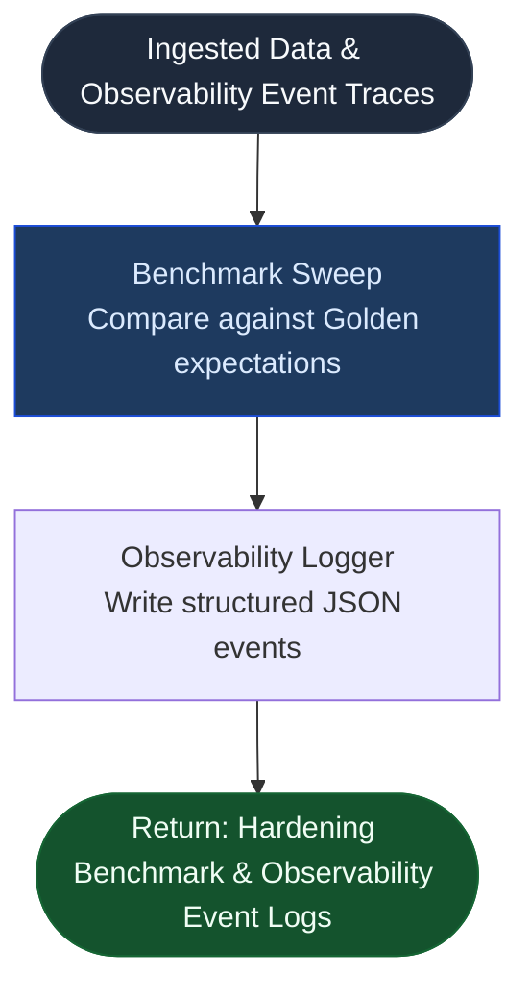

---

## 🧩 Key Modules Involved

| Module | File | Role |
|--------|------|------|
| `benchmark` | `extraction/benchmark.py` | Compiles accuracy percentages against golden subset expectations |
| `logger` | `core/logger.py` | Writes structured log traces for system health metrics |

---

## 📥 Input & 📤 Output

*   **INPUT:** Ingested Data structures (PaperDocument) + Pipeline performance metrics.
*   **OUTPUT:** `Hardening Benchmark & Observability Event Logs` (Compiles accuracy scorecards and saves structured observabilty events in `backend_observability.log`).

---

## 📌 Explanation — Point by Point

### 1. Golden Benchmark Sweep
- Compares parser accuracy metrics (page resolution, references count, section lists) against predefined thresholds for verification.

### 2. Structured Observability Logging
- Observability log traces capture latency metrics, target model names, conversation IDs, pipeline states, and error structures, ensuring operational readiness.

---

*Last updated: 2026-08-26 | Fully documented Phases 1 to 12.*
