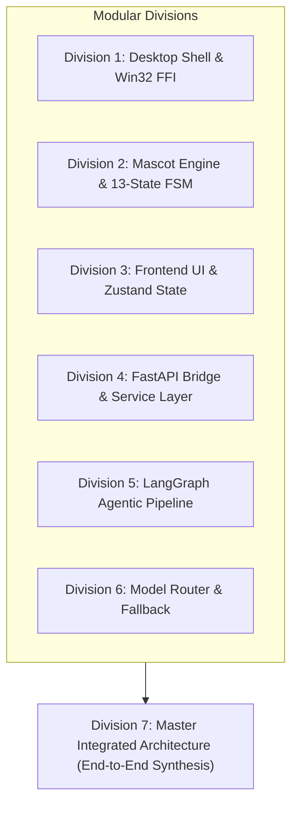
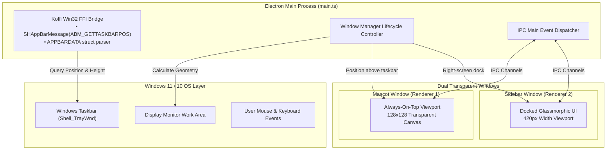
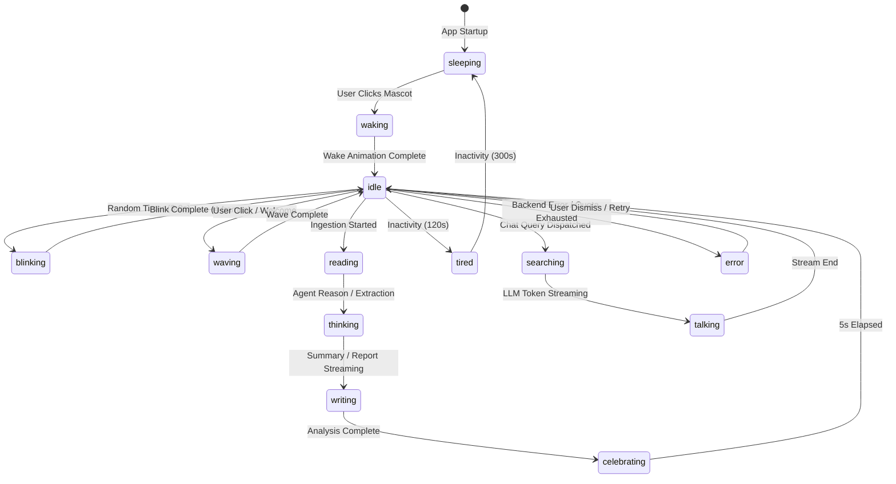
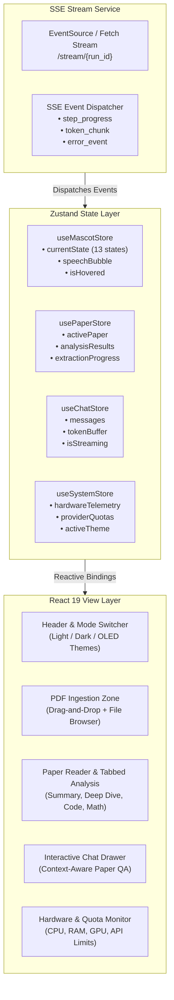
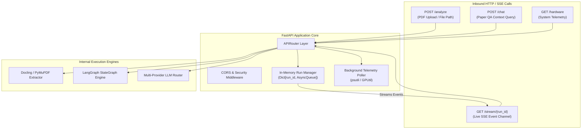
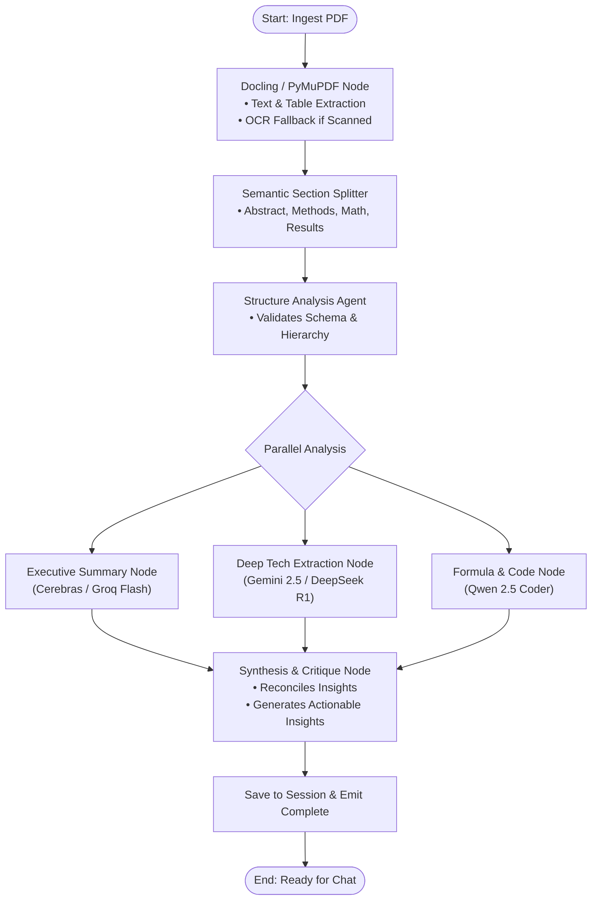
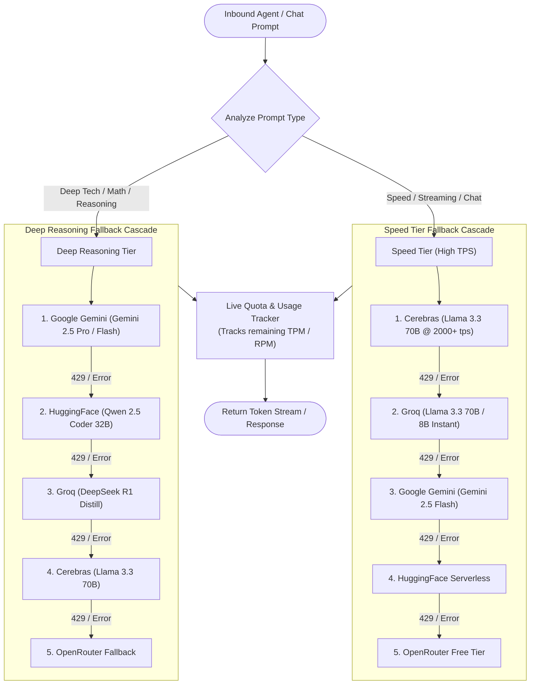
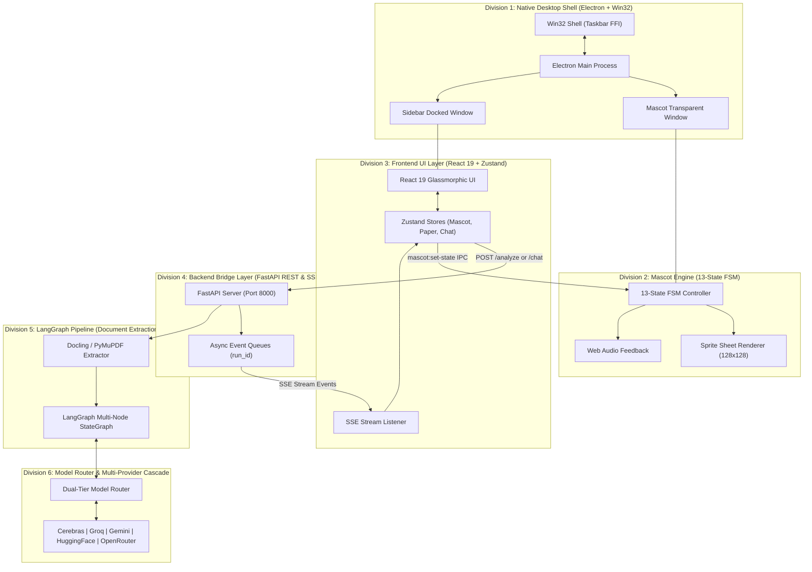
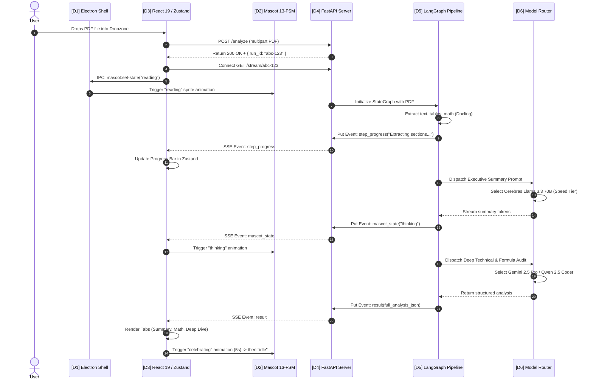

# RUEXIS AI — Detailed System Architectures & Flow Guide

> **Project Name:** RUEXIS AI (Research Understanding & EXecution Intelligence System)  
> **Document Purpose:** Complete structural and flow architecture of RUEXIS AI broken down into standalone modular divisions, culminating in an integrated end-to-end master architecture.

---

## 📑 Table of Contents
1. [Architecture Philosophy & Divisional Design](#1-architecture-philosophy--divisional-design)
2. [Division 1: Desktop Shell & Native Win32 Subsystem](#2-division-1-desktop-shell--native-win32-subsystem)
3. [Division 2: Mascot Interactive Sprite Engine & 13-State FSM](#3-division-2-mascot-interactive-sprite-engine--13-state-fsm)
4. [Division 3: Frontend UI, State Management & SSE Consumer](#4-division-3-frontend-ui-state-management--sse-consumer)
5. [Division 4: Backend FastAPI Bridge & Service Layer](#5-division-4-backend-fastapi-bridge--service-layer)
6. [Division 5: Agentic Ingestion & LangGraph Processing Pipeline](#6-division-5-agentic-ingestion--langgraph-processing-pipeline)
7. [Division 6: Intelligent Model Router & Fallback Cascade](#7-division-6-intelligent-model-router--fallback-cascade)
8. [Master Synthesis: Complete Integrated End-to-End Architecture](#8-master-synthesis-complete-integrated-end-to-end-architecture)

---

## 1. Architecture Philosophy & Divisional Design

RUEXIS AI is structured as a **modular multi-tier desktop intelligence platform**. To ensure clarity and maintainability, the system is decomposed into **6 specialized functional divisions**. Each division operates with well-defined boundaries, protocols, and data contracts. The final master architecture combines all 6 divisions into a synchronized, real-time reactive loop.



---

## 2. Division 1: Desktop Shell & Native Win32 Subsystem

### 2.1 Overview
The desktop shell is built on **Electron** and interacts directly with the **Windows Win32 API** using `koffi` (C-level Foreign Function Interface). It creates and coordinates two distinct transparent windows without standard OS borders or title bars.

### 2.2 Component Architecture Diagram



### 2.3 Key Operational Flows
1. **Taskbar Geometry Auto-Discovery:**
   - Calls `SHAppBarMessage` with `ABM_GETTASKBARPOS` via `koffi`.
   - Computes taskbar edge (Bottom, Top, Left, Right) and height/width.
   - Positions the Mascot Window precisely 12px above the active taskbar edge.
2. **IPC Communication Channels:**
   - `mascot:set-state`: Updates current mascot animation state.
   - `window:toggle-sidebar`: Expands or collapses the right-docked sidebar.
   - `app:minimize` / `app:quit`: Standard desktop lifecycle events.

---

## 3. Division 2: Mascot Interactive Sprite Engine & 13-State FSM

### 3.1 Overview
The companion mascot is an interactive desktop sprite driven by a deterministic **13-State Finite State Machine (FSM)**. It renders animated PNG sprite sheets on an HTML5 canvas and changes animations based on AI pipeline events, user clicks, and inactivity timers.

### 3.2 13-State FSM Transition Diagram



### 3.3 Sprite Engine Specs
| Parameter | Value | Notes |
| :--- | :--- | :--- |
| **Grid Size** | 128 × 128 px | Transparent background |
| **Frame Rates** | 8 FPS – 16 FPS | State-dependent (idle: 8fps, talking: 14fps) |
| **Audio Sync** | Web Audio API | Micro-chirps on wave, click, and celebrate |
| **Triggers** | SSE Events & Mouse | Direct mapping to backend pipeline states |

---

## 4. Division 3: Frontend UI, State Management & SSE Consumer

### 4.1 Overview
The frontend is built with **React 19**, **Vite**, and **Tailwind CSS** featuring a deep glassmorphism design system. Global client state is centralized in modular **Zustand stores**, receiving real-time streaming updates from the backend via a resilient **Server-Sent Events (SSE)** client.

### 4.2 State & Component Hierarchy Diagram



### 4.3 Key UI Capabilities
- **Glassmorphic Theme Engine:** Dynamic switching between Dark Indigo, Obsidian OLED, and Frost Light with backdrop blurs (`backdrop-blur-xl`).
- **Interactive Markdown & Math Rendering:** `react-markdown` with `KaTeX` for equations and `Prism` for syntax-highlighted code.
- **Optimistic State Updates:** Instant UI response on user prompts while streaming token deltas.

---

## 5. Division 4: Backend FastAPI Bridge & Service Layer

### 5.1 Overview
The backend is a high-performance **FastAPI (Python 3.11+)** server that acts as the communication and orchestration bridge between the desktop client and AI computation graph.

### 5.2 Service Architecture Diagram



### 5.3 API Endpoints Specification
- `POST /analyze`: Accepts PDF upload or local path, registers a new `run_id`, spawns asynchronous LangGraph execution.
- `GET /stream/{run_id}`: Yields real-time Server-Sent Events (`event: step_progress`, `event: result`, `event: error`).
- `POST /chat`: Context-aware conversational endpoint connected to extracted paper chunks.
- `GET /hardware`: Returns CPU %, RAM usage, and GPU VRAM statistics.
- `GET /health`: Health check and provider connectivity status.

---

## 6. Division 5: Agentic Ingestion & LangGraph Processing Pipeline

### 6.1 Overview
Document processing and research comprehension are governed by a **LangGraph StateGraph**. The pipeline extracts unstructured text, tables, and equations from PDFs, then routes the structured content through specialized analytical agent nodes.

### 6.2 LangGraph Execution Graph Diagram



### 6.3 State Schema (`AgentState`)
```python
class AgentState(TypedDict):
    run_id: str
    paper_path: str
    extracted_text: str
    sections: dict[str, str]
    tables: list[dict]
    formulas: list[str]
    executive_summary: str
    deep_dive_analysis: str
    code_artifacts: list[str]
    progress_percentage: int
    current_status: str
```

---

## 7. Division 6: Intelligent Model Router & Fallback Cascade

### 7.1 Overview
RUEXIS AI uses a **Dual-Engine Intelligent Model Router** connected to 5 external LLM providers. It guarantees zero downtime by tracking live quotas and automatically falling back to alternative providers when rate limits (HTTP 429) or timeouts occur.

### 7.2 Router Decision & Fallback Flowchart



### 7.3 Multi-Provider Configuration Matrix
| Provider | Primary Models | Latency / Speed | Purpose |
| :--- | :--- | :--- | :--- |
| **Cerebras** | `llama-3.3-70b` | Ultra-fast (~2100 tps) | Instant Chat, Executive Summaries |
| **Groq** | `llama-3.3-70b-versatile`, `deepseek-r1-distill-llama-70b` | Fast (~400 tps) | Secondary Streaming & Reasoning |
| **Google Gemini** | `gemini-2.5-flash`, `gemini-2.5-pro` | High Context (1M tokens) | Full Document Context & Synthesis |
| **HuggingFace** | `Qwen/Qwen2.5-Coder-32B-Instruct` | Specialized | Code Extraction & Equation Auditing |
| **OpenRouter** | Free backup models | Variable | Ultimate Resiliency Safety Net |

---

## 8. Master Synthesis: Complete Integrated End-to-End Architecture

### 8.1 The Unified System Blueprint
Now that all 6 divisions are defined, the diagram below maps how every division interacts across process, network, and memory boundaries during live operation.



---

### 8.2 End-to-End Execution Trace: Paper Ingestion Lifecycle

The following sequence trace illustrates how an action propagates through every division:



---

### 8.3 Summary Table: Division Interfaces & Protocols

| Interaction Path | Source Division | Target Division | Protocol / Transport | Data Payload |
| :--- | :--- | :--- | :--- | :--- |
| **Native Docking** | Division 1 (Main) | OS Taskbar | Win32 FFI (`koffi`) | `APPBARDATA` struct coordinates |
| **Mascot Sync** | Division 3 (Zustand) | Division 2 (Mascot FSM) | Electron IPC | `mascot:set-state { state: string }` |
| **Pipeline Trigger** | Division 3 (React UI) | Division 4 (FastAPI) | HTTP POST (`/analyze`) | PDF Binary / File Path |
| **Live Streaming** | Division 4 (FastAPI) | Division 3 (SSE Client) | HTTP SSE (`text/event-stream`) | JSON events (`step_progress`, `token`) |
| **Agent Execution** | Division 4 (FastAPI) | Division 5 (LangGraph) | Python Async In-Process | `AgentState` TypedDict |
| **LLM Inference** | Division 5 (LangGraph) | Division 6 (Router) | HTTP REST / OpenAI Client | Prompt, System Message, Model Params |
| **Failover Handshake**| Division 6 (Router) | Provider APIs | HTTP REST with retry | Auth Token, Stream Buffer, Status 429 |
