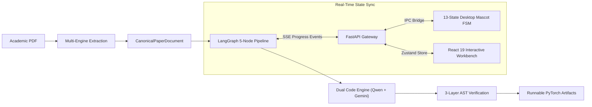
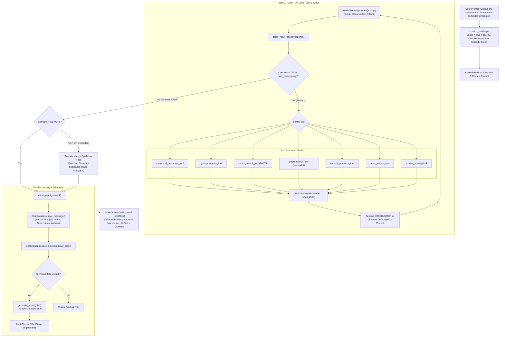
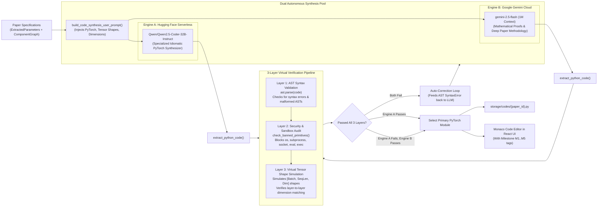
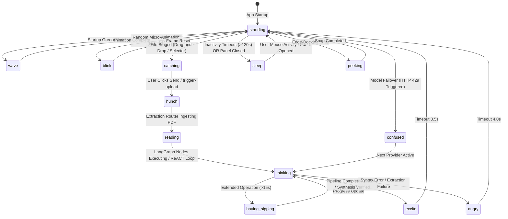

# 🌌 RUEXIS AI Platform — End-to-End System Architecture & Technical Specification

> **Project:** RUEXIS AI (**R**esearch, **U**nderstand, **E**xtract, e**X**amine, **I**mplement, **S**ynthesize)  
> **Classification:** Local-First Agentic Desktop Literature-to-PyTorch Platform  
> **Target File:** `docs/detailed_architectures.md`  
> **Document Scope:** Comprehensive architectural breakdown of all Frontend and Backend subsystems, granular data contracts, IPC channels, agent graphs, verification engines, and end-to-end Mermaid system diagrams down to the minute implementation details.

---

## 📑 Table of Contents

1. [Architectural Overview & Core Design Philosophy](#1-architectural-overview--core-design-philosophy)
2. [Minute Frontend Architecture](#2-minute-frontend-architecture)
   - [2.1 OS Subsystem & Win32 C-FFI Native Interop](#21-os-subsystem--win32-c-ffi-native-interop)
   - [2.2 Dual-Window WindowManager & Lockstep Dragging](#22-dual-window-windowmanager--lockstep-dragging)
   - [2.3 Preload Context Isolation & mascotAPI Protocol](#23-preload-context-isolation--mascotapi-protocol)
   - [2.4 Interactive Desktop Mascot Engine & 13-State FSM](#24-interactive-desktop-mascot-engine--13-state-fsm)
   - [2.5 React 19 View Hierarchy & Tailwind CSS Architecture](#25-react-19-view-hierarchy--tailwind-css-architecture)
   - [2.6 Modular Zustand State Fabric (6 Slices)](#26-modular-zustand-state-fabric-6-slices)
   - [2.7 Frontend Connectivity & EventSource SSE Consumer](#27-frontend-connectivity--eventsource-sse-consumer)
3. [Minute Backend Architecture](#3-minute-backend-architecture)
   - [3.1 FastAPI Gateway, Middleware & Endpoint Matrix](#31-fastapi-gateway-middleware--endpoint-matrix)
   - [3.2 Multi-Engine PDF Extraction Cascade](#32-multi-engine-pdf-extraction-cascade)
   - [3.3 Semantic Retrieval & Bipartite Knowledge Graph](#33-semantic-retrieval--bipartite-knowledge-graph)
   - [3.4 The 7 ReACT Academic, Graph & Memory Tools](#34-the-7-react-academic-graph--memory-tools)
   - [3.5 LangGraph 5-Node Autonomous Pipeline](#35-langgraph-5-node-autonomous-pipeline)
   - [3.6 The 10 Specialized Domain Agents](#36-the-10-specialized-domain-agents)
   - [3.7 Dual Code Synthesis Engine & 3-Layer Virtual Verifier](#37-dual-code-synthesis-engine--3-layer-virtual-verifier)
   - [3.8 Multi-Provider Model Mesh & Sliding Quota Tracker](#38-multi-provider-model-mesh--sliding-quota-tracker)
   - [3.9 Local Persistence & Database Tier](#39-local-persistence--database-tier)
4. [Master End-to-End Mermaid Architectures](#4-master-end-to-end-mermaid-architectures)
   - [4.1 Complete Master System Architecture (Tiers 1–5)](#41-complete-master-system-architecture-tiers-15)
   - [4.2 Paper Ingestion & LangGraph 5-Node Pipeline Flow](#42-paper-ingestion--langgraph-5-node-pipeline-flow)
   - [4.3 Multi-Turn ReACT Conversational Loop with 7 Tools](#43-multi-turn-react-conversational-loop-with-7-tools)
   - [4.4 Dual Code Engine & 3-Layer Virtual AST Verification](#44-dual-code-engine--3-layer-virtual-ast-verification)
   - [4.5 Desktop Mascot 13-State FSM & Window Synchronization](#45-desktop-mascot-13-state-fsm--window-synchronization)
5. [Granular Schemas, Data Contracts & API Matrix](#5-granular-schemas-data-contracts--api-matrix)
   - [5.1 PipelineState TypedDict & Data Models](#51-pipelinestate-typeddict--data-models)
   - [5.2 Electron IPC Protocol Message Registry](#52-electron-ipc-protocol-message-registry)
   - [5.3 REST & SSE Communication Matrix](#53-rest--sse-communication-matrix)

---

## 1. Architectural Overview & Core Design Philosophy

**RUEXIS AI** (*Research, Understand, Extract, eXamine, Implement, Synthesize*) bridges scientific literature and machine learning engineering. The platform operates on four foundational architectural principles:

1. **Local-First Autonomous Runtime:** The desktop client functions completely offline or in hybrid-cloud mode. Heavy parsing, FAISS vector indexing, NetworkX knowledge graph traversal, and code synthesis run either locally (via embedded models & Ollama) or through low-latency inference gateways (Groq LPUs, Google Gemini 2.5, Hugging Face).
2. **Synchronized Desktop Mascot State Reflection:** A 13-state animated mascot overlay anchors directly to the physical Windows taskbar, visually mirroring every state change occurring within the background LangGraph nodes and ReACT reasoning cycles in real time.
3. **Dual Code Engine Synthesis with 3-Layer Verification:** Parallel PyTorch generation splits responsibilities across specialized LLMs (Google Gemini 2.5 Flash for deep context & math derivations; Hugging Face Qwen 2.5 Coder 32B for idiomatic PyTorch), cross-validated through an AST syntax tree parser, security audit, and mock tensor forward-pass simulation.
4. **Resilient Failover & Quota Management:** An automated sliding-window tracker monitors Requests Per Minute (RPM) and Tokens Per Minute (TPM), immediately cascading across fallback providers upon HTTP 429 or 500 status codes without interrupting the active user session.



---

## 2. Minute Frontend Architecture

### 2.1 OS Subsystem & Win32 C-FFI Native Interop
* **Implementation File:** `frontend/electron_app/src/main.js` (Lines 23–77)
* **Underlying Libraries:** `koffi` (C-level Foreign Function Interface) binding directly to `shell32.dll`.
* **Mechanism:**
  * Maps the Windows C-struct `APPBARDATA` and `RECT`:
    ```javascript
    const RECT = koffi.struct('RECT', { left: 'long', top: 'long', right: 'long', bottom: 'long' });
    const APPBARDATA = koffi.struct('APPBARDATA', {
      cbSize: 'uint32',
      hWnd: 'void *',
      uCallbackMessage: 'uint32',
      uEdge: 'uint32', // 0: Left, 1: Top, 2: Right, 3: Bottom
      rc: RECT,
      lParam: 'intptr_t'
    });
    const SHAppBarMessage = shell32.func("__stdcall", 'SHAppBarMessage', 'uintptr_t', ['uint32', koffi.pointer(APPBARDATA)]);
    ```
  * Calls `SHAppBarMessage(ABM_GETTASKBARPOS, abd)` (message code `5`) to detect the physical screen coordinates of `Shell_TrayWnd`.
  * Computes monitor work areas (`nearestDisplay.workArea`) and extracts physical scaling factors (`scaleFactor`), anchoring the mascot `24px` horizontally from the right screen edge and directly atop the taskbar border.

### 2.2 Dual-Window WindowManager & Lockstep Dragging
* **Implementation File:** `frontend/electron_app/src/main.js` (Lines 80–235, 516–620)
* **The Dual-Window Model:**
  1. **`mascotWindow`:** Dimensions: `125 × 150` px (scaled by monitor DPI). Options: `transparent: true`, `frame: false`, `resizable: false`, `alwaysOnTop: true`, `level: 'screen-saver'` (renders over taskbars and full-screen windows).
  2. **`panelWindow`:** Dimensions: `340 × 480` px (compact) up to full-screen. Options: `transparent: false`, `frame: false`, `alwaysOnTop: true`, `level: 'floating'`. Positioned precisely `8px - 18px` directly above the mascot's head.
* **Lockstep Dragging System:**
  * Transparent canvas mouse pass-through is managed dynamically via `set-ignore-mouse-events`.
  * When dragging begins on the mascot hitbox (`drag-window` IPC with delta `(deltaX, deltaY)`), the main process moves **both** `mascotWindow` and `panelWindow` simultaneously in lockstep.
  * On `drag-end`, `screen.getDisplayNearestPoint` evaluates whether the mascot crossed monitor boundaries, adjusting DPI scaling dynamically.

### 2.3 Preload Context Isolation & mascotAPI Protocol
* **Implementation File:** `frontend/electron_app/src/preload.js`
* **Security Boundary:** `nodeIntegration: false`, `contextIsolation: true`.
* **Exposed API (`window.mascotAPI`):**
  * `dragWindow({ deltaX, deltaY })`: Transmits drag coordinates.
  * `dragEnd()`: Finalizes window repositioning.
  * `togglePanel()`: Toggles sidebar panel visibility.
  * `toggleMaximize()`: Switches between compact 340×480 and maximized workspace modes.
  * `setMascotState(state)`: Forces mascot animation state.
  * `setMascotSkin(skinId)`: Switches character skin (`mr_nerdy`, `ms_nerdy`, `mr_nerd`, `ms_nerd`).
  * `uploadPDF(filePath, type, modelName)`: Initiates PDF ingestion.
  * `openFileSelector(type, modelName)`: Opens native OS dialog for PDF/DOCX selection.
  * `triggerUpload({ filename, filePath, type, modelName })`: Dispatches staged files to the pipeline.
  * Listeners: `onStateChange`, `onMascotSkinChange`, `onPipelineLog`, `onPipelineCompleted`, `onUploadStatus`, `onFileStaged`, `onMaximizeChange`.

### 2.4 Interactive Desktop Mascot Engine & 13-State FSM
* **Implementation Files:** `frontend/electron_app/src/mascot.js`, `mascot.html`, `mascot_transitions.json`
* **Sprite Configuration:**
  * 4 Characters: `mr_nerdy` (classic male academic), `ms_nerdy` (female academic), `mr_nerd` (compact male), `ms_nerd` (compact female).
  * 13 Animated States:
    * `standing` (1 frame idle anchor)
    * `blink` (3 frames eye blinking)
    * `wave` (3 frames startup greeting)
    * `thinking` (3 frames tool execution / ReACT loop)
    * `hunch` (3 frames chat token generation)
    * `catching` (3 frames document staged)
    * `excite` (3 frames pipeline complete / celebration)
    * `tired` (3 frames session fatigue warning)
    * `having_sipping` (3 frames coffee sip during long jobs)
    * `sleep` (3 frames panel closed / inactive timeout)
    * `angry` (3 frames AST validation failure)
    * `confused` (3 frames model failover / retry)
    * `peeking` (3 frames monitor boundary transition)
* **Animation Engine:** HTML5 Canvas 2D frame-by-frame sprite sheet interpolation with configurable frame rates (`8 - 16 FPS`), floating `Zzz` particle rendering, and click/drag thresholding.

### 2.5 React 19 View Hierarchy & Tailwind CSS Architecture
* **Implementation Path:** `frontend/renderer/src/`
* **Style System:** Tailwind CSS v4 with bespoke Claude Terracotta theme tokens (`--bg-base: #1c1917`, `--accent: #da7756`, `--card-bg: #292524`).
* **Component Structure:**
  * `Panel.tsx`: Master layout coordinator, handling window state, drag-drop file overlay, and scroll anchors.
  * `Header.tsx`: Window controls, brand avatar, real-time hardware gauges, and skin selector.
  * `LeftSidebar.tsx`: Historical document index, persistent conversation threads, and paper deletion.
  * `RightSidebar.tsx`: Multi-tab analytical inspector:
    * *Executive Summary Tab*: Key contributions, problem statements, and benchmark comparisons.
    * *Deep Dive Tab*: Methodology breakdown, component hierarchy, and algorithmic innovations.
    * *Equations Tab*: LaTeX mathematical equations rendered dynamically via KaTeX.
    * *Code Tab*: Verified PyTorch modules with syntax highlighting, line numbers, and milestone badges.
    * *Feasibility Tab*: VRAM compute meters, FLOPs calculations, and GPU tier badges.
  * `MessageFeed.tsx`: Conversational turns, expandable ReACT thought blocks, syntax-highlighted code blocks, and copy-to-clipboard actions.
  * `ChatInputArea.tsx`: Multi-line prompt input, model selector dropdown, paper attachment chips, and trigger buttons.
  * `LogsDrawer.tsx`: Embedded streaming terminal showing raw pipeline logs and agent decisions.
  * `PdfViewerPage.tsx`: In-app PDF reader supporting pan, zoom, and text inspection.

### 2.6 Modular Zustand State Fabric (6 Slices)
* **Root Store:** `frontend/renderer/src/store/panelStore.ts`
* **Consolidated Slices (`frontend/renderer/src/store/slices/`):**
  1. `uiSlice.ts`: Controls modal visibility (`isAuthModalOpen`, `isLogsOpen`), active view tabs (`overview`, `deep-dive`, `formulas`, `code`), and window layout.
  2. `chatSlice.ts`: Message histories, active streaming buffers, ReACT thought parsing, active model ID, and citation links.
  3. `analysisSlice.ts`: Extracted parameter schemas, feasibility reports, build sequence milestones, synthesis progress (0–100%), and SSE listener attachments.
  4. `hardwareSlice.ts`: Polled CPU utilization %, RAM usage (used vs. total), process RSS in MB, and GPU VRAM headroom.
  5. `profileSlice.ts`: Local user profile, API keys, avatar selection, and quota monitors.
  6. `documentHistorySlice.ts`: Cached parsed papers, conversation threads, and persistence to `localStorage`.

### 2.7 Frontend Connectivity & EventSource SSE Consumer
* **Implementation File:** `frontend/renderer/src/services/connectivity.ts`
* **Base URL:** Automatically resolves `http://127.0.0.1:8000/api/v1` (with fallback to `http://localhost:8000`).
* **Endpoints Bound:**
  * `POST /papers/upload`: Dispatches FormData binaries.
  * `POST /pipeline/analyze`: Dispatches paper ID and hardware constraints.
  * `GET /pipeline/stream/{run_id}`: Subscribes to persistent Server-Sent Events, processing `SECTION_DETECTED`, `RAG_READY`, `mascot-state`, and `COMPLETED`.
  * `POST /chat`: Dispatches conversation queries and receives streamed ReACT tokens.
  * `GET /hardware`: Telemetry poller for host meters.
  * `GET /models`: Multi-provider health check.

---

## 3. Minute Backend Architecture

### 3.1 FastAPI Gateway, Middleware & Endpoint Matrix
* **Implementation File:** `backend/main.py` and `backend/app/api/v1/api_router.py`
* **ASGI Framework:** FastAPI running asynchronously on Uvicorn (Port 8000).
* **CORS Whitelist:** `http://localhost:5173`, `http://localhost:4173`, `http://127.0.0.1:5173`, `http://localhost:8000`, `http://127.0.0.1:8000`, and `app://.` (Electron packaged environment).
* **Endpoints:**
  * `/api/v1/papers/upload` (`papers.py`): PDF ingestion, SHA-256 deduplication, layout parsing, FAISS vector indexing, and NetworkX KG building.
  * `/api/v1/pipeline/analyze` (`pipeline.py`): Schedules LangGraph StateGraph execution as an async background task.
  * `/api/v1/pipeline/stream/{run_id}` (`pipeline.py`): EventSource SSE streaming endpoint.
  * `/api/v1/chat` (`chat.py`): Conversational ReACT agent endpoint with token streaming and title generation.
  * `/api/v1/hardware` (`hardware.py`): Telemetry poller reporting CPU %, memory footprint, and process RSS.
  * `/api/v1/models` (`models.py`): Dynamic provider health checks, latency tests, and token quota status.
  * `/api/v1/auth` (`auth.py`): Local authentication and user profiles.
  * `/api/v1/telemetry` (`telemetry.py`): Evaluation logging and agent tracing.
  * `/limits-dashboard` (`limits_dashboard.py`): Interactive HTML visual quota and rate-limit dashboard.

### 3.2 Multi-Engine PDF Extraction Cascade
* **Implementation Path:** `backend/app/extraction/`
* **Router (`router.py`):** Dynamically cascades document parsing across 4 specialized engines:
  1. **Primary: IBM Docling (`docling_parser.py`):** Deep multi-column document layout analysis, structured table parsing, and high-fidelity LaTeX equation extraction.
  2. **High-Speed Fallback: PyMuPDF (`pymupdf_parser.py`):** Fast geometric font, span, and bounding box parser for straightforward or cleanly styled documents.
  3. **Bibliographic Parser: Grobid (`grobid_parser.py` / `grobid_client.py`):** Extracts TEI-XML structured headers, affiliations, abstracts, and citation networks.
  4. **Complex Scanned Fallback: Vision LLM OCR (`openrouter_parser.py`):** Multimodal vision model for historical, degraded, or scanned paper figures.
* **Reconciliation & Normalization (`merger.py`, `validator.py`):** Aggregates blocks into a validated `CanonicalPaperDocument` schema with section labels, extracted formulas, and hyperparameter tables.

### 3.3 Semantic Retrieval & Bipartite Knowledge Graph
* **Implementation Path:** `backend/app/retrieval/`
* **Section-Aware Chunker (`chunker.py`):** Splits text into semantic chunks while strictly respecting equation boundaries and table fences, avoiding context clipping.
* **Vector Store (`vector_db.py`, `embeddings.py`):** Generates dense vector representations, indexing chunks into local FAISS indices saved under `backend/storage/rag_embeddings/`.
* **Bipartite Knowledge Graph (`knowledge_graph.py`):** Constructs a NetworkX graph linking entities:
  $$\text{Paper} \longrightarrow \text{Sections} \longrightarrow \text{Equations} \longrightarrow \text{Hyperparameters} \longrightarrow \text{PyTorch Modules}$$
  Enables multi-hop relational queries (e.g., locating every equation dependent on a specific hyperparameter).

### 3.4 The 7 ReACT Academic, Graph & Memory Tools
* **Implementation Path:** `backend/app/tools/`
* **Tool Registry (`backend/app/tools/__init__.py`):**
  1. `canonical_document_tool.py`: Queries canonical parsed paper sections, structural blocks, and abstract.
  2. `hyperparameter_tool.py`: Extracts specific numeric hyperparameters, learning rates, and optimizers.
  3. `vector_search_tool.py`: Executes cosine similarity search over FAISS embedding chunks.
  4. `graph_search_tool.py`: Traverses the NetworkX knowledge graph for component dependencies.
  5. `episodic_memory_tool.py`: Queries past user interactions and prior analytical conclusions.
  6. `arxiv_search_tool.py`: Performs live queries over arXiv API for related papers and citation context.
  7. `scholar_search_tool.py`: Queries academic search engines for citations, author details, and literature context.

### 3.5 LangGraph 5-Node Autonomous Pipeline
* **Implementation Files:** `backend/app/graph/workflow.py`, `state.py`, `nodes/`
* **Graph Definition:** Acyclic `StateGraph(PipelineState)` compiling into `app_workflow`.
* **Nodes:**
  1. `ingestion_node`: Parses PDF via `ExtractionRouter`, chunks text, builds FAISS index, initializes `IngestionAgent`.
  2. `extraction_node`: Runs `ParameterAgent` & `DecompositionAgent` to extract hyperparameters and module dependencies.
  3. `feasibility_node`: Runs `FeasibilityAgent` to compute FLOPs, parameter count, and VRAM memory footprint against host hardware constraints.
  4. `sequencing_node`: Runs `SequencingAgent` to create milestone build DAG (M1: Data Loader, M2: Core Layers, M3: Model Assembly, M4: Loss/Optimizer, M5: Training Loop).
  5. `verification_node`: Invokes `CodeGenAgent` and `DualCodeEngine`, parses AST, performs syntax and virtual forward pass verification.

### 3.6 The 10 Specialized Domain Agents
* **Implementation Path:** `backend/app/agents/`
  1. `IngestionAgent`: Normalizes raw text and extracts structural metadata.
  2. `DecompositionAgent`: Deconstructs paper architectures into modular sub-components.
  3. `ParameterAgent`: Extracts learning rates, batch sizes, weight decays, and tensor dimensions.
  4. `FeasibilityAgent`: Profiles computational feasibility and audits memory scaling ($O(N)$ vs. $O(N^2)$).
  5. `GapAgent`: Identifies missing equations, unstated hyperparameters, or vague implementation steps.
  6. `SequencingAgent`: Organizes code synthesis into a 5-milestone dependency DAG (M1 through M5).
  7. `SpecificationAgent`: Validates parameter bounds and I/O tensor shape contracts.
  8. `CodeGenAgent`: Synthesizes idiomatic PyTorch modules matching paper mathematical formulations.
  9. `ReportAgent`: Compiles the final Markdown executive synthesis and validation report.
  10. `ChatAgent`: Drives the multi-turn conversational ReACT loop, invoking tools and synthesizing answers.

### 3.7 Dual Code Synthesis Engine & 3-Layer Virtual Verifier
* **Implementation Files:** `backend/app/core/dual_code_engine.py` and `code_verifier.py`
* **Parallel Dual Engine (`DualCodeEngine`):**
  * **Engine A (Google Gemini 2.5 Flash):** Handles 1M+ token context to reason over the full paper methodology and mathematical proofs.
  * **Engine B (Hugging Face Qwen 2.5 Coder 32B Instruct):** Specialized open-weights code LLM generating idiomatic PyTorch implementations.
  * *Quota Isolation:* Operates on dedicated backend keys, isolated from user chat quotas.
* **3-Layer Virtual Code Verifier (`CodeVerifier`):**
  * **Layer 1: AST Syntax Validation:** Parses synthesized code using `ast.parse` to identify syntax errors, missing colons, indentation faults, or invalid tokens.
  * **Layer 2: Security & Sandbox Audit:** Scans AST nodes to block dangerous primitives (`os.system`, `subprocess`, `eval`, `exec`, arbitrary network sockets, file deletion).
  * **Layer 3: Virtual Tensor Shape Simulation:** Simulates tensor transformations across layers to verify input/output dimension compatibility and prevent runtime shape mismatch exceptions.

### 3.8 Multi-Provider Model Mesh & Sliding Quota Tracker
* **Implementation Files:** `backend/app/core/model_router.py` and `quota_tracker.py`
* **Inference Pools:**
  * *Speed Tier:* Groq LPUs (`qwen3.8-27b`, `gpt-oss-120b`).
  * *Deep Reasoning Tier:* OpenRouter (`gemini-2.5-flash`, `deepseek-r1:free`).
  * *100% Offline Tier:* Local Ollama instances.
  * *Backend Synthesis Pool:* Dedicated Gemini 2.5 Flash and Hugging Face Qwen 2.5 Coder 32B.
* **Automatic Failover:** On HTTP 429 (rate limit) or 500 (provider error), the router cascades to the next configured provider, notifying the frontend `ModelSelector` to update the active badge in real time.
* **Sliding Window Quota Tracker:** Tracks token-per-minute (TPM) and request-per-minute (RPM) consumption against hard limits.

### 3.9 Local Persistence & Database Tier
* **Implementation File:** `backend/app/core/database.py`
* **Storage Structure (`backend/storage/`):**
  * `storage/papers/`: Uploaded raw PDF and DOCX files.
  * `storage/conversations/`: SQLite database and JSON chat transcripts, message histories, and episodic ReACT trajectories.
  * `storage/rag_embeddings/`: FAISS index binaries and chunk metadata.
  * `storage/codes/`: Synthesized and verified PyTorch code implementations.

---

## 4. Master End-to-End Mermaid Architectures

### 4.1 Complete Master System Architecture (Tiers 1–5)

```mermaid
flowchart TB
    %% ─────────────────────────────────────────────────────────────
    %% STYLING DEFINITIONS
    %% ─────────────────────────────────────────────────────────────
    classDef native fill:#1E293B,stroke:#0284C7,stroke-width:2px,color:#F8FAFC;
    classDef frontend fill:#0F172A,stroke:#6366F1,stroke-width:2px,color:#F8FAFC;
    classDef backend fill:#022C22,stroke:#10B981,stroke-width:2px,color:#F8FAFC;
    classDef agents fill:#311042,stroke:#EC4899,stroke-width:2px,color:#F8FAFC;
    classDef inference fill:#3B0764,stroke:#A855F7,stroke-width:2px,color:#F8FAFC;
    classDef storage fill:#2A1B0A,stroke:#F59E0B,stroke-width:2px,color:#F8FAFC;

    %% ─────────────────────────────────────────────────────────────
    %% TIER 1: NATIVE OS & ELECTRON SHELL
    %% ─────────────────────────────────────────────────────────────
    subgraph TierOS["🖥️ Tier 1: Native Windows OS & Electron Host Shell"]
        Win32API["Windows Shell32.dll<br/>(SHAppBarMessage / Shell_TrayWnd)"]:::native
        KoffiBridge["Koffi C-FFI Native Bridge<br/>(APPBARDATA Struct & DPI Query)"]:::native
        SubprocessMgr["Subprocess Manager<br/>(Spawns .venv Python 3.11)"]:::native
        
        subgraph ElectronMain["Electron Main Process (main.js)"]
            WinManager["Dual-Window WindowManager<br/>(Lockstep Dragging & Snapping)"]:::native
            IPCHandler["IPC Dispatcher & State Hub<br/>(drag-window, upload-pdf, set-skin)"]:::native
            SSERelay["SSE HTTP Stream Proxy<br/>(Translates SSE -> webContents IPC)"]:::native
        end

        subgraph DualWindows["Dual Borderless Windows"]
            MascotWin["Mascot Overlay Window (125x150)<br/>Level: 'screen-saver' | transparent<br/>Mouse Ignore on Transparent Canvas"]:::native
            PanelWin["Control Panel Window (340x480)<br/>Level: 'floating' | Snapped +18px<br/>Vite / React 19 Client WebContents"]:::native
        end

        Win32API <-->|C stdcall| KoffiBridge
        KoffiBridge -->|Taskbar Bounds & Scale| WinManager
        WinManager -->|Position / Resize| MascotWin
        WinManager -->|Lockstep Position| PanelWin
        SubprocessMgr -->|spawn| BackendASGI
    end

    %% ─────────────────────────────────────────────────────────────
    %% TIER 2: FRONTEND VIEW LAYER & CLIENT STATE
    %% ─────────────────────────────────────────────────────────────
    subgraph TierFrontend["⚛️ Tier 2: React 19 Frontend View Layer & Zustand State Fabric"]
        PreloadBridge["Electron Preload ContextBridge (preload.js)<br/>Exposes window.mascotAPI: uploadPDF, setMascotState, onPipelineLog"]:::frontend

        subgraph ZustandStore["Zustand Modular State Fabric (panelStore.ts)"]
            UISlice["uiSlice<br/>(Modals, Tabs, Views)"]:::frontend
            ChatSlice["chatSlice<br/>(Messages, Streams, ReACT)"]:::frontend
            AnalysisSlice["analysisSlice<br/>(Progress, Code, Specs)"]:::frontend
            HardwareSlice["hardwareSlice<br/>(CPU, RAM, VRAM Gauges)"]:::frontend
            ProfileSlice["profileSlice<br/>(API Keys, Skins)"]:::frontend
            HistorySlice["documentHistorySlice<br/>(Threads, Paper Cache)"]:::frontend
        end

        subgraph ReactViews["React 19 View Hierarchy"]
            HeaderView["Header & Hardware Telemetry Bar"]:::frontend
            MessageFeedView["MessageFeed (ReACT Cards + KaTeX + Monaco)"]:::frontend
            AnalysisView["Tabbed Sidebar (Executive, DeepDive, Formulas, Code)"]:::frontend
            LogsDrawer["LogsDrawer (Terminal Telemetry View)"]:::frontend
        end

        MascotCanvasEngine["Mascot Engine (mascot.js)<br/>4 Skins | 13 Animated FSM States<br/>HTML5 2D Canvas Sprite Interpolator"]:::frontend

        MascotWin --> MascotCanvasEngine
        PanelWin --> PreloadBridge
        PreloadBridge <-->|Safe IPC| ZustandStore
        ZustandStore <--> ReactViews
        MascotCanvasEngine <-->|Click / Drag Events| IPCHandler
        IPCHandler <-->|mascot-skin-change / state-change| MascotCanvasEngine
    end

    %% ─────────────────────────────────────────────────────────────
    %% TIER 3: BACKEND GATEWAY & EXTRACTION PIPELINE
    %% ─────────────────────────────────────────────────────────────
    subgraph TierBackend["⚡ Tier 3: FastAPI ASGI Backend Gateway & Ingestion Cascade"]
        BackendASGI["FastAPI ASGI App (main.py:8000)<br/>CORS: 5173, 8000, app://."]:::backend
        
        subgraph Endpoints["API v1 Endpoint Matrix (api_router.py)"]
            PaperEP["/papers/upload & /papers/{id}"]:::backend
            PipelineEP["/pipeline/analyze & /stream/{run_id}"]:::backend
            ChatEP["/chat (Multi-turn ReACT SSE)"]:::backend
            ModelsEP["/models (Health & Headroom)"]:::backend
            HardwareEP["/hardware (psutil Poller)"]:::backend
            LimitsUI["/limits-dashboard (HTML UI)"]:::backend
        end

        subgraph ExtractionCascade["Multi-Engine Extraction Router (router.py)"]
            DoclingEng["IBM Docling Parser<br/>(Multi-column, Tables, LaTeX)"]:::backend
            PyMuPDFEng["PyMuPDF Parser<br/>(Fast Geometry & Bounding Boxes)"]:::backend
            GrobidEng["Grobid Client<br/>(TEI-XML Citations & Headers)"]:::backend
            OCREng["Vision LLM OCR Fallback<br/>(Scanned Figures / Diagrams)"]:::backend
            MergerValidator["Section Merger & Validator<br/>(CanonicalPaperDocument Schema)"]:::backend
        end

        subgraph RetrievalSubsystem["Semantic Retrieval & Knowledge Mesh"]
            Chunker["Section-Aware Semantic Chunker<br/>(Preserves Formulas & Tables)"]:::backend
            Embedder["Dense Embeddings Generator"]:::backend
            FAISSStore["FAISS Vector Index (vector_db.py)"]:::backend
            NetworkXKG["Paper Knowledge Graph (knowledge_graph.py)<br/>NetworkX Bipartite Entity-Relation Graph"]:::backend
        end

        PreloadBridge <-->|HTTP REST / Fetch| Endpoints
        SSERelay <-->|GET /stream/{run_id}| PipelineEP
        PaperEP --> ExtractionCascade
        DoclingEng --> MergerValidator
        PyMuPDFEng --> MergerValidator
        GrobidEng --> MergerValidator
        OCREng --> MergerValidator
        MergerValidator --> RetrievalSubsystem
        Chunker --> Embedder --> FAISSStore
        MergerValidator --> NetworkXKG
    end

    %% ─────────────────────────────────────────────────────────────
    %% TIER 4: AGENTIC GRAPH & DUAL CODE ENGINE
    %% ─────────────────────────────────────────────────────────────
    subgraph TierAgents["🧠 Tier 4: LangGraph StateGraph, 10 Agents & Dual Code Engine"]
        subgraph LangGraphPipe["LangGraph 5-Node Acyclic StateGraph (workflow.py)"]
            N1["1. ingestion_node"]:::agents
            N2["2. extraction_node"]:::agents
            N3["3. feasibility_node"]:::agents
            N4["4. sequencing_node"]:::agents
            N5["5. verification_node"]:::agents
            
            N1 --> N2 --> N3 --> N4 --> N5
        end

        subgraph SpecializedAgents["10 Domain-Specialized Agents"]
            A_Ingest["IngestionAgent"]:::agents
            A_Decomp["DecompositionAgent"]:::agents
            A_Param["ParameterAgent"]:::agents
            A_Feas["FeasibilityAgent<br/>(FLOPs & VRAM Scaling)"]:::agents
            A_Gap["GapAgent"]:::agents
            A_Seq["SequencingAgent<br/>(M1..M5 Implementation DAG)"]:::agents
            A_Spec["SpecificationAgent"]:::agents
            A_CodeGen["CodeGenAgent"]:::agents
            A_Report["ReportAgent"]:::agents
            A_Chat["ChatAgent (ReACT 3-Turn Loop)"]:::agents
        end

        subgraph ReACTTools["7 ReACT Academic & Retrieval Tools"]
            T1["canonical_document_tool"]:::agents
            T2["hyperparameter_tool"]:::agents
            T3["vector_search_tool"]:::agents
            T4["graph_search_tool"]:::agents
            T5["episodic_memory_tool"]:::agents
            T6["arxiv_search_tool"]:::agents
            T7["scholar_search_tool"]:::agents
        end

        subgraph DualCodeEngineSystem["Dual Code Synthesis & 3-Layer Verification"]
            DualEngine["DualCodeEngine (dual_code_engine.py)<br/>Parallel Synthesis Dispatcher"]:::agents
            Verifier["CodeVerifier (code_verifier.py)<br/>1. AST Syntax Check (ast.parse)<br/>2. Security Sandbox Audit<br/>3. Virtual Tensor Shape Simulation"]:::agents
        end

        PipelineEP --> LangGraphPipe
        LangGraphPipe <--> SpecializedAgents
        ChatEP <--> A_Chat
        A_Chat <--> ReACTTools
        ReACTTools <--> RetrievalSubsystem
        N5 --> A_CodeGen
        A_CodeGen --> DualCodeEngineSystem
        DualEngine --> Verifier
    end

    %% ─────────────────────────────────────────────────────────────
    %% TIER 5: INFERENCE MESH & STORAGE
    %% ─────────────────────────────────────────────────────────────
    subgraph TierInference["🌐 Tier 5: Multi-Provider Model Mesh & Storage"]
        ModelRouter["ModelRouter & QuotaTracker (model_router.py)<br/>Sliding Window RPM/TPM Limiter + HTTP 429 Failover"]:::inference

        subgraph CloudProviders["Inference Provider Pool"]
            GroqLPU["Groq LPUs<br/>(qwen3.8-27b, gpt-oss-120b)"]:::inference
            OpenRouterHub["OpenRouter Tier<br/>(gemini-2.5-flash, deepseek-r1:free)"]:::inference
            LocalOllama["Local Ollama<br/>(100% Offline Runtimes)"]:::inference
            GeminiBackend["Dedicated Google Gemini 2.5 Flash<br/>(1M Context Paper Analysis & Math)"]:::inference
            HFBackend["Hugging Face Serverless<br/>(Qwen 2.5 Coder 32B Instruct)"]:::inference
        end

        subgraph LocalStorage["Local Disk Persistence Layer (backend/storage/)"]
            PapersDir[("storage/papers/<br/>Raw PDF/DOCX")]:::storage
            ConvsDir[("storage/conversations/<br/>SQLite / JSON Transcripts")]:::storage
            RAGDir[("storage/rag_embeddings/<br/>FAISS Index Binaries")]:::storage
            CodesDir[("storage/codes/<br/>Synthesized PyTorch Code")]:::storage
        end

        SpecializedAgents <--> ModelRouter
        A_Chat <--> ModelRouter
        DualEngine --> GeminiBackend
        DualEngine --> HFBackend
        ModelRouter --> GroqLPU
        ModelRouter --> OpenRouterHub
        ModelRouter --> LocalOllama
        
        PaperEP --> PapersDir
        ChatEP --> ConvsDir
        FAISSStore --> RAGDir
        Verifier --> CodesDir
    end
```

---

### 4.2 Paper Ingestion & LangGraph 5-Node Pipeline Flow

```mermaid
sequenceDiagram
    autonumber
    actor User as 👤 Researcher
    participant Drop as 📥 Dropzone / React UI
    participant Bridge as 🌉 Preload ContextBridge
    participant Main as 💻 Electron Main
    participant Mascot as 🎭 Mascot FSM Engine
    participant API as ⚡ FastAPI (/pipeline)
    participant Extract as 📄 Extraction Router
    participant Graph as 🕸️ LangGraph StateGraph
    participant Agents as 🤖 Parameter / Feas / Seq Agents
    participant DualCode as ⚡ Dual Code Engine
    participant Verifier as 🛡️ AST Code Verifier

    User->>Drop: Drops research paper PDF
    Drop->>Bridge: mascotAPI.uploadPDF(filePath, 'academic', model)
    Bridge->>Main: ipcRenderer.send('upload-pdf')
    Main->>Main: Stage PDF file in electron_app/src/uploads/
    Main->>Mascot: sendMascotState('reading')
    Mascot-->>User: Animates reading sprite sheet (10 FPS)
    Main->>API: HTTP POST /pipeline/analyze { paper_id, constraints }
    API-->>Main: { job_id: "job_a1b2", status: "queued" }
    
    Main->>API: HTTP GET /pipeline/stream/job_a1b2 (SSE Listener)
    Note over API,Main: Persistent Server-Sent Events (text/event-stream)

    rect rgb(15, 30, 45)
    Note over API,Graph: Async Background Task Execution
    API->>Extract: extract(pdf_path)
    Extract->>Extract: 1. Try IBM Docling (multi-column, tables, LaTeX)<br/>2. Fallback: PyMuPDF + Grobid<br/>3. Reconcile to CanonicalPaperDocument
    API-->>Main: SSE event: SECTION_DETECTED { progress: 30 }
    Main->>Mascot: sendMascotState('thinking')
    
    API->>Graph: app_workflow.invoke(initial_state)
    Note over Graph: Node 1: ingestion_node
    Graph->>Graph: Chunk sections & persist FAISS index
    API-->>Main: SSE event: RAG_READY { progress: 60 }
    
    Note over Graph,Agents: Node 2: extraction_node
    Graph->>Agents: Run ParameterAgent & DecompositionAgent
    Agents-->>Graph: Return ExtractedParameters & ComponentGraph
    
    Note over Graph,Agents: Node 3: feasibility_node
    Graph->>Agents: Run FeasibilityAgent (Compute VRAM & FLOPs)
    Agents-->>Graph: FeasibilityReport (Tier: Medium GPU, VRAM: 4.2GB)
    
    Note over Graph,Agents: Node 4: sequencing_node
    Graph->>Agents: Run SequencingAgent (Generate Milestones M1..M5)
    Agents-->>Graph: BuildSequence DAG
    
    Note over Graph,DualCode: Node 5: verification_node
    Graph->>DualCode: run_code_gen_agent(params, comp_graph)
    par Parallel Synthesis
        DualCode->>DualCode: Engine A: Hugging Face Qwen 2.5 Coder 32B
    and
        DualCode->>DualCode: Engine B: Google Gemini 2.5 Flash
    end
    DualCode->>Verifier: validate_code_syntax(synthesized_code)
    Verifier->>Verifier: 1. ast.parse() syntax tree check<br/>2. Security scan for banned primitives<br/>3. Mock tensor forward-pass shape validation
    Verifier-->>Graph: Verified sample_code & test status
    end

    Graph-->>API: final_state { parameters, feasibility, build_sequence, sample_code }
    API->>API: Persist JSON to storage/papers/{id}.json & update NetworkX KG
    API-->>Main: SSE event: COMPLETED { progress: 100, report }
    Main->>Mascot: sendMascotState('excite')
    Mascot-->>User: Animates celebration sprite sheet (16 FPS)
    Main->>Drop: ipcRenderer.send('pipeline-completed', reportData)
    Drop-->>User: Renders Executive Report, KaTeX Equations & PyTorch Code
```



---

### 4.3 Multi-Turn ReACT Conversational Loop with 7 Tools



---

### 4.4 Dual Code Engine & 3-Layer Virtual AST Verification



---

### 4.5 Desktop Mascot 13-State FSM & Window Synchronization



---

## 5. Granular Schemas, Data Contracts & API Matrix

### 5.1 PipelineState TypedDict & Data Models
Defined in `backend/app/graph/state.py` and `backend/app/schemas/`:

```python
class PipelineState(TypedDict):
    pdf_path: str                              # Local path to staged PDF binary
    constraints: dict                          # Hardware limits (e.g. max_vram_gb: 6.0)
    model_name: str                            # Active inference model ID
    loop_count: int                            # ReACT / synthesis retry counter
    raw_sections: Dict[str, str]               # Raw text keyed by section name
    metadata: PaperMetadata                    # Extracted title, authors, abstract, arXiv ID
    paper_doc: PaperDocument                   # Canonical structural document object
    component_graph: Dict[str, Any]            # Decomposition sub-layer dependency graph
    extracted_parameters: ExtractedParameters  # Hyperparameters, tensor dimensions, optimizers
    feasibility_report: FeasibilityReport      # VRAM estimation, FLOPs, recommended GPU tier
    build_sequence: BuildSequence              # M1..M5 implementation milestones DAG
    generate_code_requested: bool              # Toggle for code synthesis
    parameters_approved: bool                  # Human-in-the-loop approval gate
    report: Dict[str, Any]                     # Final markdown executive summary & tables
```

### 5.2 Electron IPC Protocol Message Registry

| Channel | Direction | Payload Structure | Handler / Action |
| :--- | :--- | :--- | :--- |
| `drag-window` | Renderer $\rightarrow$ Main | `{ deltaX: number, deltaY: number }` | Shifts `mascotWindow` and `panelWindow` in lockstep bounds. |
| `drag-end` | Renderer $\rightarrow$ Main | `void` | Evaluates active display DPI and snaps panel above mascot head. |
| `set-ignore-mouse-events`| Renderer $\rightarrow$ Main | `ignore: boolean, options: object` | Enables click-through on transparent margins of `mascotWindow`. |
| `toggle-panel` | Renderer $\rightarrow$ Main | `void` | Toggles visibility and focus of `panelWindow`. |
| `toggle-maximize` | Renderer $\rightarrow$ Main | `void` | Toggles panel between compact `340×480` px and maximized mode. |
| `set-mascot-state` | Renderer $\rightarrow$ Main | `state: string` | Pushes new FSM animation state to `mascotWindow.webContents`. |
| `set-mascot-skin` | Renderer $\rightarrow$ Main | `skinId: 'mr_nerdy' \| 'ms_nerdy' \| ...` | Switches sprite sheet asset directory and triggers re-render. |
| `upload-pdf` | Renderer $\rightarrow$ Main | `{ filePath: string, type: string, modelName: string }` | Copies file to `uploads/` and triggers `runPipelineOrchestrator`. |
| `open-file-selector` | Renderer $\rightarrow$ Main | `type: 'pdf' \| 'docx', modelName: string` | Opens native OS dialog, stages file, and sends `file-staged` reply. |
| `trigger-upload` | Renderer $\rightarrow$ Main | `{ filename, filePath, type, modelName }` | Dispatches staged file to the active FastAPI background task. |
| `pipeline-log` | Main $\rightarrow$ Renderer | `{ text: string }` | Relays SSE log lines into `logsDrawer` in React UI. |
| `pipeline-completed` | Main $\rightarrow$ Renderer | `{ success: boolean, reportContent: object }` | Injects finished analysis into Zustand store and triggers celebratory mascot state. |

### 5.3 REST & SSE Communication Matrix

| Endpoint | Method | Input Payload | Output / Event Stream | Consumed By |
| :--- | :--- | :--- | :--- | :--- |
| `/api/v1/papers/upload` | `POST` | `multipart/form-data (file: UploadFile)` | `UploadResponse (paper_id, metadata, status)` | `connectivityService.uploadPaper` |
| `/api/v1/pipeline/analyze` | `POST` | `AnalyzeRequest { paper_id, constraints, model_name }` | `{ job_id: string, status: "queued" }` | `connectivityService.analyzePaper` |
| `/api/v1/pipeline/stream/{run_id}` | `GET` | Path param `run_id` | `text/event-stream (SECTION_DETECTED, RAG_READY, mascot-state, COMPLETED)` | `listenToStream (Main) & EventSource (Renderer)` |
| `/api/v1/chat` | `POST` | `ChatPayload { conversation_id, query, paper_id, model_name }` | `ChatMessage { id, role, content, thought, action, observation, answer }` | `usePanelStore (chatSlice)` |
| `/api/v1/hardware` | `GET` | None | `HardwareMetrics { cpu_percent, memory: { total, used }, process_rss_mb }` | `Header.tsx & hardwareSlice` |
| `/api/v1/models` | `GET` | None | `ModelsStatus { active_model, providers: { groq, openrouter, ollama, gemini, hf } }` | `ModelSelector.tsx & profileSlice` |
| `/limits-dashboard` | `GET` | Headers `Accept: text/html` | Full HTML dashboard with live usage progress bars | Browser / Developer debugging |
