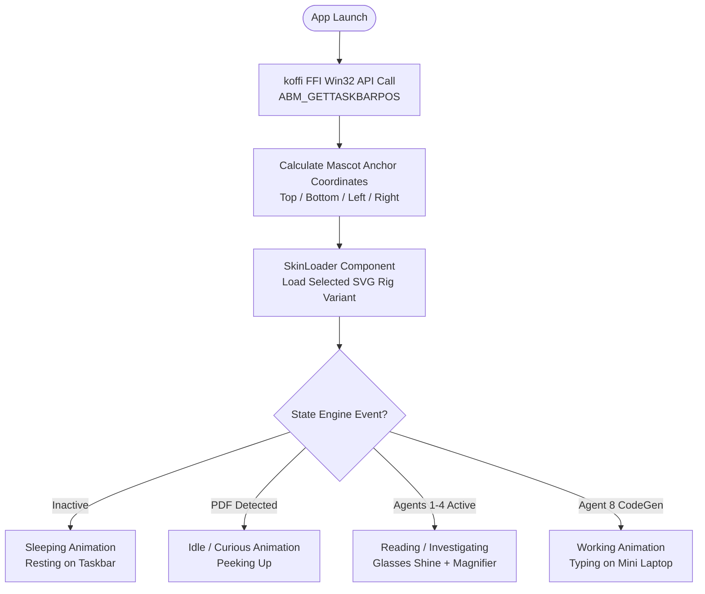
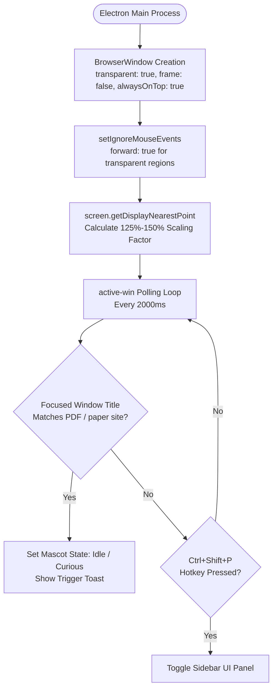
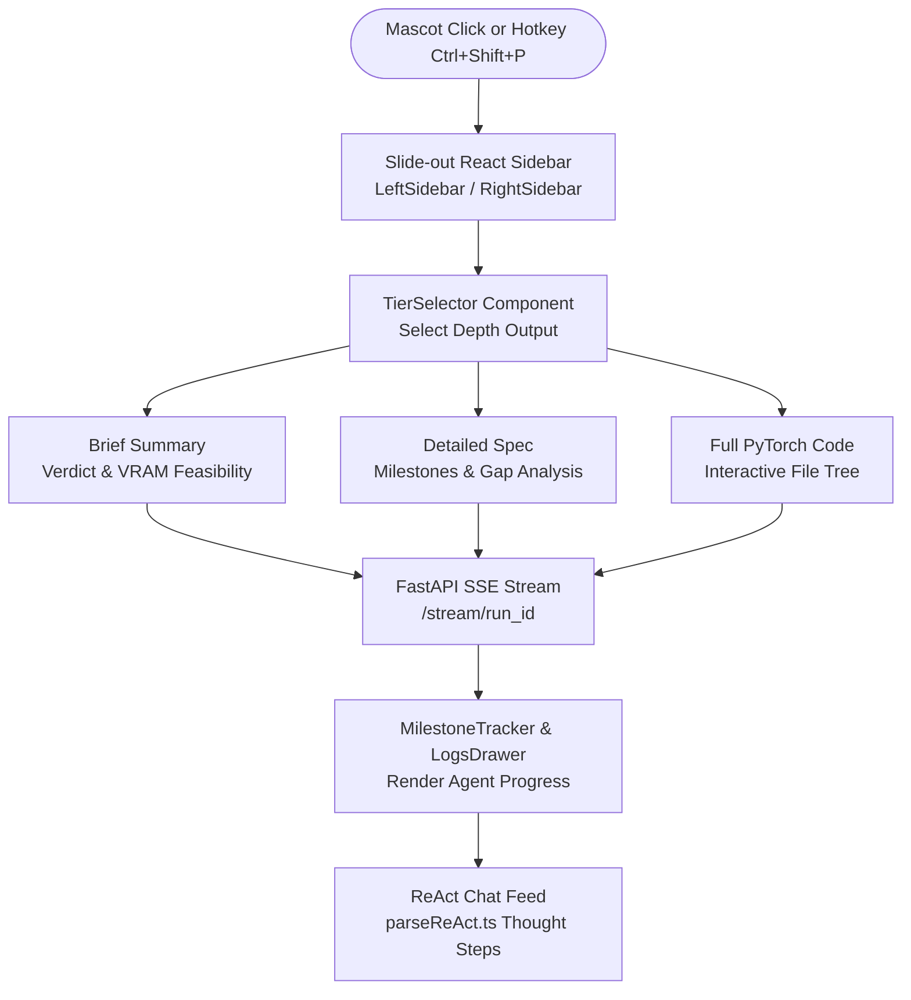
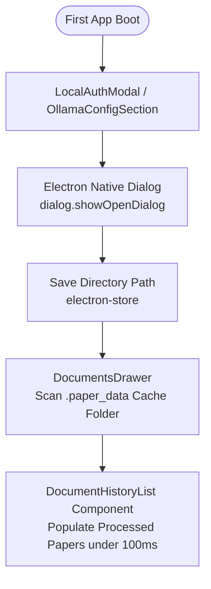
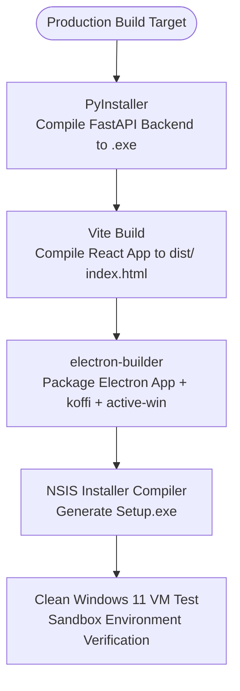

# 🎨 Frontend & Mascot Architecture — Master Phase-wise & Day-wise Technical Explanation

> **System Component:** Synthexis Desktop Mascot Overlay App & Docked React Sidebar UI  
> **Tech Stack:** Electron 43 + React 19 + TypeScript + Vite 8 + TailwindCSS 4 + Zustand 5 + Motion  
> **Native Bindings:** `active-win` (Window title polling) + `koffi` (Win32 WinAPI Taskbar query) + `electron-store`  
> **Master Project Plan Cross-Reference:** [`docs/backend_docs/Paper-2-Project_plan.md`](../backend_docs/Paper-2-Project_plan.md)  

---

## 📌 Frontend Component Assessment & Directory Map

| Package / Folder | Purpose & Architecture | Key Codebase Files |
|---|---|---|
| `frontend/electron_app/` | **Electron Desktop Shell & Mascot Container**: Manages transparent window overlay, Win32 taskbar docking, active window PDF title polling, and native IPC channels. | `src/main.js`, `src/preload.js`, `src/mascot.js`, `src/mascot.html`, `src/mascot.css` |
| `frontend/renderer/src/store/` | **Zustand State Management**: Modular state slices managing PDF analysis progress, multi-turn chat feeds, local Ollama configuration, and sidebar UI state. | `slices/analysisSlice.ts`, `slices/chatSlice.ts`, `slices/profileSlice.ts`, `slices/uiSlice.ts` |
| `frontend/renderer/src/components/layout/` | **Layout Components**: Collapsible docked sidebars, interactive mascot container, application header, and user profile cards. | `LeftSidebar.tsx`, `RightSidebar.tsx`, `MascotBox.tsx`, `Header.tsx`, `UserProfileCard.tsx` |
| `frontend/renderer/src/components/features/` | **Feature Modules**: Interactive report viewers, milestone trackers, ReACT chat feeds, log drawers, and Ollama configuration sections. | `analysis/ReportView.tsx`, `analysis/MilestoneTracker.tsx`, `chat/MessageFeed.tsx`, `logs/LogsDrawer.tsx` |
| `frontend/renderer/src/components/ui/` | **UI Components**: Output depth tier selector, PDF drag & drop overlays, skin loaders, and theme toggles. | `TierSelector.tsx`, `DropZone.tsx`, `DragDropOverlay.tsx`, `SkinLoader.tsx` |

---

## 🏗️ Phase-wise & Day-wise Frontend Technical Breakdown

---

### PHASE 1 — SVG MASCOT CHARACTER RIG & WIN32 TASKBAR DOCKING (Days 15–17)

#### 🔁 Phase 1 Flowchart

#### Day 15 — SVG Character Rig & Reskin System
* **Technical Explanation**: Builds a modular SVG character rig featuring standardized anchor points for head, glasses, hair, torso, limbs, and props.
* **🔑 Key Implementation Points**:
  * Reskin variants: 4 selectable skins (`mr_nerdy_stand_sleep`, `mr_nerdy_stand_to_excite`, `mr_nerd_stand_to_angry`, `mr_nerd_stand_to_hunch`).
  * Managed dynamically via `SkinLoader.tsx` and `MascotSelector.tsx`.

#### Day 16 — Native Win32 Taskbar Positioning Engine
* **Technical Explanation**: Uses `koffi` (Win32 FFI wrapper) in Electron main process (`main.js`) to invoke `ABM_GETTASKBARPOS` via the Windows API (`SHAppBarMessage`).
* **🔑 Key Implementation Points**:
  * Calculates mascot window placement relative to Taskbar edge (top, bottom, left, right).
  * Auto-adjusts mascot coordinate bounds when taskbar auto-hide is enabled.

#### Day 17 — Mascot Animation State Machine
* **Technical Explanation**: State machine inside `mascot.js` and `mascot.css` mapping backend agent processing events to mascot CSS-transform animations.
* **4 Animation States**:
  1. `Sleeping`: Mascot resting on taskbar when inactive.
  2. `Idle / Curious`: Peeking up when a research PDF is opened in the active window.
  3. `Reading / Investigating`: Glasses shine animation + magnifying glass when Agents 1–4 are parsing layout and parameters.
  4. `Working`: Typing on mini laptop when Agent 8 is synthesizing PyTorch code.

---

### PHASE 2 — TRANSPARENT WINDOW SHELL & ACTIVE DETECTION (Days 18–19)

#### 🔁 Phase 2 Flowchart

#### Day 18 — DPI-Aware Transparent Window Shell
* **Technical Explanation**: Configures frameless, transparent, always-on-top Electron overlay window.
* **🔑 Key Implementation Points**:
  * `setIgnoreMouseEvents(true, { forward: true })`: Click-through enabled for non-character transparent screen regions.
  * Multi-DPI screen scaling via `screen.getDisplayNearestPoint()` handling 125%–150% Windows DPI scaling factors.

#### Day 19 — Active Window Detection & Global Hotkey Engine
* **Technical Explanation**: Polling service in `main.js` running `active-win` to inspect focused window titles.
* **🔑 Key Implementation Points**:
  * Pattern-matches PDF viewer processes (Acrobat, Edge, Sumatra) and paper site keywords ("arXiv", "IEEE", "CVPR", ".pdf").
  * Global hotkey `Ctrl+Shift+P` registered via `globalShortcut` to manually toggle sidebar UI.

---

### PHASE 3 — DOCKED SIDEBAR PANEL & REAL-TIME SSE STREAM UI (Days 20–22)

#### 🔁 Phase 3 Flowchart

#### Day 20 — Docked Sidebar Panel & Output Depth Selector
* **Technical Explanation**: React + TailwindCSS sidebar (`LeftSidebar.tsx`, `RightSidebar.tsx`) docked to active monitor edge.
* **🔑 Key Implementation Points**:
  * `TierSelector.tsx`: 3-Tier Output Depth selector:
    1. **Brief Summary**: Executive summary & VRAM feasibility verdict.
    2. **Detailed Spec**: Full 6-milestone DAG sequence & parameter gap analysis.
    3. **Full PyTorch Implementation**: Interactive code tree viewer for synthesized `.py` files.

#### Day 21 — Real-Time Server-Sent Events (SSE) Progress Bridge
* **Technical Explanation**: Connects frontend Zustand store (`analysisSlice.ts`, `logsStore.ts`) to FastAPI SSE stream (`/stream/{run_id}`).
* **🔑 Key Implementation Points**:
  * `LogsDrawer.tsx` & `MilestoneTracker.tsx`: Renders real-time node transition events ("Decomposing Swin backbone...", "Synthesizing train.py...").
  * Automatically updates mascot animation states in sync with live agent progress.

#### Day 22 — Markdown Renderer & Multi-Turn ReACT Chat Widget
* **Technical Explanation**: Markdown renderer (`ReportView.tsx`) displaying synthesized reports with syntax-highlighted PyTorch code blocks.
* **🔑 Key Implementation Points**:
  * ReACT Chat UI (`MessageFeed.tsx`, `ChatInputArea.tsx`, `ReActStepsAccordion.tsx`): Multi-turn conversational interface displaying agent thought steps parsed by `parseReAct.ts`.

---

### PHASE 4 — LOCAL WORKSPACE STORAGE & CACHE HISTORY (Days 23–25)

#### 🔁 Phase 4 Flowchart

#### Day 23 — Onboarding & Workspace Selector Wizard
* **Technical Explanation**: First-boot modal (`LocalAuthModal.tsx`, `OllamaConfigSection.tsx`) requesting workspace directory path via native Electron picker (`dialog.showOpenDialog`).
* **🔑 Key Implementation Points**:
  * Local Ollama URL configuration (`http://localhost:11434`) and persistent store via `electron-store`.

#### Day 24 — History Drawer & Cache Scanner
* **Technical Explanation**: `DocumentsDrawer.tsx` & `DocumentHistoryList.tsx` scanning local `.paper_data` cache folder on startup (< 100ms load time).
* **🔑 Key Implementation Points**:
  * Displays previously processed research papers, generated PyTorch files, and saved ReACT chat histories.

#### Day 25 — UI Stress Testing & Reliability Verification 🔒
* **Technical Explanation**: Verification harness testing display resolution changes, sleep/wake cycles, full-screen applications, and display disconnects.

---

### PHASE 5 — WINDOWS PACKAGING & INSTALLER DISTRIBUTION (Days 26–31)

#### 🔁 Phase 5 Flowchart

#### Day 26 — Python Backend Binary Packaging
* **Technical Explanation**: Bundles Python FastAPI backend into a standalone executable using PyInstaller.

#### Day 27 — Electron Installer Configuration
* **Technical Explanation**: Configures `electron-builder` (`package.json`) to create Windows NSIS `.exe` installer bundling native C++ bindings (`koffi`/`ffi-napi`/`active-win`).

#### Day 28 — Pre-Flight Health Check Window
* **Technical Explanation**: Setup window verifying local Ollama connectivity (`http://localhost:11434`) and GROBID Docker status (`http://localhost:8070`).

#### Days 29–31 — Clean Windows VM Test & Portfolio Demo Checkpoint 🔒
* **Technical Explanation**: End-to-end verification run inside clean Windows 11 sandbox VM without dev tools installed.
