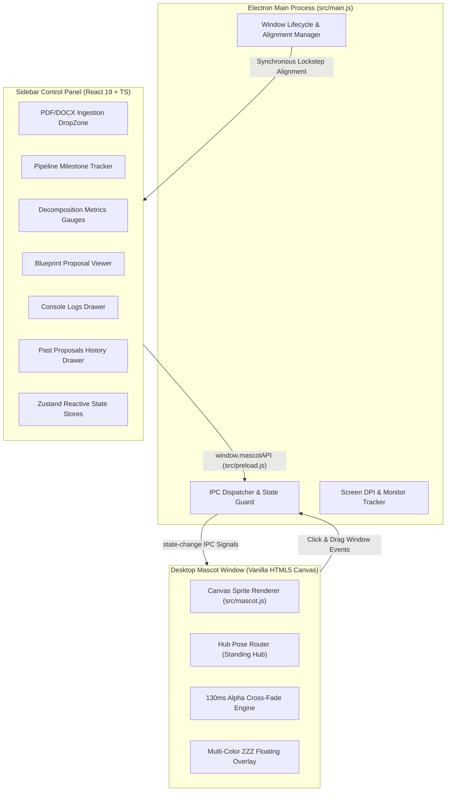
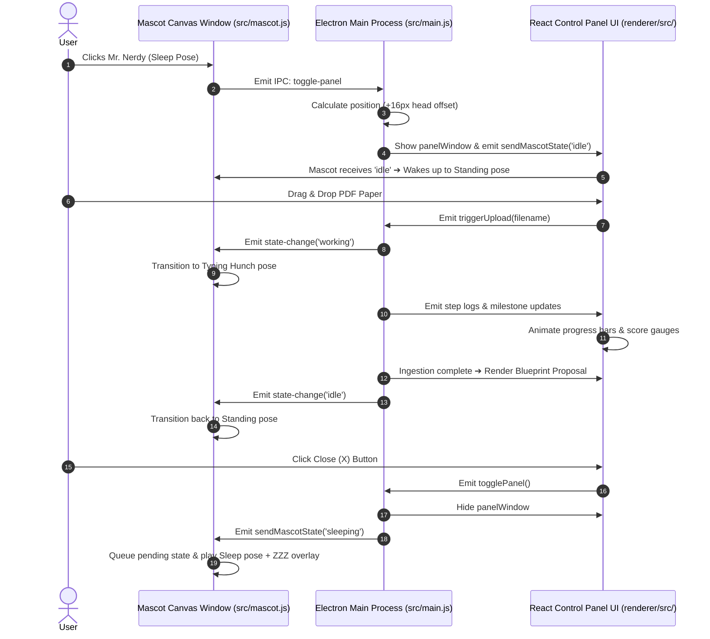

# 🎨 Marginalia Frontend Architecture & Feature Documentation

This document provides a comprehensive technical guide to the frontend architecture, desktop mascot canvas engine, React sidebar control panel, IPC messaging bridge, design tokens, and window positioning systems.

---

## 🏗️ Architecture Overview

The frontend operates a **Dual-Window Electron Architecture** separating the frameless desktop mascot overlay from the interactive sidebar control panel:

```
frontend/
├── src/                        # Mascot Overlay & Electron Main Process
│   ├── main.js                 # Electron Main Process (Window lifecycle, IPC, DPI, positioning)
│   ├── preload.js              # IPC Bridge (Exposes window.mascotAPI to renderer)
│   ├── mascot.html             # Canvas stage DOM container & ZZZ overlay
│   ├── mascot.css              # Grounded positioning, ZZZ floating keyframes, cursor rules
│   ├── mascot.js               # Sprite canvas rendering engine, state queue, alpha cross-fading
│   └── assets/                 # Transparent PNG sprite sheets (Mr. Nerdy)
│
└── renderer/                   # React Sidebar Control Panel Application
    ├── src/
    │   ├── App.tsx             # React Root Entrypoint
    │   ├── index.css           # Tailwind v4 theme tokens & theme-aware scrollbars
    │   ├── components/         # Modular UI Views (DropZone, Milestones, Charts, Reports, Drawers)
    │   └── store/              # Zustand Reactive State Stores (panelStore, logsStore, themeStore)
    ├── dist/                   # Compiled static production bundle (index.html, JS, CSS)
    └── vite.config.ts          # Vite + Tailwind v4 build configuration
```

### 📊 System Architecture Diagram



---

## ⚛️ How React.js Powers the Control Panel

### 1. Vite Compilation to Static Bundle
During development or build, Vite compiles the React TypeScript source code inside `renderer/` into static production assets:
```bash
renderer/src/  ──(vite build)──>  renderer/dist/
                                    ├── index.html
                                    └── assets/index-*.js
```

### 2. Native Electron Window Injection
In `src/main.js`, when the user clicks Mr. Nerdy, Electron creates a frameless sidebar window (`panelWindow`) and loads the built React HTML entrypoint directly:

```javascript
panelWindow = new BrowserWindow({
    width: Math.round(340 * scaleFactor),
    height: Math.round(480 * scaleFactor),
    frame: false,
    alwaysOnTop: true,
    preload: path.join(__dirname, 'preload.js')
});

// Directly loads the compiled React app
panelWindow.loadFile(path.join(__dirname, '../renderer/dist/index.html'));
```

### 3. IPC Communication Sequence Diagram



---

## 🎭 Mascot Canvas Sprite Engine (`src/mascot.js`)

### 1. Transparent Sprite Sheets
Utilizes transparent PNG strips mapped from `src/assets/`:
- `mr_nerdy_stand_sleep-removebg-preview.png` (`sleep`)
- `mr_nerdy_stand_to_excite-removebg-preview.png` (`excite` / `reading`)
- `mr_nerd_stand_to_angry-removebg-preview.png` (`angry`)
- `mr_nerd_stand_to_hunch-removebg-preview.png` (`hunch` / `working`)

### 2. Hub Routing State Machine
All pose transitions route through frame `0` of the standing pose (`idle`) as a central hub. For example, transitioning from `sleep` to `hunch` (`working`):
1. Reverses `sleep` sequence: Frame 2 ➔ Frame 1 ➔ Frame 0 (`standing`).
2. Plays `hunch` sequence: Frame 0 ➔ Frame 1 ➔ Frame 2 (`working`).

### 3. Alpha Cross-Fade Engine (`drawFrameCrossFade`)
Eliminates visual frame popping between pose steps by executing a 6-step `globalAlpha` cross-blend over 130ms in `src/mascot.js`.

### 4. Floating Multi-Color ZZZ Overlay
Displays animated sleeping Zs directly above Mr. Nerdy's head (`bottom: 92px; left: 48%` in `src/mascot.css`) in three distinct tailored colors:
- **Z 1 (9px):** Sky Blue (`#38bdf8`)
- **Z 2 (12px):** Violet Purple (`#a855f7`)
- **Z 3 (15px):** Coral Rose (`#f43f5e`)

### 5. Asynchronous State Queue (`pendingTargetState`)
Prevents state drop race conditions when double-clicking or closing the panel rapidly. If a state change arrives mid-animation, it is saved in a queue and executed immediately after the current step finishes.

---

## 📊 Sidebar Control Panel Features (React + TypeScript)

* **DropZone (`renderer/src/components/panel/DropZone.tsx`):** Drag-and-drop ingestion interface for PDF and DOCX academic research papers.
* **Milestone Pipeline Tracker (`renderer/src/components/panel/MilestoneTracker.tsx`):** Animated 5-stage progress tracker (Ingestion ➔ Method Decomposition ➔ Parameter Refinement ➔ Hardware Feasibility ➔ Blueprint Synthesis).
* **Decomposition & Certainty Gauges (`renderer/src/components/panel/StatsCharts.tsx`):** Circular percentage metric charts for model score breakdown.
* **Execution Tier Selector (`renderer/src/components/panel/TierSelector.tsx`):** Toggle buttons to switch synthesis granularity (Brief, Detailed, Implementation).
* **Proposal Report View (`renderer/src/components/panel/ReportView.tsx`):** Markdown report renderer displaying structured execution plans and PyTorch code snippets.
* **Filterable Console Logs Drawer (`renderer/src/components/logs/LogsDrawer.tsx`):** Expandable terminal log viewer with level filtering (System, Info, Success, Error).
* **Past Ingestion History Drawer (`renderer/src/components/panel/DocumentsDrawer.tsx`):** Slide-out history list permitting instant reload or deletion of previously analyzed papers.

---

## 🎨 Theme Tokens & Custom Scrollbars (`renderer/src/index.css`)

### 1. Marginalia Color Palette
Configured in `@theme` variables inside `renderer/src/index.css`:
- `--ink` (`#1A1B20` dark background / text in light mode)
- `--parchment` (`#EDE6D6` light text / background in light mode)
- `--brass` (`#C99A3E` primary accent / buttons)
- `--confirmed` (`#6B9B7C` green metric indicators)
- `--inferred` (`#D9A441` amber metric indicators)
- `--assumed` (`#8B8378` gray secondary text)
- `--error-color` (`#B5533C` red status alerts)

### 2. Theme-Aware Scrollbar System
Custom WebKit and Firefox scrollbars inside `renderer/src/index.css` dynamically adjust based on active theme state:
- **Track:** Adapts to `--background`.
- **Thumb:** Uses `--muted` with `--border` stroke.
- **Hover:** Highlights in warm `--brass`.

---

## 📐 Window Alignment & Lockstep Dragging

### 1. Precision Vertical Alignment
`getPanelPosition()` in `src/main.js` applies a `+16px` vertical offset to account for canvas transparency, creating a clean **2-3 line space** above Mr. Nerdy's head.

### 2. Lockstep Window Dragging
Dragging Mr. Nerdy emits `drag-window` events in `src/main.js` that shift `panelWindow` by `(deltaX, deltaY)` in real-time sync.

### 3. High-DPI Size Clamping
To prevent window size expansion on High-DPI displays (125%/150% Windows scaling), `panelWindow` bounds are explicitly clamped during drag to `340 * scaleFactor` x `480 * scaleFactor`.

---

## 🚀 Running & Building

### Build Renderer Bundle:
```bash
cd renderer
npm install
npm run build
```

### Start Electron Application:
```bash
cd ..
npm start
```
