# ⚛️ Synthexis Renderer — React 19 + Vite Docked Sidebar UI Documentation

Welcome to the renderer documentation for **Synthexis AI Platform**. This application is a high-performance **React 19** single-page application built with **Vite 8**, **TypeScript**, **TailwindCSS 4**, and **Zustand 5**, serving as the docked sidebar control panel and interactive paper analysis dashboard.

---

## 🏗️ Architecture Overview

```mermaid
flowchart TD
    subgraph Core ["React Root & Main Entry (src/)"]
        MAIN["main.tsx"] --> APP["App.tsx"]
        APP --> PANEL["Panel.tsx (Dashboard Hub)"]
    end

    subgraph Store ["Zustand Reactive State Engine (src/store/)"]
        PANEL --> ANALYSIS["analysisSlice.ts (PDF, Milestones, Reports)"]
        PANEL --> CHAT_STORE["chatSlice.ts (ReACT Feed, Messages)"]
        PANEL --> PROFILE["profileSlice.ts (Avatar, Ollama Config)"]
        PANEL --> UI_STORE["uiSlice.ts (Sidebars, Theme)"]
        PANEL --> LOGS["logsStore.ts (SSE Stream Logs)"]
    end

    subgraph Layout ["Layout Framework (src/components/layout/)"]
        PANEL --> HEADER["Header.tsx"]
        PANEL --> LEFT["LeftSidebar.tsx"]
        PANEL --> RIGHT["RightSidebar.tsx"]
        PANEL --> MASCOT["MascotBox.tsx"]
        PANEL --> USER_CARD["UserProfileCard.tsx"]
    end

    subgraph Features ["Feature Modules (src/components/features/)"]
        PANEL --> REPORT["analysis/ReportView.tsx"]
        PANEL --> TRACKER["analysis/MilestoneTracker.tsx"]
        PANEL --> CHAT_UI["chat/MessageFeed.tsx & ChatInputArea.tsx"]
        PANEL --> LOGS_UI["logs/LogsDrawer.tsx"]
        PANEL --> PROFILE_UI["profile/UserProfile.tsx & MascotSelector.tsx"]
    end

    subgraph UI_Primitives ["UI Primitives (src/components/ui/)"]
        PANEL --> TIER["TierSelector.tsx (Brief, Spec, Full PyTorch)"]
        PANEL --> DROP["DropZone.tsx & DragDropOverlay.tsx"]
        PANEL --> SKIN["SkinLoader.tsx"]
        PANEL --> THEME["ThemeToggle.tsx"]
    end
```



---

## 📁 File-by-File Breakdown of `frontend/renderer/src/`

### 1. Root & App Core (`src/`)
* **`main.tsx`**: React 19 application entry point, mounting `App.tsx` into the DOM (`#root`).
* **`App.tsx`**: Main component wrapper integrating global theme tokens, drag-and-drop overlays, modal dialogs, and the core dashboard panel.
* **`index.css`**: TailwindCSS v4 design system tokens, font imports (`IBM Plex Mono`, `Public Sans`), glassmorphic CSS variables, and animation keyframes.
* **`global.d.ts`**: TypeScript definitions for `window.electronAPI` IPC bridge methods.
* **`services/connectivity.ts`**: Health check utility probing backend server (`http://localhost:8000/health`) and local Ollama (`http://localhost:11434`).

### 2. Reactive State Management (`src/store/`)
* **`slices/analysisSlice.ts`**: Manages PDF file ingestion, active paper metadata, milestone DAG tracking, 3-tier depth output selection, and generated PyTorch codebase views.
* **`slices/chatSlice.ts`**: Manages multi-turn ReACT chat messages, input feed state, streaming responses, and thought step parsing via `parseReAct.ts`.
* **`slices/profileSlice.ts`**: Manages user profile settings, Ollama host URL (`http://localhost:11434`), and selected mascot avatar skin.
* **`slices/uiSlice.ts`**: Manages collapsible left/right sidebars, drawer states, theme modes, and modal dialogs.
* **`logsStore.ts`**: Real-time SSE event log store capturing backend node transitions (`EXTRACTION_STARTED`, `SECTION_DETECTED`, `CODE_GENERATION_STARTED`).
* **`themeStore.ts`**: Manages theme palette state (`dark`, `light`, `arctic`, `iris`).
* **`utils/storeUtils.ts`**: Persistence helpers and local storage state serializers.

### 3. Layout Scaffolding (`src/components/layout/`)
* **`Header.tsx`**: Top navigation bar displaying paper title, analysis status indicators, theme toggle, and profile access.
* **`LeftSidebar.tsx` & `RightSidebar.tsx`**: Docked collapsible sidebars housing document history, milestone checklists, and logs.
* **`MascotBox.tsx`**: Interactive mascot canvas container rendering character poses and animation keyframes.
* **`UserProfileCard.tsx`**: Compact user avatar card displaying selected mascot skin and Ollama connection status.
* **`DocumentHistoryList.tsx` & `ChatHistoryList.tsx`**: History drawers listing previously analyzed papers and saved chat threads.
* **`CompactHistoryDropdown.tsx`**: Quick-access dropdown for switching between recently processed papers.

### 4. Feature Modules (`src/components/features/`)
* **`analysis/ReportView.tsx`**: Markdown report viewer rendering synthesized specifications, gap analysis reports, and interactive PyTorch code trees with syntax highlighting.
* **`analysis/MilestoneTracker.tsx`**: Progress tracker displaying the 6-step DAG build sequence with expandable task checklists.
* **`analysis/PdfViewerPage.tsx`**: Embedded PDF document viewer with page navigation and section highlights.
* **`analysis/DocumentsDrawer.tsx`**: Slide-out drawer displaying processed papers, canonical JSON metadata, and cached PyTorch files.
* **`analysis/StatsCharts.tsx`**: Visual performance charts displaying GPU VRAM memory footprints and processing benchmarks.
* **`chat/MessageFeed.tsx` & `MessageBubble.tsx`**: Conversational chat interface displaying user prompts and assistant answers with grounded RAG citations.
* **`chat/ChatInputArea.tsx`**: Text input box with PDF attachment cards and send trigger.
* **`chat/ReActStepsAccordion.tsx` & `parseReAct.ts`**: Accordion component parsing and rendering ReACT agent thought steps (`thought`, `action`, `observation`).
* **`logs/LogsDrawer.tsx`**: Live terminal-style drawer streaming real-time backend log events via SSE.
* **`profile/UserProfile.tsx`, `MascotSelector.tsx`, `OllamaConfigSection.tsx`**: Configuration modal for avatar skin selection and local Ollama host URL setup.

### 5. UI Primitives (`src/components/ui/`)
* **`TierSelector.tsx`**: 3-Tier depth selector (Brief Summary, Detailed Spec, Full PyTorch Implementation).
* **`DropZone.tsx` & `DragDropOverlay.tsx`**: Drag-and-drop PDF ingestion overlay with visual drop target animations.
* **`SkinLoader.tsx`**: SVG/PNG avatar skin loader rendering mascot poses (`mr_nerdy_stand_sleep`, `mr_nerdy_stand_to_excite`, `mr_nerd_stand_to_angry`, `mr_nerd_stand_to_hunch`).
* **`ThemeToggle.tsx`**: One-click theme switcher toggle.
* **`LocalAuthModal.tsx`**: First-run setup modal asking for workspace directory and local Ollama setup.
* **`ModelSelector.tsx`**: Dropdown selector for choosing local Ollama models (`qwen2.5-coder:1.5b`).

---

## ⚡ Quick Start & Development

```bash
# 1. Navigate to renderer directory
cd frontend/renderer

# 2. Install dependencies
npm install

# 3. Start Vite development server
npm run dev

# 4. Build production bundle (tsc + vite build)
npm run build
```
