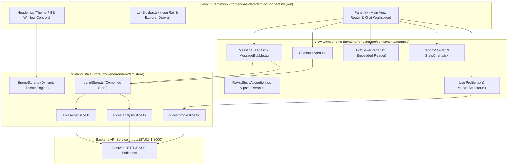
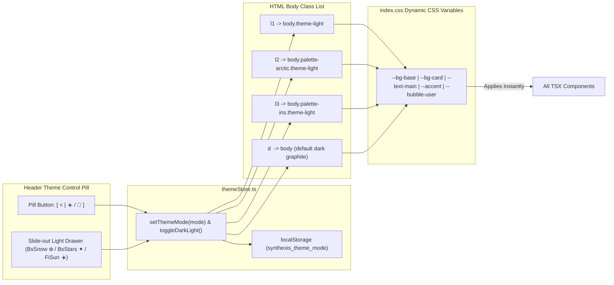

# 💻 Synthexis — Frontend Desktop UI Documentation

Welcome to the frontend renderer documentation for **Synthexis**. 
This is a modern, theme-adaptive desktop user interface built with **React 18**, **TypeScript**, **Vite**, **Tailwind CSS**, and **Zustand**.

---

## 🏗️ System & State Architecture

The frontend renderer is organized around modular layout components, state slices, and a dynamic CSS variable theme engine:



---

## 🎨 4-Way Dynamic Theme Engine Flow

The user interface supports 3 Light themes + 1 Dark theme with zero hardcoded color glitches:



---

## 📁 Repository Directory Structure

The frontend maintains a clean modular organization using folder-wide relative paths:

```
frontend/renderer/
├── index.html                       # HTML Entry Point
├── package.json                     # NPM Dependencies & Scripts
├── vite.config.ts                   # Vite Build Configuration
├── tsconfig.json                    # TypeScript Configuration
└── src/
    ├── App.tsx                      # Root Application Container
    ├── main.tsx                     # React DOM Mount Entry Point
    ├── index.css                    # Nordic Minimal Dynamic CSS Variable Tokens
    ├── assets/                      # Mascot Avatars & Media Assets
    ├── components/
    │   ├── layout/
    │   │   ├── Header.tsx           # Top Control Bar (Title, Theme Switcher, Window Controls)
    │   │   ├── LeftSidebar.tsx      # VS Code-style Slim Icon Rail + Explorer Drawer
    │   │   ├── RightSidebar.tsx     # Supplemental Information Drawer
    │   │   ├── ChatHistoryList.tsx  # Saved Conversation Threads List
    │   │   ├── DocumentHistoryList.tsx # Research Paper History List (with View & Delete buttons)
    │   │   └── CompactHistoryDropdown.tsx # Top Popup Thread History Menu
    │   ├── features/
    │   │   ├── chat/
    │   │   │   ├── MessageFeed.tsx  # Conversation Thread Container & Welcome Screen
    │   │   │   ├── MessageBubble.tsx# Chat Message Bubble with Theme Accent Styling
    │   │   │   ├── ChatInputArea.tsx# Text Input Dock, Staged File Pill, Send Action
    │   │   │   ├── ReActStepsAccordion.tsx # ReACT Reasoning Trace Accordion (🟡 REACT REASONING TRACE ∨ 3 steps)
    │   │   │   ├── parseReAct.ts    # ReACT Trace Regex & Fallback Synthesizer
    │   │   │   └── messageFormatters.ts # Inline Markdown Parser
    │   │   ├── analysis/
    │   │   │   ├── PdfViewerPage.tsx# Embedded PDF Document Reader Viewport
    │   │   │   ├── ReportView.tsx   # Markdown Proposal Report & Hyperparameter Forms
    │   │   │   ├── StatsCharts.tsx  # Ingestion Progress Rings & Gauge Bars
    │   │   │   └── DocumentsDrawer.tsx # Ingested Paper Library Drawer
    │   │   └── profile/
    │   │       ├── UserProfile.tsx  # Developer Profile & Backend Sync Form
    │   │       ├── MascotSelector.tsx # Mascot Companion Selector Cards
    │   │       └── OllamaConfigSection.tsx # Local Ollama Link & Instructions
    │   ├── panel/
    │   │   └── Panel.tsx            # Main View Router & Full-Height Window Frame
    │   └── ui/
    │       ├── ModelSelector.tsx    # Live Inference Model Engine Dropdown Selector
    │       ├── LocalAuthModal.tsx   # Workspace Initialization Modal
    │       ├── SkinLoader.tsx       # System Component Skeleton Loader
    │       ├── PdfAttachmentCard.tsx# Chat Attachment Pill Component
    │       └── DragDropOverlay.tsx  # Drag & Drop File Backdrop Overlay
    └── store/
        ├── panelStore.ts            # Centralized Zustand Store Hub
        ├── themeStore.ts            # Dynamic 4-Way Theme Engine Store
        ├── logsStore.ts             # Terminal Logs Console Store
        └── slices/
            ├── analysisSlice.ts     # Paper Upload & Live Pipeline SSE Store
            ├── chatSlice.ts         # Conversational Threads & Messages Store
            ├── profileSlice.ts      # Extended Profile & Backend Excel Sync Store
            └── uiSlice.ts           # Active Views & Modal States Store
```

---

## 🛠️ UI Features & Component Highlights

### 1. ReACT Reasoning Trace Accordion (`src/components/features/chat/ReActStepsAccordion.tsx`)
- Formats ReACT reasoning traces: `🟡 REACT REASONING TRACE ∨ 3 steps`.
- Displays step pipeline badges: `Thought` ➔ `Action` ➔ `Observation`.
- Automatically synthesizes traces for all assistant responses so the trace header is always visible.

### 2. Dynamic Inference Model Selector (`src/components/ui/ModelSelector.tsx`)
- Fetches active model engines on mount via `GET /api/v1/models`.
- Displays status indicators for local Ollama instances (`llama3`, `deepseek-r1`, `qwen2.5`) and cloud providers (`Groq`, `OpenRouter`, `Gemini`).

### 3. Document History & Embedded PDF Reader (`src/components/layout/DocumentHistoryList.tsx`, `src/components/features/analysis/PdfViewerPage.tsx`)
- Displays all ingested papers with file size and date formatting.
- Features permanently sticked **View** (`BsBoxArrowUpRight`) and **Delete** (`FaTrash`) action buttons.
- Clicking View opens the paper in the embedded PDF Viewer (`pdf-viewer` view).

### 4. Seamless Header Controls & Window Toggle (`src/components/layout/Header.tsx`)
- Single dynamic Maximize/Minimize button (`FiMaximize` when standard, `FiMinimize` when maximized).
- Compact theme pill button with slide-out light mode options (`FiSun ☀️`, `BsSnow ❄️`, `BsStars ✦`).

---

## 🚀 Local Setup & Development

### Installation & Launch

1. **Install NPM Dependencies:**
   ```bash
   npm install
   ```

2. **Run Vite Development Server:**
   ```bash
   npm run dev
   ```
   *The renderer dev server runs locally at `http://localhost:5173`.*

3. **TypeScript Compilation Check:**
   ```bash
   npx tsc --noEmit
   ```

4. **Production Build:**
   ```bash
   npm run build
   ```
